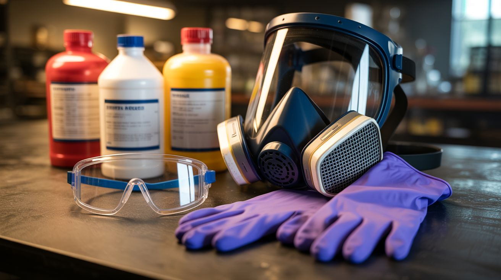

# Chemical Safety

  

> Chemicals don't forgive mistakes. They don't wait for you to put gloves on. They react instantly and exactly as chemistry dictates, whether you're ready or not.

This guide covers PPE requirements, storage rules, disposal procedures, dangerous combinations, and first aid for chemical incidents across all builds.

---

## PPE Requirements by Chemical Type

### Acids (Muriatic Acid, Sulfuric Acid, Phosphoric Acid)

| PPE | Requirement |
|---|---|
| **Gloves** | Acid-resistant gloves (nitrile for dilute, neoprene or butyl rubber for concentrated) |
| **Eye protection** | Chemical splash goggles (sealed, not safety glasses — splashes go around glasses) |
| **Face shield** | Required when handling concentrated sulfuric acid or pouring any acid |
| **Respiratory** | Required for muriatic acid (HCl fumes on opening) — use acid gas cartridge respirator or work outdoors |
| **Clothing** | Long sleeves, closed shoes, apron or old clothes you don't mind destroying |

### Bases (Sodium Hydroxide, Sodium Silicate)

| PPE | Requirement |
|---|---|
| **Gloves** | Nitrile or neoprene gloves |
| **Eye protection** | Chemical splash goggles — base burns to the eyes are WORSE than acid burns because you don't feel them immediately |
| **Clothing** | Long sleeves, closed shoes |
| **Note** | Sodium hydroxide dissolved in water generates significant heat. Add lye TO water slowly, never water to lye |

### Oxidizers (Potassium Permanganate, Potassium Nitrate, Hydrogen Peroxide 12%+)

| PPE | Requirement |
|---|---|
| **Gloves** | Nitrile gloves |
| **Eye protection** | Safety goggles |
| **Clothing** | Old clothes — permanganate stains everything purple/brown permanently |
| **Note** | Keep away from organic materials, fuels, and reducing agents. Oxidizers provide their own oxygen for fires — they make things burn faster and hotter |

### Metal Salts (Copper Sulfate, Ferric Chloride, Cobalt Chloride, Nickel Sulfate)

| PPE | Requirement |
|---|---|
| **Gloves** | Nitrile gloves |
| **Eye protection** | Safety glasses minimum, splash goggles for solutions |
| **Note** | Toxic if ingested. Wash hands after handling. Copper sulfate and ferric chloride stain skin and surfaces |

### Flammable Solvents (Acetone, Isopropyl Alcohol)

| PPE | Requirement |
|---|---|
| **Gloves** | Nitrile (but note: acetone degrades nitrile over prolonged contact — use quickly or use butyl rubber) |
| **Eye protection** | Safety glasses |
| **Respiratory** | Work in ventilated area — vapors are heavier than air and can accumulate at floor level |
| **Note** | NO open flames, NO sparks, NO smoking anywhere in the work area |

### Pyrotechnic Materials (Aluminum Powder, Iron Oxide, Sulfur, Magnesium)

| PPE | Requirement |
|---|---|
| **Gloves** | Nitrile for handling powders |
| **Eye protection** | Safety goggles during handling, welding shade 5+ during ignition |
| **Respiratory** | Dust mask (N95) when handling fine powders |
| **Note** | Ground yourself before handling (static can ignite metal powders). Use non-sparking tools (plastic, wood). Never use metal containers for mixing |

### Cryogenics (Dry Ice, Liquid Nitrogen)

| PPE | Requirement |
|---|---|
| **Gloves** | Cryogenic gloves for liquid nitrogen (NOT regular gloves — fabric absorbs LN2 and makes burns worse). Insulated gloves or tongs for dry ice |
| **Eye protection** | Safety goggles (splash protection for LN2) |
| **Note** | Both displace oxygen. NEVER use in enclosed spaces without ventilation. Never seal in closed containers (pressure buildup causes explosion) |

---

## Storage Rules

### General Principles

1. **Store chemicals in their original containers** with original labels. If you transfer to another container, label it clearly with the chemical name, concentration, and date.
2. **Keep the storage area cool, dry, and ventilated.** Avoid direct sunlight and heat sources.
3. **Store on low shelves, never above head height.** A falling bottle of acid is a catastrophe.
4. **Keep a spill kit nearby** — absorbent material (cat litter works), baking soda (for acid neutralization), and a bucket.

### What to Store Separately

Certain chemicals react dangerously with each other. NEVER store them together or on the same shelf.

| Keep These Apart | Why |
|---|---|
| **Acids** and **Bases** | Violent exothermic reaction, splashing, heat |
| **Oxidizers** and **Fuels/Organics** | Fire, explosion |
| **Oxidizers** (KMnO4, KNO3, H2O2) and **Reducing agents** (metal powders, sulfur, sugar) | Spontaneous combustion |
| **Acids** and **Metals** (aluminum powder, iron, zinc) | Hydrogen gas production (flammable/explosive) |
| **Muriatic acid** and **Bleach** | Produces toxic chlorine gas — this combination has killed people in household settings |
| **Sulfuric acid** and **Potassium permanganate** | Produces Mn2O7 — a shock-sensitive explosive |
| **Calcium carbide** and **Water/moisture** | Produces acetylene gas (explosive) |

### Temperature-Sensitive Storage

| Chemical | Storage Temperature | Notes |
|---|---|---|
| Hydrogen peroxide (30%+) | Cool, dark, below 75°F | Decomposes faster at high temperature; container may pressurize |
| Calcium carbide | Room temperature, COMPLETELY DRY | Reacts with moisture including humidity |
| Thermochromic pigment | Room temperature, sealed | Moisture absorption causes clumping |
| Gallium | Room temperature or fridge (below 85.6°F to keep solid) | Melts at body temperature |
| Liquid nitrogen | Cannot be stored long-term | Boils off continuously; purchase same day as use |

---

## Disposal Methods

### The Cardinal Rule

**NEVER pour chemicals down the drain** unless you are certain they are drain-safe at the concentration you're disposing.

### Safe for Drain Disposal (with dilution)

These can be flushed with large amounts of water:
- Baking soda solutions
- Sodium acetate solutions
- Dilute (under 1%) salt solutions
- Dilute vinegar

### Neutralize Before Disposal

| Chemical | Neutralization Method | Then |
|---|---|---|
| Dilute acids | Add baking soda (sodium bicarbonate) slowly until fizzing stops (pH ~7) | Flush neutralized solution down drain with water |
| Dilute bases (lye solution) | Add vinegar slowly until pH ~7 | Flush neutralized solution down drain with water |

### Hazardous Waste Disposal Required

These chemicals MUST be disposed through your local hazardous waste program:
- **Copper sulfate solutions** — toxic to aquatic life
- **Ferric chloride** — corrosive, toxic to aquatic life
- **Potassium permanganate solutions** — strong oxidizer
- **Nickel and cobalt compounds** — toxic heavy metals
- **Concentrated acids** (muriatic, sulfuric) — neutralize first if small quantities, or take to hazardous waste
- **Used electroplating solutions** — contain dissolved metals
- **Lithium battery cells** — take to battery recycling (Home Depot, Lowe's, Best Buy accept them)
- **Mercury** (from old thermometers, some switches) — hazardous waste, never trash

**How to find hazardous waste disposal:** Search "[your city/county] hazardous waste disposal" or call your local public works department. Most municipalities offer free or low-cost hazardous waste drop-off days several times per year.

---

## Dangerous Combinations Table

These combinations produce dangerous reactions. Some of them are INTENTIONAL in certain builds (thermite = iron oxide + aluminum powder), but accidental mixing or improper storage can cause unintended reactions.

| Chemical A | Chemical B | Reaction | Danger Level |
|---|---|---|---|
| Muriatic acid (HCl) | Bleach (NaOCl) | Produces chlorine gas | **LETHAL** — chlorine gas kills |
| Muriatic acid (HCl) | Ammonia | Produces ammonium chloride (NH₄Cl) vapor/fumes | **TOXIC** — irritant fumes, corrosive |
| Sulfuric acid (conc.) | Potassium permanganate | Produces Mn2O7 | **EXPLOSIVE** — shock-sensitive |
| Sulfuric acid (conc.) | Water (added wrong) | Violent exothermic boiling | **Severe burns** — add acid TO water |
| Potassium permanganate | Glycerin | Spontaneous ignition | **Fire** — used intentionally in build #115 |
| Aluminum powder | Iron oxide (rust) | Thermite reaction (if ignited) | **Extreme heat** (4000°F+) — used intentionally in build #105 |
| Potassium nitrate | Sugar or charcoal | Smoke composition (if ignited) | **Fire/smoke** — used intentionally in build #103 |
| Calcium carbide | Water | Produces acetylene gas | **Explosive gas** — used intentionally in build #116 |
| Hydrogen peroxide (conc.) | Acetone | Produces acetone peroxide | **EXPLOSIVE** — shock-sensitive, extremely dangerous |
| Hydrogen peroxide (conc.) | Any organic material | Vigorous oxidation | **Fire** risk |
| Sodium hydroxide (lye) | Aluminum (metal) | Produces hydrogen gas | **Flammable gas** — can ignite |
| Oxidizers (any) | Fuels (any organic) | Enhanced combustion | **Fire/explosion** |

### Combinations You Must Never Create Accidentally

The three most dangerous accidental combinations:

1. **Bleach + acid = chlorine gas.** This kills people in home cleaning accidents every year. If your workspace has both bleach and muriatic acid, they must be stored on opposite sides of the room, clearly labeled, and NEVER used in the same container or surface without thorough rinsing between.

2. **Concentrated hydrogen peroxide + acetone = acetone peroxide (TATP).** This is a primary explosive. It is shock-sensitive, friction-sensitive, and heat-sensitive. NEVER mix these chemicals. If you use both in your workshop (acetone for cleaning, H2O2 for builds), keep them separated and never let them contact each other.

3. **Sulfuric acid + potassium permanganate = Mn2O7.** This is a shock-sensitive explosive oil. NEVER let these two chemicals mix. If your workspace has both, store on different shelves with physical separation.

---

## First Aid

### Chemical Burns (Skin Contact)

1. **Remove contaminated clothing** immediately. Chemicals trapped against skin by clothing continue to burn.
2. **Flush with water** for at least 15-20 minutes. Use a low-pressure stream — not a fire hose (which drives chemicals deeper). A garden hose, shower, or sink works.
3. **Do NOT neutralize on skin.** Don't put baking soda on an acid burn or vinegar on a base burn — the neutralization reaction produces heat that makes the burn worse.
4. **After flushing,** cover loosely with a clean, dry cloth.
5. **Seek medical attention** for any chemical burn larger than a quarter, or any burn from concentrated acid or base.

### Chemical Splash in Eyes

1. **Flush immediately** with clean water or saline eye wash for at least 15-20 minutes. Hold the eyelids open — the instinct is to squeeze them shut, which traps the chemical.
2. **Remove contact lenses** if wearing them, as soon as you start flushing.
3. **Tilt head** so the contaminated eye is lower — this prevents wash water from carrying the chemical into the unaffected eye.
4. **Go to the ER** after flushing. ALL chemical eye exposures require medical evaluation, even if the eye feels fine after flushing. Base burns (sodium hydroxide) are especially insidious — they may feel mild initially but cause progressive damage over hours.

### Inhalation (Fumes, Gas)

1. **Move to fresh air** immediately. If the victim cannot move themselves, do NOT enter a confined space with toxic atmosphere to rescue them without proper respiratory protection — you'll become a second victim.
2. **Call 911** if the person is dizzy, confused, having difficulty breathing, or unconscious.
3. **Call Poison Control (1-800-222-1222)** for guidance on the specific chemical inhaled.
4. **Monitor breathing.** Some chemical inhalation effects are delayed — the person may feel fine initially and deteriorate hours later (phosgene, nitrogen dioxide). Seek medical attention for any significant inhalation exposure.

### Ingestion

1. **Call Poison Control (1-800-222-1222)** immediately. Tell them the chemical name, approximate amount, and the person's weight and age.
2. **Do NOT induce vomiting** unless Poison Control specifically tells you to. Some chemicals cause additional damage coming back up.
3. **Do NOT give milk, water, or activated charcoal** unless directed by Poison Control.
4. **Bring the chemical container** to the ER so medical staff know exactly what was ingested.

---

## The Bottom Line

1. **Read the label.** Every chemical has safety information. Read it before opening.
2. **Wear the PPE.** Gloves and goggles are cheap. Medical bills and permanent injury are not.
3. **Know what you're mixing.** If you don't understand the chemistry, research it before combining anything.
4. **Store it right.** Separate incompatibles. Label everything. Keep it cool and dry.
5. **Dispose of it properly.** The drain is not a waste disposal system.
6. **Have water and baking soda within arm's reach.** These handle the most common chemical incidents (flushing and acid neutralization).
