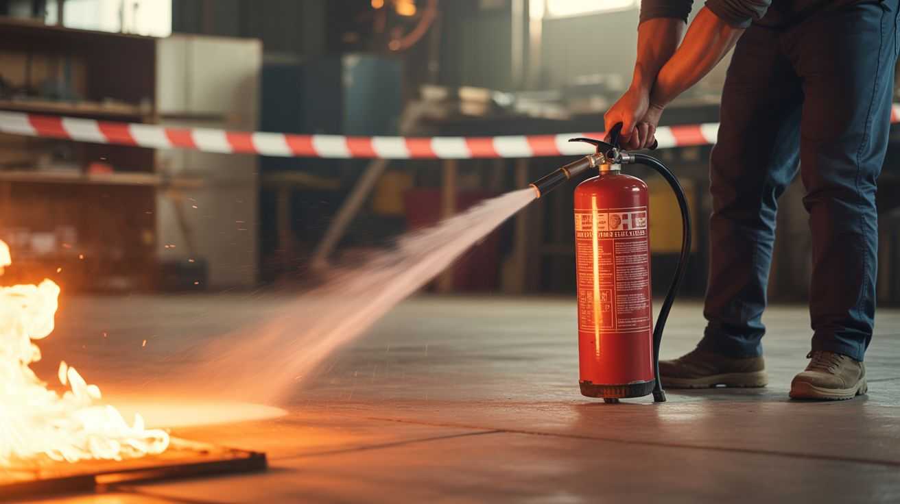

# Fire & Pyrotechnic Safety

  

> Fire is the oldest technology and the one that demands the most respect. It has no off switch. Once ignited, it follows physics, not your plans.

This guide covers fire prevention, fire extinguisher selection, burn treatment, ventilation requirements, safe distances, and legal considerations for all builds involving fire, heat, or pyrotechnics.

---

## Fire Extinguisher Types

Not all fires are the same, and using the wrong extinguisher can make things worse. Know what you're likely to burn before you start.

| Class | Fire Type | What's Burning | Extinguisher Type | Color Code |
|---|---|---|---|---|
| **A** | Ordinary combustibles | Wood, paper, cloth, plastic | Water, foam, or dry chemical | Green triangle |
| **B** | Flammable liquids | Gasoline, oil, grease, acetone, isopropyl alcohol | CO2, dry chemical, or foam | Red square |
| **C** | Electrical | Energized equipment (MOTs, capacitors, wiring) | CO2 or dry chemical (NEVER water) | Blue circle |
| **D** | Combustible metals | Magnesium, aluminum, thermite, sodium, lithium | Class D dry powder (Met-L-X, Lith-X) or dry sand | Yellow star |
| **K** | Cooking oils | Kitchen fires (not relevant to most builds) | Wet chemical | Black hexagon |

### Which Extinguisher for Which Build

| Build Category | Primary Fire Risk | Extinguisher Needed |
|---|---|---|
| MOT/HV builds (plasma, Lichtenberg) | Electrical fire, wood ignition | ABC (covers A, B, and C) |
| Thermite | Burning metal at 4000°F+ | **Class D ONLY** — or dry sand. Water causes steam explosion. ABC won't work. |
| Colored fire, fire tornado, foundry | Open flame, propane, hot metal | ABC |
| Solvent-based builds (acetone, IPA) | Flammable liquid fire | BC or ABC |
| Magnesium ribbon ignition | Burning metal | Class D or dry sand |
| Steel wool photography | Small metal fire | ABC or sand |
| Fireworks/pyrotechnics | Pyrotechnic composition fire | ABC from safe distance |
| Smoke bombs | Pyrotechnic composition | ABC |
| General electronics (soldering, wiring) | Small electrical fire | ABC |

### Critical Exception: What NEVER to Use on Metal Fires

**NEVER use water, CO2, or standard ABC extinguishers on burning metals** (magnesium, aluminum, thermite, lithium). Here's why:

- **Water:** Molten metal decomposes water into hydrogen and oxygen. Hydrogen is explosive. The result is a steam explosion that sprays molten metal in all directions. This is one of the most dangerous things that can happen in a workshop.
- **CO2:** Burning magnesium and aluminum can reduce CO2, sustaining the fire and producing toxic carbon monoxide.
- **ABC dry chemical:** Ineffective. The heat of a metal fire exceeds the suppression capability of standard dry chemicals.

**What to use:** Class D fire extinguisher (dry powder — sodium chloride based, like Met-L-X), or smother with DRY sand (not wet sand). For thermite: let it burn out. Thermite is self-limiting — once the reactants are consumed, it stops. Do not attempt to extinguish active thermite. Clear the area and let it finish.

### Buying and Maintaining Extinguishers

- **Minimum recommendation:** One 5 lb ABC-rated extinguisher for your workshop. Covers most fire types except metal fires. Costs $20-30 at any hardware store.
- **For metal/pyro builds:** Add a bucket of dry sand (free) and consider a Class D extinguisher ($50-100) if you work with magnesium or thermite regularly.
- **Check the pressure gauge** monthly. If the needle is in the red zone, recharge or replace.
- **Inspect annually.** Most fire extinguishers have a 5-12 year service life.
- **Mount it on the wall** near your work area, not on the floor behind a shelf. You need to grab it in seconds.

---

## Burn First Aid

### Thermal Burns (Fire, Hot Metal, Soldering Irons)

**Minor burns (first degree — red, no blisters, small area):**
1. Cool the burn under cool (not cold, not ice) running water for 10-20 minutes. Start immediately.
2. Do NOT use ice, butter, toothpaste, or any home remedy. Cool water only.
3. After cooling, apply aloe vera gel or burn cream.
4. Cover loosely with a non-stick bandage.
5. Take ibuprofen or acetaminophen for pain.

**Moderate burns (second degree — blisters, red, painful, larger area):**
1. Cool under running water for 20 minutes.
2. Do NOT pop blisters — they protect the underlying tissue.
3. Cover loosely with a clean, non-stick bandage.
4. Seek medical attention if the burn is larger than 3 inches, on the face/hands/feet/joints, or in a vulnerable person (child, elderly).

**Severe burns (third degree — white/charred, no pain in burned area, large area):**
1. Call 911 immediately.
2. Do NOT remove clothing stuck to the burn.
3. Do NOT immerse large burns in water (hypothermia risk).
4. Cover loosely with a clean sheet or cloth.
5. Elevate the burned area above the heart if possible.
6. Monitor for shock (pale, cold, rapid pulse, confusion).

### Chemical Burns

See [Chemical Safety — First Aid](chemicals.md#first-aid).

### Electrical Burns

Electrical burns often look minor on the surface but can be severe internally (the current cooks tissue along its path). ALL electrical burns require medical evaluation — even small entry/exit wounds.

---

## Ventilation Requirements

### Builds That MUST Be Done Outdoors

These produce fumes, gas, or smoke that are dangerous in enclosed spaces:

| Build | Why Outdoors |
|---|---|
| [Thermite Flower Pot](../../categories/pyro-and-chemistry/105-thermite-flower-pot.md) | Molten metal, intense heat, sparks, UV radiation |
| [Colored Fire](../../categories/pyro-and-chemistry/101-colored-fire.md) | Metal salt smoke is toxic — do not breathe |
| [Steel Wool Photography](../../categories/pyro-and-chemistry/113-steel-wool-photography.md) | Sparks travel 15+ feet, fire risk |
| [Calcium Carbide Cannon](../../categories/pyro-and-chemistry/116-calcium-carbide-cannon.md) | Acetylene gas is explosive |
| [Smoke Bomb Array](../../categories/pyro-and-chemistry/103-smoke-bomb-array.md) | Dense smoke, KNO3 combustion products |
| [Permanganate Auto-Ignition](../../categories/pyro-and-chemistry/115-permanganate-auto-ignition.md) | Spontaneous fire, fumes |
| [Pharaoh's Serpent](../../categories/pyro-and-chemistry/110-pharaohs-serpent.md) | Toxic combustion products |
| [Fire Tornado Table](../../categories/fire-and-plasma/007-fire-tornado-table.md) | Open flame, heat column |
| [Propane Vortex Cannon](../../categories/fire-and-plasma/003-propane-vortex-cannon.md) | Propane, open flame |
| [Desktop Foundry](../../categories/fire-and-plasma/005-desktop-foundry.md) | Extreme heat, potential for metal splatter |
| [Fireworks Sequencer](../../categories/pi-and-arduino/121-fireworks-sequencer.md) | Pyrotechnic devices |
| [Lichtenberg Wood Burner](../../categories/fire-and-plasma/002-lichtenberg-wood-burner.md) | Burning wood produces smoke, fire risk |

### Builds That Need Good Ventilation (Garage with Open Door, Workshop with Fan)

| Build | Why Ventilation |
|---|---|
| [PCB Etching Station](../../categories/chemical-electronic/158-pcb-etching-station.md) | Ferric chloride fumes |
| [Electroplating Station](../../categories/chemical-electronic/156-electroplating-station.md) | Small amounts of hydrogen gas at cathode |
| [Hydrogen Generator](../../categories/chemical-electronic/159-hydrogen-generator.md) | Hydrogen gas production |
| [Luminol Crime Scene](../../categories/pyro-and-chemistry/109-luminol-crime-scene.md) | Spray mist contains NaOH and H2O2 |
| [Anodizing Setup](../../categories/chemical-electronic/157-anodizing-setup.md) | Acid fumes |
| [Soldering](any build with soldering) | Flux fumes are respiratory irritants |
| [Bismuth Crystal Garden](../../categories/pyro-and-chemistry/107-bismuth-crystal-garden.md) | Metal oxide fumes at temperature |

---

## Safe Distances

Minimum distance between spectators/bystanders and the active build:

| Build Type | Minimum Safe Distance | Notes |
|---|---|---|
| Thermite | 15 feet minimum | Molten iron can splatter several feet; UV requires welding goggles at any distance |
| Fireworks (consumer) | 50 feet (firing position to spectators) | Follow manufacturer's instructions; more is better |
| Steel wool photography | 15 feet from spinning point | Sparks travel far and can ignite dry grass |
| Colored fire (campfire) | 6 feet | Normal campfire distance; stay upwind of metal salt smoke |
| Smoke bombs | 10 feet | Dense smoke can obscure vision and cause coughing |
| Calcium carbide cannon | 15 feet | Loud report, potential for projectile |
| Propane vortex cannon | 15 feet | Flame jet extends several feet |
| Fire tornado table | 6 feet | Contained flame, but heat column rises |
| Foundry / metal melting | 10 feet | Molten metal splatter risk |
| Lichtenberg wood burner | 6 feet (behind the operator) | Main risk is to the operator, not spectators |

---

## Legal Considerations for Pyrotechnic Builds

### Fireworks Laws

Fireworks laws vary enormously by jurisdiction. This is NOT a comprehensive legal guide — check your local laws.

- **Completely banned:** Some states and many cities ban all consumer fireworks, including sparklers.
- **Limited legal:** Many states allow "safe and sane" fireworks (ground-based, non-aerial) but ban aerial shells and rockets.
- **Mostly legal:** Some states allow most consumer fireworks with minimal restrictions.
- **Permits:** Electronically fired displays ([Fireworks Sequencer](../../categories/pi-and-arduino/121-fireworks-sequencer.md)) may require a display permit in many jurisdictions, even for consumer fireworks. Check with your local fire marshal.

### Open Burning Regulations

- Most municipalities regulate open burning (including fire pits, bonfires, and foundries).
- Many require a burn permit (often free or cheap) from the local fire department.
- Burn bans during dry seasons are common and enforced. Check before any outdoor fire build.
- HOA rules may be stricter than municipal codes. Check if applicable.

### Thermite and Pyrotechnic Compositions

- Possessing and using thermite is legal for adults in most US jurisdictions.
- Manufacturing or possessing pyrotechnic compositions for sale or display may require an ATF license (federal explosive user permit).
- Building pyrotechnic devices for personal, non-commercial use on your own property is generally legal but may violate local ordinances.
- **Bottom line:** For personal builds on your own property, you're generally fine. For anything public, commercial, or involving quantities beyond personal use, consult local laws and potentially an attorney.

---

## Never Do Pyro Builds Indoors

This is stated multiple times throughout the repo and bears explicit repetition here:

**NEVER perform pyrotechnic, thermite, fire, or smoke-producing builds indoors.**

Reasons:
1. **Oxygen depletion.** Combustion consumes oxygen. In an enclosed space, oxygen levels can drop to dangerous levels without warning. You won't feel dizzy until it's too late.
2. **Toxic gas accumulation.** Combustion products (CO, CO2, SO2, metal oxide fumes, NOx) accumulate in enclosed spaces. Many are odorless and can cause unconsciousness or death.
3. **Fire spread.** Indoor fires spread to walls, ceilings, furniture, and structural elements within minutes. A fire that's manageable outdoors becomes a house fire indoors.
4. **Smoke.** Even non-toxic smoke reduces visibility to zero, causing disorientation and preventing escape.
5. **Heat.** A fire outdoors dissipates heat upward into open air. A fire indoors creates a superheated gas layer at ceiling level that can ignite everything in the room simultaneously (flashover).

The only exceptions are controlled-flame builds at very small scale (soldering, candle-based demonstrations, small alcohol burners) in ventilated workspaces with fire extinguishers present.

---

## Pre-Build Fire Safety Checklist

Before starting any build that involves fire, heat, or pyrotechnics:

- [ ] Fire extinguisher present, charged, and within arm's reach (correct class for the fire type)
- [ ] Water source available (garden hose connected, bucket of water)
- [ ] Location is outdoors on non-flammable surface (concrete, gravel, dirt — NOT wood deck, NOT dry grass)
- [ ] Wind conditions checked (light wind is fine; strong wind scatters sparks and embers)
- [ ] Dry conditions assessed (during fire season or dry spells, consider postponing)
- [ ] 15-foot clear radius around the build (no dry leaves, no propane tanks, no vehicles, no structures)
- [ ] Spectators informed and at safe distance
- [ ] PPE ready: safety goggles (welding shade for thermite/magnesium), heat-resistant gloves, closed shoes, long sleeves
- [ ] Phone charged and accessible for 911
- [ ] Someone else knows what you're doing and where you are
- [ ] Local burn regulations checked (burn ban status, permit requirements)
- [ ] Exit path clear (you can retreat from the build in any direction without obstacles)
- [ ] Wind direction noted (position yourself upwind of smoke and fumes)
