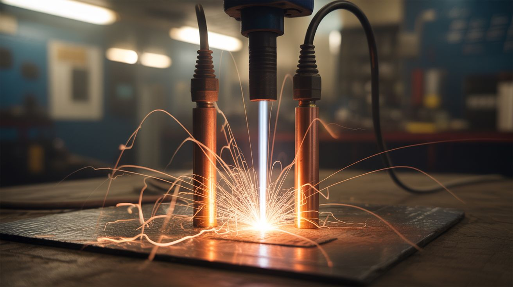

# High Voltage Safety

  

> Electricity doesn't give warnings. It doesn't care how careful you think you are. It kills in a fraction of a second.

This guide covers the specific safety procedures for builds that involve dangerous voltages. If a build uses a microwave oven transformer (MOT), CRT flyback transformer, capacitor bank, or any voltage above 50V AC / 120V DC, this guide applies.

---

## Understanding the Danger

It's not the voltage that kills — it's the current flowing through your body. But voltage determines whether current can flow at all (it has to overcome your skin's resistance). Here's the reality:

| Voltage | Current Path | Result |
|---|---|---|
| 50V AC | Hand to hand (through heart) | Can be lethal under right conditions |
| 120V AC (wall outlet) | Hand to hand | Severe shock, potentially fatal |
| 2,000V AC (MOT secondary) | Any path through body | Almost certainly fatal |
| 10,000-30,000V DC (CRT anode) | Any path through body | Almost certainly fatal |

**Key fact:** A MOT delivers 2,000V at 500mA-1A. It takes only 100mA through the heart to cause ventricular fibrillation (cardiac arrest). A MOT delivers 5-10 times the lethal current. There is no "minor shock" from a MOT.

---

## Capacitor Discharge Procedures

Capacitors store electrical charge and can deliver it all at once — even when the device is unplugged. A charged capacitor is a time bomb sitting in your project.

### Microwave Oven Capacitors

MOT capacitors are typically rated at ~2,100V and 1µF. They store enough energy (approximately 2.2 joules) to be lethal.

**Discharge procedure:**

1. **Unplug the microwave** and wait 60 seconds.
2. **Build a discharge tool:** Connect a 10k ohm, **50-watt** resistor between two insulated-handle screwdrivers or probes. The resistor limits the discharge current, preventing violent arcing. A 10W resistor is NOT sufficient — peak power during discharge can exceed 400W momentarily, and an undersized resistor can fail open, leaving the capacitor still charged.
3. **Touch both probes to the capacitor terminals simultaneously.** Hold for 10 seconds. You may see a small spark — that's the stored charge dissipating through the resistor.
4. **Verify with a multimeter** set to DC voltage. Read across the capacitor terminals. The reading should be less than 1V. If it's higher, discharge again.
5. **Short the terminals** with a screwdriver (insulated handle) as a final safety measure. You should see no spark if the discharge was successful.

**NEVER just short a capacitor with a screwdriver without the resistor.** The instantaneous discharge can weld the screwdriver to the terminal, arc-flash, or damage the capacitor (causing it to rupture or leak).

### CRT Anode Capacitor

The CRT tube itself acts as a capacitor. The inner coating (aquadag) and outer coating form the two plates, with the glass as the dielectric. The anode can hold 10,000-30,000V for weeks after unplugging.

**Discharge procedure:**

1. **Unplug the TV** and wait at least 5 minutes.
2. **Build a discharge tool:** Connect a 10M ohm, **25-watt** resistor to a thick insulated wire, with one end clipped to the chassis ground (metal frame or the grounding strap on the CRT). Peak power during discharge can reach 10W, and a 5W resistor can fail — use a higher-rated resistor for safety margin.
3. **Wearing insulated gloves,** slide the other end of the wire under the rubber anode cap on the side of the CRT tube. You should hear a loud SNAP — that's the stored charge.
4. **Leave the discharge wire connected for 30 seconds** to drain any residual charge.
5. **Verify:** Disconnect and reconnect the discharge tool. If there's a second snap (smaller), repeat. Some CRTs have "bounce back" — they rebuild a partial charge after initial discharge.

### Capacitor Banks (Electromagnetic Can Crusher, Coil Gun, etc.)

These are the most dangerous capacitors in any build — banks of large electrolytic capacitors charged to hundreds or thousands of volts, storing tens or hundreds of joules. Enough energy to cause severe burns or cardiac arrest.

**Rules:**

- **ALWAYS have a physical discharge mechanism** built into the device — a high-wattage resistor (or bank of resistors) that can be switched across the capacitor bank to drain it safely.
- **Verify voltage with a multimeter** before touching anything, every single time.
- **Treat every capacitor as charged** until you personally verify it's discharged. Don't trust someone else's word. Don't trust that you "already discharged it."
- **Bleeder resistors:** Install a permanent bleeder resistor across the capacitor bank. This slowly drains the charge over time as a passive safety measure. It does NOT replace active discharge procedures.

---

## The One-Hand Rule

When working on or near high-voltage circuits:

**Keep one hand in your pocket or behind your back.**

This is not a joke. This is standard practice in electrical engineering labs, power companies, and any environment where lethal voltage is present.

**Why:** If you touch a high-voltage source with both hands, the current path goes hand-to-hand THROUGH YOUR HEART. This is the most lethal shock path. If you touch it with one hand only, the current path goes through that arm to ground — still dangerous, still painful, but much less likely to cause cardiac arrest.

**Practice this every time** you're near energized high-voltage equipment. It should become automatic.

---

## Required Equipment for HV Builds

| Equipment | Purpose | Approximate Cost |
|---|---|---|
| **Insulated gloves** (Class 00 or higher) | Protect against shock up to 500V-1,000V. These are NOT rubber dishwashing gloves — they are rated electrical insulation gloves. | $20-40 |
| **Rubber mat** (electrical insulating mat) | Stand on this. It insulates you from ground, reducing shock current through your body. | $15-30 |
| **Discharge tool** | Resistor + insulated probes for safely discharging capacitors. Build one before you need it. | $5 (DIY) |
| **Multimeter** | Verify voltage is zero before touching anything. Use it EVERY time. | $15-30 |
| **Kill switch** | Physical switch that disconnects mains power, within arm's reach. Not a software switch, not a relay — a physical, manual disconnect. | $5-10 |
| **Fire extinguisher (Class C rated)** | Electrical fires. Class C means safe to use on energized equipment. | $20-30 |
| **Safety goggles** | Arc flash can blind. Goggles protect against UV from arcs and flying debris from capacitor failures. | $5-10 |
| **Non-contact voltage tester** | Quick check for live wires without touching them. Not a substitute for a multimeter, but a fast first-pass safety check. | $15-20 |

---

## High Voltage Builds — Voltage Table

| Build | Voltage Range | Current | Lethality | Source |
|---|---|---|---|---|
| [Plasma Tornado Lamp](../../categories/fire-and-plasma/001-plasma-tornado-lamp.md) | ~2,000V AC | 500mA+ | **LETHAL** | MOT secondary |
| [Lichtenberg Wood Burner](../../categories/fire-and-plasma/002-lichtenberg-wood-burner.md) | ~2,000V AC | 500mA+ | **LETHAL** | MOT secondary |
| [Atmospheric Reentry Simulator](../../categories/fire-and-plasma/006-atmospheric-reentry-simulator.md) | ~2,000V AC | 500mA+ | **LETHAL** | MOT secondary |
| [Musical Tesla Coil](../../categories/mad-scientist/033-musical-tesla-coil.md) | 100,000V+ | Low (RF) | Dangerous | Resonant transformer |
| [Jacob's Ladder](../../categories/mad-scientist/034-jacobs-ladder.md) | 10,000-15,000V | Moderate | **LETHAL** | Neon sign transformer / MOT |
| [Electromagnetic Can Crusher](../../categories/mad-scientist/035-electromagnetic-can-crusher.md) | 400-1,000V DC | Extremely high (capacitor bank) | **LETHAL** | Capacitor bank |
| [Rail Gun](../../categories/mad-scientist/036-rail-gun.md) | 400-1,000V DC | Extremely high (capacitor bank) | **LETHAL** | Capacitor bank |
| [Coil Gun](../../categories/mad-scientist/037-coil-gun.md) | 200-450V DC | High (capacitor bank) | **LETHAL** | Capacitor bank |
| [DIY Neon Sign](../../categories/chemical-electronic/166-diy-neon-sign.md) | 2,000-15,000V | Low | Dangerous | Neon sign transformer |
| [Vacuum Tube Amp](../../categories/chemical-electronic/169-vacuum-tube-amp.md) | 200-400V DC | Low | Dangerous | Power supply |
| [Ozone Generator](../../categories/chemical-electronic/167-ozone-generator.md) | 5,000-15,000V | Very low | Dangerous | HV module |

---

## What to Do if Someone Gets Shocked

### If They Are Still in Contact with the Electrical Source

1. **DO NOT TOUCH THEM.** You will become part of the circuit. You will also be shocked.
2. **Cut the power.** Flip the kill switch, unplug the device, or turn off the circuit breaker. If you can't reach the power source safely, use a DRY non-conductive object (wooden broom handle, dry rope, thick rubber mat) to push the person away from the source.
3. **Call 911 immediately.**

### After They Are Free from the Source

1. **Check responsiveness.** Call their name, tap their shoulder.
2. **Check for breathing and pulse.** If they are not breathing or have no pulse, begin CPR immediately. Electrical shock causes cardiac arrest — CPR can save their life if started within minutes.
3. **Call 911** if you haven't already. Tell them: "Electrical shock, [voltage if known], [person is/isn't breathing]."
4. **Look for burns.** Electrical burns occur at the entry and exit points of the current. These may look minor on the surface but can be severe internally. Cover burns loosely with a clean cloth.
5. **Do not move the person** unless they are in continued danger (near fire, ongoing electrical hazard).
6. **Keep them warm** and comfortable until emergency services arrive. Shock victims can go into physical shock (low blood pressure, cold skin).

### Preventing the Situation

- **Always use a kill switch** within arm's reach.
- **Never work alone** on builds above ⭐⭐⭐.
- **Make sure your helper knows** where the kill switch is, what to do if you get shocked (DO NOT TOUCH, cut power first), and to call 911.
- **Have a charged phone nearby** — not across the shop, not upstairs.

---

## Electrical Fire Safety

Electrical fires are Class C fires. Standard rules:

- **NEVER use water** on an energized electrical fire. Water conducts electricity — you'll be shocked.
- **Use a Class C rated fire extinguisher** (CO2 or dry chemical). ABC-rated extinguishers are also safe for electrical fires.
- **If possible, de-energize first.** Once the power is off, it becomes a Class A fire (ordinary combustible) and water is safe.
- **Capacitor fires:** If a capacitor ruptures and catches fire, the electrolyte is flammable. Keep distance. The burning electrolyte produces toxic fumes. Ventilate the area.

---

## Specific Component Warnings

### Microwave Oven Transformers (MOTs)

- The secondary winding outputs ~2,000V at 500mA-1A. This is 5-10x the lethal current level.
- MOTs are intentionally designed to deliver high current — they are NOT current-limited like neon sign transformers.
- The secondary winding is often connected to the core (chassis ground). Touching the core while touching the secondary output = shock.
- Always remove the magnetic shunts intentionally if you want more power, but understand that this makes the transformer even more dangerous.

### Capacitors

- Treat EVERY capacitor as charged until you personally verify it's discharged with a multimeter.
- Oil-filled capacitors (MOT caps) can rupture and leak carcinogenic PCB oil (in older units). Dispose of properly.
- Electrolytic capacitors can explode if connected with reversed polarity or charged beyond their rated voltage. The explosion sprays caustic electrolyte.

### CRT Tubes

- The anode holds charge for weeks. Discharge EVERY time, even if "you just discharged it yesterday."
- The tube is under vacuum. A broken CRT implodes, sending glass in all directions. Handle with extreme care. Wear goggles.
- The phosphor coating contains toxic compounds. Never break the screen intentionally.

### Neon Sign Transformers (NSTs)

- Lower current than MOTs (typically 30-60mA) but much higher voltage (2,000-15,000V). Still dangerous and potentially lethal.
- NSTs are current-limited, which makes them slightly less dangerous than MOTs, but "less dangerous" is not "safe."

---

## The Golden Rules

1. **One hand at a time.** Always.
2. **Discharge first.** Always.
3. **Verify with a meter.** Always.
4. **Kill switch within reach.** Always.
5. **Someone knows what you're doing.** Always.
6. **When in doubt, don't.** Always.
