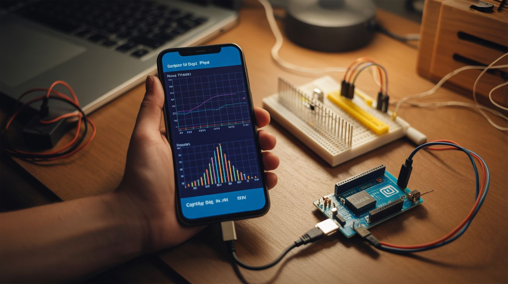

# Android Apps for Builds

<p align="center">
  
</p>

> Your old phone is already packed with accelerometers, gyroscopes, magnetometers, barometers, cameras, and microphones. These apps unlock them for builds.

A phone you already own (or a $30 used phone from eBay) has more sensors than most microcontroller setups. These apps turn a phone into a lab instrument, controller, camera system, or data logger — no soldering required.

---

## Phyphox

**What it does:** The single best physics sensor app. Built by RWTH Aachen University. Gives you direct access to every sensor on your phone with real-time graphs, data export (CSV, Excel), and remote access via a built-in web server (control the phone from your laptop browser).

**Sensors accessible:** Accelerometer, gyroscope, magnetometer, barometer, light sensor, proximity sensor, GPS, microphone (with FFT, autocorrelation, and spectrum analysis).

**Key features:**
- Real-time graphing of all sensor data
- Data export to CSV for analysis in Python/Excel
- Remote access — control the phone from any device on the same WiFi network
- Custom experiments — chain multiple sensors and processing steps
- Acoustic stopwatch (measures time between sounds)
- Doppler effect measurement
- Pendulum period analysis

**Used in builds:**
- [Phone Sensor Network](../categories/computer-and-phone/064-phone-sensor-network.md) — multi-phone sensor logging
- [Earthquake Detector](../categories/python-projects/146-earthquake-detector.md) — accelerometer data capture
- Calibration and testing across many builds

**Free/Paid:** Completely free, no ads, open source.

**Platform:** Android and iOS. [Google Play link](https://play.google.com/store/apps/details?id=de.rwth_aachen.phyphox)

---

## Spectroid

**What it does:** Real-time audio spectrum analyzer. Shows a scrolling spectrogram (frequency vs time) with color-coded intensity. Excellent for visualizing sound patterns, finding resonant frequencies, and diagnosing audio issues.

**Key features:**
- Real-time scrolling spectrogram
- Frequency range up to 22kHz (limited by phone microphone)
- Peak frequency display
- Adjustable FFT size and window function
- Waterfall display mode

**Used in builds:**
- [Arduino Guitar Pedal](../categories/pi-and-arduino/124-arduino-guitar-pedal.md) — verifying audio effects
- [MIDI Stepper Organ](../categories/pi-and-arduino/135-midi-stepper-organ.md) — tuning stepper frequencies
- [Hard Drive Speaker](../categories/computer-and-phone/056-hard-drive-speaker.md) — testing frequency response
- Any build that produces or modifies sound

**Free/Paid:** Free, with ads. No paid version needed — the free version is fully functional.

**Platform:** Android. [Google Play link](https://play.google.com/store/apps/details?id=org.intoorbit.spectrum)

---

## Physics Toolbox Suite

**What it does:** Multi-sensor data logger that records and exports data from all phone sensors simultaneously. More focused on data logging and export than Phyphox's experiment-building approach.

**Key features:**
- Simultaneous recording from multiple sensors
- CSV data export
- Real-time multi-axis graphs
- GPS logger with altitude and speed
- Sound level meter (dB)
- Tone generator (for testing speakers and microphones)
- Stroboscope function

**Used in builds:**
- [Phone Sensor Network](../categories/computer-and-phone/064-phone-sensor-network.md) — data logging
- [Earthquake Detector](../categories/python-projects/146-earthquake-detector.md) — vibration recording
- Testing and calibration across builds

**Free/Paid:** Free version available. Pro version ($2.99) removes ads and adds multi-sensor simultaneous recording.

**Platform:** Android and iOS. [Google Play link](https://play.google.com/store/apps/details?id=com.chrystianvieyra.physicstoolboxsuite)

---

## FrequenSee

**What it does:** Audio frequency visualizer with a clean, readable interface. Shows real-time frequency spectrum as a bar graph or line graph. Simpler than Spectroid but easier to read at a glance.

**Key features:**
- Real-time frequency spectrum display
- Peak hold (shows the highest level reached at each frequency)
- Adjustable frequency range and resolution
- Clean, high-contrast display
- dB scale with adjustable range

**Used in builds:**
- [Plasma Speaker](../categories/sound-and-music/) — verifying audio reproduction quality
- Audio testing for any build with speakers or microphones
- Finding resonant frequencies of mechanical structures

**Free/Paid:** Free.

**Platform:** Android. [Google Play link](https://play.google.com/store/apps/details?id=com.makinolo.frequensee)

---

## IP Webcam

**What it does:** Turns your phone into a network-accessible IP camera. Streams video (and audio) over WiFi that can be captured by Python scripts (OpenCV), VLC, or any RTSP/MJPEG client. Effectively gives you a free wireless camera for any build.

**Key features:**
- MJPEG and RTSP video streaming over WiFi
- Accessible via browser (http://phone-ip:8080)
- OpenCV-compatible URL: `http://phone-ip:8080/video`
- Motion detection with recording
- Audio streaming
- Flash/torch control via API
- Autofocus control
- Sensor data overlay (accelerometer, GPS) on video

**Used in builds:**
- [Face Tracking Laser](../categories/python-projects/141-face-tracking-laser.md) — video source for OpenCV (alternative to USB webcam)
- [AI Photo Booth](../categories/python-projects/143-ai-photo-booth.md) — camera source
- [AI Doorbell](../categories/pi-and-arduino/130-ai-doorbell.md) — camera feed
- [ESP32-CAM Security](../categories/pi-and-arduino/128-esp32-cam-security.md) — alternative/additional camera
- Any build needing a wireless camera feed

**Free/Paid:** Free version fully functional. Pro version ($3.99) adds features like cloud streaming and tasker integration.

**Platform:** Android. [Google Play link](https://play.google.com/store/apps/details?id=com.pas.webcam)

**Python integration example:**
```python
import cv2
cap = cv2.VideoCapture("http://192.168.1.100:8080/video")
while True:
    ret, frame = cap.read()
    if ret:
        cv2.imshow("Phone Camera", frame)
    if cv2.waitKey(1) & 0xFF == ord('q'):
        break
```

---

## Sensors Multitool

**What it does:** Raw sensor access with numerical readouts. Shows the exact values from every sensor on your phone in real time — no graphs, no processing, just raw numbers. Useful for verifying sensor functionality and reading precise values.

**Key features:**
- Lists every sensor on your phone with model numbers and specs
- Real-time numerical readout of all sensor axes
- Magnetic field strength in microtesla (useful for magnet testing)
- Barometric pressure in hPa
- Light level in lux
- Proximity sensor distance
- Sensor specifications (range, resolution, power draw)

**Used in builds:**
- [EMF Ghost Detector](../categories/pi-and-arduino/140-emf-ghost-detector.md) — comparing phone magnetometer readings with Arduino EMF sensor
- Verifying sensor calibration and functionality
- Quick magnetic field measurements (testing salvaged magnets)

**Free/Paid:** Free, with ads.

**Platform:** Android. [Google Play link](https://play.google.com/store/apps/details?id=com.wered.sensorsmultitool)

---

## Arduino Bluetooth Controller

**What it does:** Sends commands to an Arduino or ESP32 via Bluetooth. Provides virtual buttons, joystick, slider, and terminal interfaces. The fastest way to add wireless control to a microcontroller build without writing a custom app.

**Key features:**
- Button mode — up to 6 customizable buttons, each sends a character or string
- Joystick mode — sends X/Y coordinates continuously
- Slider mode — sends a value from 0-255
- Terminal mode — send and receive text strings
- Accelerometer mode — sends phone tilt data
- Voice control mode — speech-to-text commands

**Used in builds:**
- [ESP32 Mesh Walkie-Talkie](../categories/pi-and-arduino/125-esp32-mesh-walkie-talkie.md) — configuration interface
- [Nerf Sentry Turret](../categories/pi-and-arduino/138-nerf-sentry-turret.md) — manual override control
- [Electric Skateboard](../categories/scooter-and-motor/088-electric-skateboard.md) — configuration and diagnostics
- Any Arduino/ESP32 build needing wireless control

**Free/Paid:** Free version supports basic modes. Pro version ($1.99) adds more buttons and features.

**Platform:** Android. [Google Play link](https://play.google.com/store/apps/details?id=com.giristudio.hc05.bluetooth.arduino.controller)

---

## Quick Reference Table

| App | Primary Use | Phone Sensors Used | Connects To | Free? |
|---|---|---|---|---|
| Phyphox | Full sensor lab | All sensors | WiFi (remote access) | Yes |
| Spectroid | Audio spectrum analysis | Microphone | None (standalone) | Yes |
| Physics Toolbox Suite | Multi-sensor data logging | All sensors | CSV export | Free/Pro |
| FrequenSee | Audio frequency display | Microphone | None (standalone) | Yes |
| IP Webcam | Network camera | Camera, microphone | WiFi (HTTP/RTSP) | Free/Pro |
| Sensors Multitool | Raw sensor readouts | All sensors | None (standalone) | Yes |
| Arduino BT Controller | Bluetooth remote control | Accelerometer (optional) | Bluetooth to Arduino/ESP32 | Free/Pro |

---

## Tips for Using Phones in Builds

1. **Use an old phone.** Dedicate a used phone to your build rather than risking your daily driver. A used Android phone with working sensors costs $20-30 on eBay.

2. **Keep the phone plugged in.** For builds that run continuously (cameras, sensor networks), power the phone via USB to prevent battery drain. Disable battery optimization for the app.

3. **Lock the screen on.** Many apps stop streaming or logging when the screen turns off. Use a "Stay Alive" or "Caffeine" app, or enable Developer Options > Stay Awake (while charging).

4. **Connect to local WiFi.** For IP Webcam and Phyphox remote access, the phone and your computer/Pi must be on the same WiFi network. Use the phone's IP address (Settings > WiFi > tap your network > IP address).

5. **Disable notifications.** Notifications can interrupt apps and cause data gaps. Use Do Not Disturb mode during data collection.
