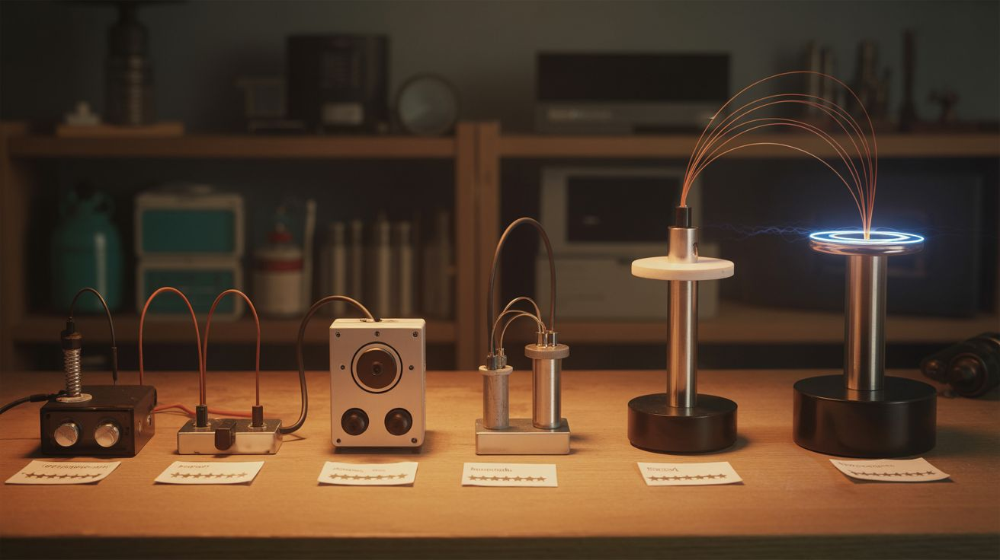
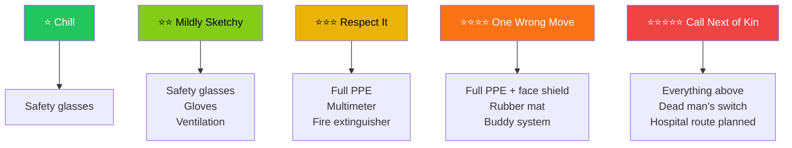

# Difficulty & Ratings Guide

  

> Every build in this repo is rated on six dimensions. None of them are "overall difficulty" because that's a lazy metric that tells you nothing useful. A build can be dead simple to execute but genuinely dangerous, or technically brilliant but cheap and safe. The six scales tell you what you're actually signing up for.

---

## The 6-Scale Rating System

| Dimension | What It Measures | Range |
|---|---|---|
| **Jaw Drop** | Visual impact / wow factor | ⭐ to ⭐⭐⭐⭐⭐ |
| **Brain Melt** | Technical complexity | ⭐ to ⭐⭐⭐⭐⭐ |
| **Wallet Damage** | Out-of-pocket cost after salvaging | ⭐ to ⭐⭐⭐⭐⭐ |
| **Spicy Level** | Danger / safety risk | ⭐ to ⭐⭐⭐⭐⭐ |
| **Clout Potential** | Social media / bragging rights | ⭐ to ⭐⭐⭐⭐⭐ |
| **Time to Build** | Total build time | ⭐ to ⭐⭐⭐⭐⭐ |

---

### Jaw Drop Rating

Visual impact. How hard does this hit when someone sees it for the first time?

| Rating | Description | Example Builds |
|---|---|---|
| ⭐ | "Huh, neat." Interesting if you explain it. Doesn't stop scrolling. | [#198 Homopolar Motor](../categories/weird-science/198-homopolar-motor.md), [#068 RAM Stick Ruler](../categories/computer-and-phone/068-ram-stick-ruler.md) |
| ⭐⭐ | "Oh, cool." Gets a second look. Makes someone lean in. | [#184 Chain Fountain](../categories/mechanical-and-kinetic/184-chain-fountain.md), [#107 Bismuth Crystal Garden](../categories/pyro-and-chemistry/107-bismuth-crystal-garden.md) |
| ⭐⭐⭐ | "Wait, how?" Stops conversation. People pull out their phones. | [#042 Grape Plasma](../categories/mad-scientist/042-grape-plasma.md), [#016 Infinity Mirror Table](../categories/light-and-visual/016-infinity-mirror-table.md) |
| ⭐⭐⭐⭐ | "That's not real." Genuinely hard to believe it was built from junk. | [#033 Musical Tesla Coil](../categories/mad-scientist/033-musical-tesla-coil.md), [#009 Rubens' Tube](../categories/sound-and-music/009-rubens-tube.md) |
| ⭐⭐⭐⭐⭐ | "I need to rethink my life." Changes what someone believes is possible with salvaged parts. | [#055 Levitating Plasma Speaker](../categories/unholy-combos/055-levitating-plasma-speaker.md), [#181 Musical Marble Machine](../categories/mechanical-and-kinetic/181-musical-marble-machine.md) |

---

### Brain Melt Level

Technical complexity. How much do you need to understand before you can build this?

| Rating | Description | Example Builds |
|---|---|---|
| ⭐ | Follow the instructions. If you can read, you can build it. | [#101 Colored Fire](../categories/pyro-and-chemistry/101-colored-fire.md), [#280 Density Tower](../categories/household-chemistry/280-density-tower.md) |
| ⭐⭐ | Basic skills required — soldering, wiring, or simple mechanical assembly. One afternoon of YouTube gets you there. | [#187 Ball Bearing Motor](../categories/mechanical-and-kinetic/187-ball-bearing-motor.md), [#139 Pi-Hole Ad Blocker](../categories/pi-and-arduino/139-pi-hole-ad-blocker.md) |
| ⭐⭐⭐ | Multiple skill domains. You need to understand the theory, not just follow steps. Things can go wrong in non-obvious ways. | [#122 LED Cube 8x8x8](../categories/pi-and-arduino/122-led-cube-8x8x8.md), [#156 Electroplating Station](../categories/chemical-electronic/156-electroplating-station.md) |
| ⭐⭐⭐⭐ | Serious engineering. You're designing circuits, debugging invisible problems, and troubleshooting failures with a multimeter and an oscilloscope. | [#033 Musical Tesla Coil](../categories/mad-scientist/033-musical-tesla-coil.md), [#141 Face Tracking Laser](../categories/python-projects/141-face-tracking-laser.md) |
| ⭐⭐⭐⭐⭐ | You're basically doing R&D. The build doc gets you started, but you'll be reading datasheets, solving novel problems, and iterating through failures. Nobody's holding your hand. | [#036 Rail Gun](../categories/mad-scientist/036-rail-gun.md), [#153 Deepfake Mirror](../categories/python-projects/153-deepfake-mirror.md) |

---

### Wallet Damage

Out-of-pocket cost AFTER salvaging what you can. Every build assumes you're scavenging hard before you spend a dime.

| Rating | Cost Range | Description | Example Builds |
|---|---|---|---|
| ⭐ | $0 | Free. Trash only. Everything comes from the junk pile. | [#198 Homopolar Motor](../categories/weird-science/198-homopolar-motor.md), [#058 HDD Platter Wind Chimes](../categories/computer-and-phone/058-hdd-platter-wind-chimes.md) |
| ⭐⭐ | $1–15 | A few bucks for consumables — solder, wire, a chemical you can't salvage. | [#101 Colored Fire](../categories/pyro-and-chemistry/101-colored-fire.md), [#184 Chain Fountain](../categories/mechanical-and-kinetic/184-chain-fountain.md) |
| ⭐⭐⭐ | $15–50 | Real money, but nothing that hurts. Microcontrollers, specialty chemicals, specific components. | [#132 ESP32 Weather Station](../categories/pi-and-arduino/132-esp32-weather-station.md), [#107 Bismuth Crystal Garden](../categories/pyro-and-chemistry/107-bismuth-crystal-garden.md) |
| ⭐⭐⭐⭐ | $50–150 | You're investing. Buying modules, sensors, structural materials, or specialty parts that don't exist in junk piles. | [#088 Electric Skateboard](../categories/scooter-and-motor/088-electric-skateboard.md), [#123 Smart Mirror](../categories/pi-and-arduino/123-smart-mirror.md) |
| ⭐⭐⭐⭐⭐ | $150+ | Even with aggressive salvaging, this build costs real money. Capacitor banks, large motors, precision components. | [#036 Rail Gun](../categories/mad-scientist/036-rail-gun.md), [#024 Electric Go-Kart](../categories/functional-machines/024-electric-go-kart.md) |

---

### Spicy Level

Danger. This is the one that matters most. Ignore the other ratings if you want — never ignore this one.

| Rating | Name | Description | Example Builds |
|---|---|---|---|
| ⭐ | Chill | Paper cuts and stubbed toes. The worst that happens is a minor inconvenience. | [#171 Pepper's Ghost Hologram](../categories/light-and-visual/171-peppers-ghost-hologram.md), [#280 Density Tower](../categories/household-chemistry/280-density-tower.md) |
| ⭐⭐ | Mildly Sketchy | Soldering iron burns, minor chemical exposure, hot glue blisters. Routine shop hazards. Respect them, but they won't send you to the ER. | [#187 Ball Bearing Motor](../categories/mechanical-and-kinetic/187-ball-bearing-motor.md), [#122 LED Cube 8x8x8](../categories/pi-and-arduino/122-led-cube-8x8x8.md) |
| ⭐⭐⭐ | Respect It | High voltage, power tools, toxic chemicals. Things that punish carelessness with real injuries. You need to understand the hazards before you start. | [#034 Jacob's Ladder](../categories/mad-scientist/034-jacobs-ladder.md), [#110 Pharaoh's Serpent](../categories/pyro-and-chemistry/110-pharaohs-serpent.md) |
| ⭐⭐⭐⭐ | One Wrong Move | One mistake means a hospital visit. MOT capacitors, high-current circuits, molten metal, concentrated acids. Serious preparation required. Don't work alone. | [#005 Desktop Foundry](../categories/fire-and-plasma/005-desktop-foundry.md), [#035 Electromagnetic Can Crusher](../categories/mad-scientist/035-electromagnetic-can-crusher.md) |
| ⭐⭐⭐⭐⭐ | Call Next of Kin | Can kill you if you're careless. Lethal voltage, thermite-class reactions, capacitor banks storing enough energy to stop a heart. Read ALL safety documentation before you touch a single component. | [#036 Rail Gun](../categories/mad-scientist/036-rail-gun.md), [#105 Thermite Flower Pot](../categories/pyro-and-chemistry/105-thermite-flower-pot.md) |

**Required safety gear by spicy level:**

| Spicy Level | Minimum Safety Gear |
|---|---|
| ⭐ | Safety glasses |
| ⭐⭐ | Safety glasses, nitrile gloves, ventilation |
| ⭐⭐⭐ | Full PPE (glasses, gloves, closed-toe shoes), multimeter, fire extinguisher |
| ⭐⭐⭐⭐ | Full PPE + face shield, rubber insulating mat, buddy system (never work alone) |
| ⭐⭐⭐⭐⭐ | Everything above + dead man's switch on circuits, hospital route planned, someone who knows what you're doing and when you're doing it |

---

### Clout Potential

Social media and bragging rights. How much attention will this get when you post it?

| Rating | Description | Example Builds |
|---|---|---|
| ⭐ | Your mom likes it. That's about it. | [#139 Pi-Hole Ad Blocker](../categories/pi-and-arduino/139-pi-hole-ad-blocker.md), [#068 RAM Stick Ruler](../categories/computer-and-phone/068-ram-stick-ruler.md) |
| ⭐⭐ | Your friends think it's cool. Gets some engagement in maker communities. | [#127 Auto Plant Watering](../categories/pi-and-arduino/127-auto-plant-watering.md), [#132 ESP32 Weather Station](../categories/pi-and-arduino/132-esp32-weather-station.md) |
| ⭐⭐⭐ | Strangers share it. Solid Reddit/TikTok material. "That's actually sick." | [#042 Grape Plasma](../categories/mad-scientist/042-grape-plasma.md), [#016 Infinity Mirror Table](../categories/light-and-visual/016-infinity-mirror-table.md) |
| ⭐⭐⭐⭐ | Goes semi-viral. People who don't care about building things share it because it looks unreal. | [#009 Rubens' Tube](../categories/sound-and-music/009-rubens-tube.md), [#033 Musical Tesla Coil](../categories/mad-scientist/033-musical-tesla-coil.md) |
| ⭐⭐⭐⭐⭐ | Main character energy. The algorithm picks it up. News outlets repost it. Your DMs don't recover. | [#055 Levitating Plasma Speaker](../categories/unholy-combos/055-levitating-plasma-speaker.md), [#053 Singing Ferrofluid Tornado](../categories/unholy-combos/053-singing-ferrofluid-tornado.md) |

---

### Time to Build

From first teardown to final test. Assumes you have the tools and materials ready.

| Rating | Time Range | Description | Example Builds |
|---|---|---|---|
| ⭐ | Under 1 hour | Quick hit. Set up, build, film, clean up. One sitting. | [#198 Homopolar Motor](../categories/weird-science/198-homopolar-motor.md), [#101 Colored Fire](../categories/pyro-and-chemistry/101-colored-fire.md) |
| ⭐⭐ | 1–4 hours | An afternoon project. Start after lunch, done by dinner. | [#184 Chain Fountain](../categories/mechanical-and-kinetic/184-chain-fountain.md), [#042 Grape Plasma](../categories/mad-scientist/042-grape-plasma.md) |
| ⭐⭐⭐ | 4–12 hours | A full day or a couple evenings. You'll sleep on it at least once. | [#122 LED Cube 8x8x8](../categories/pi-and-arduino/122-led-cube-8x8x8.md), [#156 Electroplating Station](../categories/chemical-electronic/156-electroplating-station.md) |
| ⭐⭐⭐⭐ | 1–3 weekends | Multi-session build. You'll have a work-in-progress on your bench for a while. Plan for iterating and debugging. | [#033 Musical Tesla Coil](../categories/mad-scientist/033-musical-tesla-coil.md), [#182 Stirling Engine](../categories/mechanical-and-kinetic/182-stirling-engine.md) |
| ⭐⭐⭐⭐⭐ | Multi-weekend marathon | This is a campaign, not a project. Weeks of work across multiple sessions. The kind of build that earns a dedicated shelf in your shop. | [#036 Rail Gun](../categories/mad-scientist/036-rail-gun.md), [#181 Musical Marble Machine](../categories/mechanical-and-kinetic/181-musical-marble-machine.md) |

---

## Danger Level Deep Dive

The spicy level rating is the only one that can put you in the hospital. Here's exactly what each level looks like, what hazards it includes, and what you need on hand before you start.

**Specific hazards by level:**

| Level | Hazards You'll Encounter | What "Going Wrong" Looks Like |
|---|---|---|
| ⭐ Chill | Sharp edges, minor pinches, hot glue drips | Band-aid territory |
| ⭐⭐ Mildly Sketchy | Soldering iron burns (350-400C), mild chemical skin irritation, small cuts from wire and sheet metal | A blister, a rash, or a nick that bleeds for a minute |
| ⭐⭐⭐ Respect It | Mains voltage (120/240V), angle grinder kickback, toxic fumes, corrosive chemicals | Burns, lacerations, chemical exposure that needs flushing, electrical shock that hurts but doesn't kill |
| ⭐⭐⭐⭐ One Wrong Move | MOT output (2000V+), molten metal splashes, concentrated acid spills, high-current arcs, spinning machinery | Deep burns, broken bones from kickback, acid burns requiring medical treatment, cardiac disruption |
| ⭐⭐⭐⭐⭐ Call Next of Kin | Capacitor banks (lethal energy storage), thermite (4000F), rail gun projectiles, high-energy electromagnetic discharge | Electrocution, severe burns over large areas, shrapnel injuries, fires that can't be conventionally extinguished |

**The golden rule:** If you're not sure which spicy level you're comfortable with, build a few ⭐⭐ projects first. Learn what "being careful in a shop" feels like before you touch anything that doesn't forgive mistakes.

---

## What Should I Build First?

Pick your row. Build the thing. Come back for more.

| You Have | Comfort Level | Start With |
|---|---|---|
| Nothing | Curious | [#198 Homopolar Motor](../categories/weird-science/198-homopolar-motor.md) |
| Basic hand tools | Beginner | [#184 Chain Fountain](../categories/mechanical-and-kinetic/184-chain-fountain.md) |
| Soldering iron | Ready | [#042 Grape Plasma](../categories/mad-scientist/042-grape-plasma.md) |
| Multimeter + solder | Intermediate | [#009 Rubens' Tube](../categories/sound-and-music/009-rubens-tube.md) |
| Full toolkit | Confident | [#033 Musical Tesla Coil](../categories/mad-scientist/033-musical-tesla-coil.md) |
| Everything | Fearless | [#055 Levitating Plasma Speaker](../categories/unholy-combos/055-levitating-plasma-speaker.md) |

The progression isn't arbitrary. Each build teaches you the skills and safety instincts the next one requires. Skipping ahead is how people get hurt or get frustrated. Start where you are. The hard stuff isn't going anywhere.

---

## See Also

- [Skill Trees](skill-trees.md) — progression paths by interest area
- [Tools Needed](tools-needed.md) — what each tool tier unlocks
