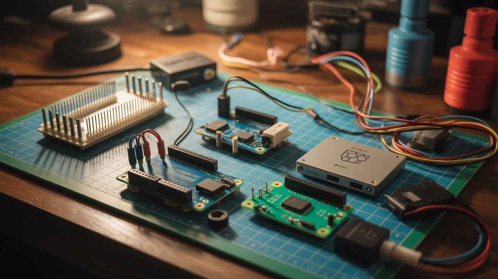

# Electronics & Microcontrollers Guide

  

> The brains, sensors, actuators, and power systems that bring junkyard builds to life.

This guide covers the electronic components and microcontroller platforms used across builds. If a build has code, sensors, or blinking lights, the parts are listed here.

---

## Microcontroller Platforms

### Raspberry Pi

A full Linux computer the size of a credit card. Runs Python, has GPIO pins for hardware control, and handles tasks like image processing, audio analysis, and web serving that would choke an Arduino.

| Model | CPU | RAM | Key Features | Approximate Cost |
|---|---|---|---|---|
| **Pi Zero 2 W** | Quad-core 1GHz | 512MB | Tiny, WiFi, $15. Good for headless builds where size matters. | ~$15 |
| **Pi 3 B+** | Quad-core 1.4GHz | 1GB | The workhorse. Enough power for most builds. WiFi + BT built in. | ~$35 |
| **Pi 4 B** | Quad-core 1.8GHz | 2/4/8GB | Dual HDMI, USB 3.0, enough power for OpenCV and media projects. | ~$35-75 |
| **Pi 5** | Quad-core 2.4GHz | 4/8GB | Latest generation. PCIe, faster I/O. Overkill for most builds but future-proof. | ~$60-80 |

**When to use a Pi:** When you need to run Python scripts, process images or audio, serve a web interface, or do anything that requires an operating system. If you're running OpenCV, a web server, or complex logic — use a Pi.

**Used in builds:**
- [Fireworks Sequencer](../categories/pi-and-arduino/121-fireworks-sequencer.md) — GPIO relay control
- [Smart Mirror](../categories/pi-and-arduino/123-smart-mirror.md) — web display
- [Retro Arcade Cabinet](../categories/pi-and-arduino/126-retro-arcade-cabinet.md) — emulation
- [Pi DJ Controller](../categories/pi-and-arduino/131-pi-dj-controller.md) — audio processing
- [Pi-Hole Ad Blocker](../categories/pi-and-arduino/139-pi-hole-ad-blocker.md) — DNS server
- [Face Tracking Laser](../categories/python-projects/141-face-tracking-laser.md) — OpenCV processing
- [Music Visualizer LED Wall](../categories/python-projects/145-music-visualizer-led-wall.md) — audio FFT + LED control
- All Python Projects category builds

---

### Arduino

An open-source microcontroller board. No operating system — it runs one program (sketch) in a loop. Dead simple, real-time, and perfect for hardware control tasks that don't need an OS.

| Model | Processor | Digital I/O | Analog In | Key Features | Approximate Cost |
|---|---|---|---|---|---|
| **Arduino Uno** | ATmega328P (16MHz) | 14 | 6 | The classic. Most tutorials and shields are designed for this. | ~$15-25 (official), ~$5 (clone) |
| **Arduino Nano** | ATmega328P (16MHz) | 14 | 8 | Same chip as the Uno but breadboard-friendly and tiny. | ~$3-5 (clone) |
| **Arduino Mega** | ATmega2560 (16MHz) | 54 | 16 | When you need more pins — LED cubes, multi-motor builds. | ~$10-15 (clone) |

**When to use an Arduino:** When you need real-time hardware control without the overhead of an operating system. Reading sensors, driving motors, controlling relays, running LED animations. If the task is "read input, do thing, repeat" — use an Arduino.

**Used in builds:**
- [Arduino Guitar Pedal](../categories/pi-and-arduino/124-arduino-guitar-pedal.md) — real-time audio DSP
- [Auto Plant Watering](../categories/pi-and-arduino/127-auto-plant-watering.md) — sensor reading + relay control
- [Arduino Breathalyzer](../categories/pi-and-arduino/133-arduino-breathalyzer.md) — MQ sensor reading
- [LED Cube 8x8x8](../categories/pi-and-arduino/122-led-cube-8x8x8.md) — high-speed LED multiplexing
- [MIDI Stepper Organ](../categories/pi-and-arduino/135-midi-stepper-organ.md) — precise stepper timing
- [Nerf Sentry Turret](../categories/pi-and-arduino/138-nerf-sentry-turret.md) — servo control
- [EMF Ghost Detector](../categories/pi-and-arduino/140-emf-ghost-detector.md) — analog sensing

---

### ESP32

A WiFi + Bluetooth microcontroller that costs less than a coffee. The sweet spot between Arduino simplicity and Pi connectivity. Programmable with the Arduino IDE, MicroPython, or ESP-IDF.

| Variant | Key Features | Approximate Cost |
|---|---|---|
| **ESP32 DevKit** | WiFi + BT, dual-core 240MHz, 34 GPIO, plenty of memory. The default choice. | ~$5-8 |
| **ESP32-CAM** | ESP32 + OV2640 camera module. Stream video over WiFi for $8. Absurd value. | ~$8-10 |
| **ESP32-S3** | Newer silicon, USB-OTG, better for TensorFlow Lite and edge computing. | ~$8-12 |

**When to use an ESP32:** When you need WiFi or Bluetooth connectivity, or when the project needs more processing power than an Arduino but doesn't need a full OS. Mesh networks, IoT sensors, wireless controllers, and camera projects are ESP32 territory.

**Used in builds:**
- [ESP32 Mesh Walkie-Talkie](../categories/pi-and-arduino/125-esp32-mesh-walkie-talkie.md) — mesh WiFi communication
- [ESP32-CAM Security](../categories/pi-and-arduino/128-esp32-cam-security.md) — video streaming
- [ESP32 Weather Station](../categories/pi-and-arduino/132-esp32-weather-station.md) — sensor data over WiFi
- [ESP32 Micro Drone](../categories/pi-and-arduino/136-esp32-micro-drone.md) — flight controller
- [Star Tracker](../categories/pi-and-arduino/137-star-tracker.md) — stepper motor control with mobile app

---

### When to Use Which

| Need | Use This |
|---|---|
| Run Python, OpenCV, web server, audio processing | Raspberry Pi |
| Real-time hardware control, simple sensor reading | Arduino |
| WiFi/Bluetooth connectivity, IoT, wireless | ESP32 |
| Camera over WiFi on a budget | ESP32-CAM |
| Maximum GPIO pins | Arduino Mega |
| Smallest possible footprint | Arduino Nano or ESP32 |
| Precise timing for motors/LEDs | Arduino (no OS jitter) |
| Run machine learning models | Raspberry Pi 4+ |

---

## Common Sensors

### BME280 — Temperature, Humidity, Pressure

**What it does:** Measures temperature (-40 to +85°C), humidity (0-100%), and barometric pressure (300-1100 hPa) in a single tiny module. Communicates via I2C or SPI.

**Approximate cost:** $3-5

**Used in builds:** [ESP32 Weather Station](../categories/pi-and-arduino/132-esp32-weather-station.md), [Fermentation Chamber](../categories/fridge-and-cooling/092-fermentation-chamber.md)

---

### MPU6050 — Accelerometer + Gyroscope

**What it does:** 6-axis inertial measurement unit (3-axis accelerometer + 3-axis gyroscope). Detects motion, tilt, rotation, and vibration. I2C interface.

**Approximate cost:** $2-4

**Used in builds:** [Earthquake Detector](../categories/python-projects/146-earthquake-detector.md), [ESP32 Micro Drone](../categories/pi-and-arduino/136-esp32-micro-drone.md), [Body Pose Music](../categories/python-projects/152-body-pose-music.md)

---

### HC-SR04 — Ultrasonic Distance Sensor

**What it does:** Measures distance (2-400 cm) by sending ultrasonic pulses and timing the echo. Accuracy ~3mm. Simple trigger/echo interface — no library needed.

**Approximate cost:** $1-3

**Used in builds:** [Nerf Sentry Turret](../categories/pi-and-arduino/138-nerf-sentry-turret.md) (proximity detection), general obstacle avoidance

---

### MQ Series — Gas Sensors

**What it does:** A family of metal-oxide semiconductor gas sensors. Different models detect different gases:
- MQ-2: Combustible gas, smoke
- MQ-3: Alcohol vapor
- MQ-7: Carbon monoxide
- MQ-135: Air quality (NH3, benzene, smoke)

**Approximate cost:** $2-5 each

**Used in builds:** [Arduino Breathalyzer](../categories/pi-and-arduino/133-arduino-breathalyzer.md) (MQ-3), environmental monitoring

---

### Soil Moisture Sensor

**What it does:** Measures the moisture content of soil using either resistive (cheap, corrodes fast) or capacitive (better, lasts longer) probes. Outputs analog voltage proportional to moisture.

**Approximate cost:** $1-3 (resistive), $3-5 (capacitive)

**Used in builds:** [Auto Plant Watering](../categories/pi-and-arduino/127-auto-plant-watering.md)

---

### Photoresistors (LDR)

**What it does:** A resistor whose resistance changes with light intensity. Bright light = low resistance, darkness = high resistance. The simplest light sensor possible.

**Approximate cost:** $0.10-0.50 each (usually sold in packs of 20-50)

**Used in builds:** [Star Tracker](../categories/pi-and-arduino/137-star-tracker.md) (ambient light detection), various light-activated builds

---

## Actuators

### Servo Motors

**What they do:** Rotate to a specific angle (0-180° typically) and hold position. Controlled by PWM signal. Available in micro (SG90, 9g) and standard (MG996R, 55g metal gear) sizes.

**Approximate cost:** $2-3 (micro), $5-8 (standard metal gear)

**Used in builds:** [Face Tracking Laser](../categories/python-projects/141-face-tracking-laser.md), [Nerf Sentry Turret](../categories/pi-and-arduino/138-nerf-sentry-turret.md), [Star Tracker](../categories/pi-and-arduino/137-star-tracker.md)

**Power note:** ALWAYS power servos from a separate 5V supply, not from the microcontroller's 5V pin. Servos draw current spikes that cause brownouts and resets.

---

### Stepper Motors

**What they do:** Rotate in precise, discrete steps (typically 200 steps per revolution = 1.8° per step). Can be microstepped to 1/16 or 1/32 step for smoother motion. Require a driver board (A4988, DRV8825, or TMC2209).

**Approximate cost:** $5-15 (NEMA 17), free (salvaged from printers — see [Appliance Teardown Guide](appliance-teardown-guide.md))

**Used in builds:** [Printer Stepper CNC](../categories/printer-and-scanner/069-printer-stepper-cnc.md), [Pen Plotter](../categories/printer-and-scanner/072-pen-plotter.md), [MIDI Stepper Organ](../categories/pi-and-arduino/135-midi-stepper-organ.md), [Printer Robot Arm](../categories/pi-and-arduino/129-printer-robot-arm.md), [Motorized Camera Slider](../categories/scooter-and-motor/089-motorized-camera-slider.md)

---

### Relay Modules

**What they do:** Electrically controlled switches. A low-voltage signal (3.3V or 5V) from a microcontroller switches a high-voltage/high-current circuit (up to 250V AC, 10A typically). Available in 1, 2, 4, 8, and 16 channel modules.

**Approximate cost:** $2-3 (single), $5-8 (8-channel), $8-12 (16-channel)

**Used in builds:** [Fireworks Sequencer](../categories/pi-and-arduino/121-fireworks-sequencer.md), [Auto Plant Watering](../categories/pi-and-arduino/127-auto-plant-watering.md), [Sentiment Room Lighting](../categories/python-projects/144-sentiment-room-lighting.md), [Voice Home Automation](../categories/python-projects/149-voice-home-automation.md)

**Safety note:** When switching mains voltage (120V/240V) through relays, use optically isolated relay modules. Verify the relay is rated for the voltage and current you're switching. Use proper wire gauge and connectors — not breadboard jumper wires.

---

## Displays

### OLED 0.96" (SSD1306)

**What it is:** A tiny 128x64 pixel monochrome OLED display. Bright, sharp, readable in direct sunlight. I2C interface — only needs 2 data pins.

**Approximate cost:** $3-5

**Used in builds:** [ESP32 Weather Station](../categories/pi-and-arduino/132-esp32-weather-station.md), [Arduino Breathalyzer](../categories/pi-and-arduino/133-arduino-breathalyzer.md), [EMF Ghost Detector](../categories/pi-and-arduino/140-emf-ghost-detector.md)

---

### LED Matrices

**What they are:** Grids of LEDs in 8x8 or larger configurations. The MAX7219 driver handles multiplexing for you. Chain multiple modules for scrolling text displays.

**Approximate cost:** $3-5 per 8x8 module (with MAX7219 driver)

**Used in builds:** [LED Cube 8x8x8](../categories/pi-and-arduino/122-led-cube-8x8x8.md)

---

### Neopixel / WS2812B LED Strips

**What they are:** Individually addressable RGB LED strips. Each LED has its own controller chip — you can set any LED to any color independently. One data wire controls the entire strip. Available in various densities (30, 60, 144 LEDs/meter).

**Approximate cost:** $5-10 per meter (30 LEDs/m), $10-20 per meter (60 LEDs/m)

**Used in builds:** [Music Visualizer LED Wall](../categories/python-projects/145-music-visualizer-led-wall.md), [LED Cube 8x8x8](../categories/pi-and-arduino/122-led-cube-8x8x8.md), [Sentiment Room Lighting](../categories/python-projects/144-sentiment-room-lighting.md)

**Power note:** Each LED draws up to 60mA at full white. A strip of 300 LEDs can draw 18A. Use a beefy 5V power supply and inject power at multiple points along the strip to prevent voltage drop. Use a level shifter (3.3V to 5V) when driving from ESP32 or Pi.

---

## Power

### 5V Power Supplies

**What they do:** Convert wall AC to regulated 5V DC for microcontrollers, LEDs, and low-voltage electronics.

**Common sources:**
- USB phone chargers (5V 1-3A) — good for Pi, Arduino, small builds
- Mean Well LRS-50-5 (5V 10A) — good for LED strips
- Repurposed ATX computer power supplies (5V 20A+) — free and overpowered

**Approximate cost:** $0 (salvaged charger) to $15 (dedicated 5V 10A supply)

---

### 12V Power Supplies

**What they do:** Power motors, relay coils, LED strips (12V variant), solenoids, and fans.

**Common sources:**
- Old laptop chargers (12-19V, 3-5A) — often close enough to 12V
- LED strip power supplies (12V 5-30A)
- Repurposed ATX computer power supplies (12V 15A+)

**Approximate cost:** $0 (salvaged) to $15 (dedicated supply)

---

### LiPo Batteries

**What they are:** Lithium polymer battery packs. Lightweight, high energy density, high discharge rates. Common in RC hobby (drones, cars). Rated by voltage (cell count: 1S=3.7V, 2S=7.4V, 3S=11.1V) and capacity (mAh).

**Approximate cost:** $10-30 depending on capacity and cell count

**Used in builds:** [ESP32 Micro Drone](../categories/pi-and-arduino/136-esp32-micro-drone.md), portable builds

**Safety note:** LiPo batteries can catch fire if overcharged, over-discharged, punctured, or short-circuited. Always use with a proper BMS or charger. Store in a LiPo-safe bag. Never charge unattended.

---

### TP4056 Charger Boards

**What they are:** Single-cell lithium-ion/LiPo charger modules with micro-USB input. Charges one 3.7V cell safely with overcharge and overdischarge protection (when using the version with protection circuit).

**Approximate cost:** $0.50-1 each (often sold in packs of 5-10)

**Used in builds:** Any portable build powered by a single lithium cell. [Laptop Battery Power Bank](../categories/computer-and-phone/067-laptop-battery-power-bank.md)

---

## Audio

### INMP441 — I2S MEMS Microphone

**What it is:** A digital microphone module that communicates via I2S protocol. Clean audio capture without the noise of analog microphones. Works directly with ESP32 and Raspberry Pi.

**Approximate cost:** $3-5

**Used in builds:** [ESP32 Mesh Walkie-Talkie](../categories/pi-and-arduino/125-esp32-mesh-walkie-talkie.md), [Earthquake Detector](../categories/python-projects/146-earthquake-detector.md) (vibration as audio), audio capture projects

---

### Speakers

**What they are:** Electromagnetic transducers that convert electrical signals into sound. Salvage from dead electronics (laptops, TVs, phones) or buy small 8-ohm speakers for $1-3.

**Approximate cost:** $0 (salvaged) to $3 (purchased)

**Used in builds:** [Hard Drive Speaker](../categories/computer-and-phone/056-hard-drive-speaker.md), [Pirate Radio](../categories/pi-and-arduino/134-pirate-radio.md), audio output for any build

---

### Piezo Buzzers

**What they are:** Simple tone generators. Apply voltage and they beep. Available as active (built-in oscillator, just needs power) or passive (needs a frequency signal, can play tones).

**Approximate cost:** $0.50-1 each

**Used in builds:** Alert/notification sounds across many builds, [EMF Ghost Detector](../categories/pi-and-arduino/140-emf-ghost-detector.md)

---

## Buying Guide Summary

| Component | Best Source | Budget Source |
|---|---|---|
| Raspberry Pi | Official resellers (Adafruit, SparkFun, The Pi Hut) | Authorized resellers (avoid scalpers) |
| Arduino | Arduino.cc (official) | AliExpress/Amazon clones ($3-5 each) |
| ESP32 | Espressif authorized dealers | AliExpress ($4-6 each, buy in bulk) |
| Sensors | Adafruit, SparkFun (with docs) | AliExpress (cheap, slower shipping, no support) |
| LED strips | BTF-Lighting (Amazon) | AliExpress (buy extra — some DOA) |
| Power supplies | Mean Well (reliable brand) | Amazon generics (read reviews carefully) |
| Servo motors | TowerPro (original) | Amazon/AliExpress clones (quality varies) |
| Stepper motors | StepperOnline | Dead printers (free — see [Teardown Guide](appliance-teardown-guide.md)) |
| Relay modules | Any electronics supplier | AliExpress ($2-3 for 8-channel) |
| Connectors/wires | Adafruit, SparkFun | AliExpress (buy assortment kits) |

---

## Essential Tools for Electronics Work

You don't need a lot, but you do need these:

- **Soldering iron** — Hakko FX-888D ($100) is the gold standard. Budget: any temperature-controlled iron ($20-30).
- **Multimeter** — Measures voltage, current, resistance, continuity. A $15 meter from Amazon handles 95% of needs.
- **Breadboard and jumper wires** — For prototyping before soldering. Buy an assortment pack.
- **Wire strippers** — Self-adjusting type saves time and frustration.
- **Heat shrink tubing** — Assortment pack. Better than electrical tape for permanent connections.
- **Third-hand/helping hands tool** — Holds components while you solder.
- **USB-to-serial adapter** — For programming Arduino clones and ESP32 boards that don't have built-in USB.
