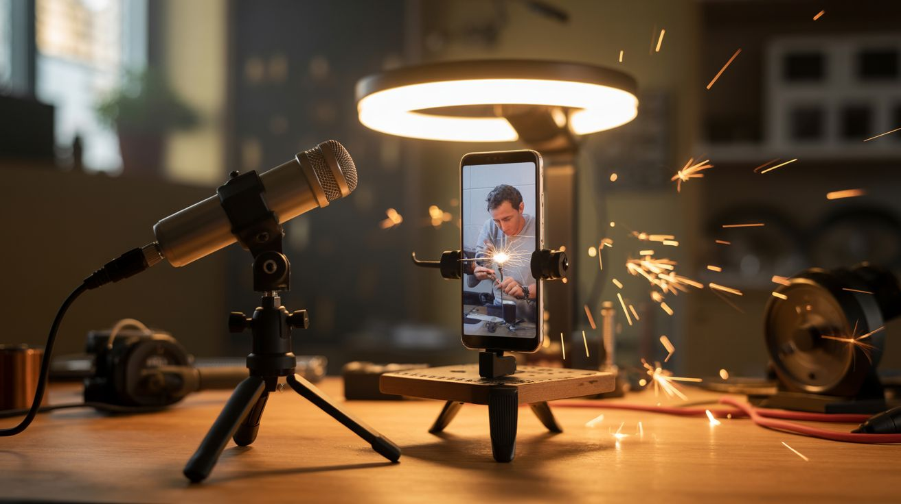

# How to Film Your Builds

  

> Your build is only as good as the video you show people. A Tesla coil playing music in a dark garage is a masterpiece. A Tesla coil filmed in portrait mode under fluorescent lights is a blurry mess that gets 12 views.

You've spent hours building something incredible from salvaged junk. Don't let bad footage bury it. This guide covers everything you need to turn your builds into content that performs on TikTok, YouTube, Instagram, and whatever platform rises next. No expensive equipment required — your phone is already the best camera you need.

---

## The Camera You Already Own

Your phone. Seriously. The camera on a 3-year-old phone shoots better video than a $5,000 professional camera from 2010. Here's how to get the most out of it:

### Settings that matter:
- **Resolution:** 4K if your phone supports it. You can always downscale for social media, but you can't upscale blurry footage.
- **Frame rate:** 30fps for talking and process shots. 60fps for anything with motion. 120fps or 240fps for slow-mo (sparks, plasma, liquids, explosions).
- **Focus:** Tap to lock focus on your subject. Auto-focus hunts and wobbles — lock it.
- **Exposure:** Tap and hold to lock exposure. For fire/plasma/spark builds, lock exposure on the bright element so it doesn't blow out.
- **Orientation:** LANDSCAPE (horizontal) for YouTube. PORTRAIT (vertical) for TikTok/Reels/Shorts. Decide before you press record.

### Phone mounting:
- A $10 phone tripod from Amazon changes everything. Shaky footage screams amateur.
- No tripod? Lean your phone against a stack of books, a mug, or a vise.
- For overhead shots (soldering, assembly): clamp the phone to a shelf above your workbench with a spring clamp and a rubber band. Ugly but effective.
- Gorilla-style flexible tripods ($15) wrap around pipes, shelves, and fence posts for angles a normal tripod can't reach.

---

## Camera Angles That Tell the Story

Every build video needs multiple angles. Shooting the entire build from one static position is the fastest way to bore your audience. Here are the shots that work:

### The essential five:
1. **Wide establishing shot** — Shows the whole workspace and the project. Sets the scene. "This is where it's happening."
2. **Close-up process shot** — Tight on the hands. Soldering, wiring, gluing, cutting. This is where the audience learns.
3. **Detail insert** — Extreme close-up of the critical moment. The solder flowing onto the joint. The wire being stripped. The chemical changing color. Shoot these at 60fps minimum.
4. **The reveal** — Pull back from close-up to wide as the build powers on for the first time. This is the money shot.
5. **The hero shot** — The finished build, beautifully lit, doing its thing. No hands in frame. Just the creation. This is your thumbnail.

### Angles for specific build types:

| Build Type | Best Angles | Why |
|---|---|---|
| Fire / plasma / sparks | Low angle, looking up. Dark background. | Fire looks bigger from below. Dark backgrounds make plasma glow pop. |
| Chemistry / reactions | Overhead (top-down). Close-up side view. | Overhead shows the whole reaction. Side view shows layers, color changes, and bubbling. |
| Mechanical / kinetic | Eye level. Tracking shot following motion. | Mechanical builds need to show the full range of motion. |
| Electronics / soldering | Overhead. 45-degree close-up. | Overhead shows the board layout. 45-degree shows depth and component placement. |
| Before/after | Same angle, same lighting. Cut between them. | Consistency makes the transformation dramatic. |

### The B-roll checklist:
Film these even if you don't think you need them. You'll thank yourself in the edit.
- [ ] Parts laid out on the table (the "ingredients shot")
- [ ] Close-up of each major component
- [ ] Tools being picked up and used
- [ ] Screws going in
- [ ] Wires being connected
- [ ] Test fitting parts together
- [ ] Failed attempts (audiences love seeing you struggle and recover)
- [ ] The first power-on (multiple angles if possible)
- [ ] Reactions — your face when it works (or doesn't)

---

## Lighting

Bad lighting kills more videos than bad cameras. Good news: you don't need studio lights.

### The free option: natural light
- Film near a window during the day. A north-facing window gives even, diffused light.
- Don't film with the window behind you — your face/project will be a silhouette.
- Overcast days produce the most flattering, shadow-free light.

### The $20 option: work lights
- A $10 LED work light from the hardware store (1000+ lumens) is the single best video upgrade you can buy.
- Place it at 45 degrees to your subject, slightly above eye level.
- Use two lights on either side for even illumination and minimal shadows.
- Clip-on LED desk lamps ($8) work great for close-up shots.

### The $30 option: ring light
- An LED ring light ($15-30) provides even, flattering front-facing light.
- Great for talking-to-camera and close-up demonstrations.
- Mount your phone in the center of the ring for shadowless close-ups.

### Lighting for specific situations:

| Situation | Lighting Setup | Why |
|---|---|---|
| Plasma / sparks / fire | DARK. Kill all ambient light. | Plasma and sparks need to be the only light source. Ambient light washes them out. |
| Soldering / electronics | Bright overhead + side fill | You need to see the components clearly. Shadows hide detail. |
| Chemistry / color changes | Bright, neutral (daylight temp) | Color accuracy matters. Warm/yellow light shifts the colors of your chemicals. |
| Finished build showcase | Dramatic single light source, dark bg | Shadows add depth and drama. One strong light + dark background = gallery-quality shot. |
| UV / blacklight builds | Full dark + UV light only | Any ambient light kills the UV glow effect. Black out the room completely. |

### Color temperature:
- **Daylight (5000-6500K):** Best for color accuracy. Use for chemistry and anything where exact colors matter.
- **Warm (2700-3000K):** Cozy, inviting. Good for workshop vibes and talking head shots.
- **Don't mix temperatures.** A daylight LED and a warm tungsten bulb in the same shot creates ugly color casts.

---

## Slow Motion

Slow-mo is the single most impactful technique for build videos. Things that look ordinary at normal speed become cinematic at 240fps.

### What to shoot in slow-mo:
- Sparks flying from an angle grinder
- Solder flowing onto a joint
- Plasma arcs forming and dancing
- Chemical reactions (color changes, eruptions, crystallization)
- Metal being cut or drilled
- First power-on of any electrical build
- Balls or projectiles launching from mechanical builds
- Fire ignition and spread
- Water splashing, boiling, or freezing
- Ferrofluid responding to magnets
- Lichtenberg figures burning into wood
- Glass shattering (Prince Rupert's drop)

### Phone slow-mo settings:
- **120fps** — 4x slow motion. Good for most things. Still looks sharp.
- **240fps** — 8x slow motion. The sweet spot for sparks, plasma, and reactions.
- **960fps** (some phones) — 32x slow motion. Absurdly slow. Use for explosions, shattering, and ultra-fast events. Quality drops significantly at this speed.

### Slow-mo tips:
- **Needs more light.** Higher frame rates let in less light per frame. Double your lighting for slow-mo.
- **Lock focus.** Auto-focus can't keep up at high frame rates. Manual/locked focus only.
- **Shoot wider than you think.** Fast-moving subjects leave the frame quickly at normal zoom. Go wider and crop in post.
- **Sound is garbage.** Most phones don't record audio during slow-mo. Plan to add music or narration in post.

---

## Audio & Narration

Bad audio is worse than bad video. People will watch a fuzzy video with clear audio. Nobody watches HD video with muffled, echo-y audio.

### Recording options:

| Option | Cost | Quality | Best For |
|---|---|---|---|
| Phone's built-in mic | Free | Acceptable (close up) | Quick clips where you're close to the phone |
| Wired lavalier mic | $10-15 | Good | Narration while building (clip to shirt collar) |
| USB microphone (for voiceover) | $30-50 | Great | Recording narration after filming, at your desk |
| Wireless lavalier (Rode, DJI) | $50-100 | Excellent | Talking while moving around the workshop |

### Narration style:
- **Be yourself.** Don't try to sound like a YouTube personality. Talk like you'd talk to a friend at the workbench.
- **Explain the "why," not just the "what."** "I'm connecting this wire here" is boring. "This wire carries the signal that tells the motor when to spin — get this wrong and the motor just sits there" is interesting.
- **Call out mistakes.** "I screwed this up the first time — don't do what I did" is more engaging than pretending everything went perfectly.
- **Short sentences.** Viewers are scanning. Long rambling explanations lose people.
- **Voiceover in post** produces better audio than narrating live. Film the build silently, then record narration at your desk while watching the footage.

### Sound effects:
- Satisfying clicks, snaps, and crunches during assembly are gold. Don't cover them with music.
- Record ambient workshop sounds (soldering sizzle, drill whine, angle grinder roar) at close range for punchy, visceral audio.
- Free sound effect libraries: Freesound.org, Mixkit, Pixabay Audio.

---

## Thumbnail Strategy

The thumbnail decides whether anyone clicks. It doesn't matter how good the video is if nobody watches it.

### The formula that works:
1. **One clear subject** — not a busy workshop. One thing in focus, everything else blurred or dark.
2. **Contrast** — bright subject on dark background, or vice versa. Plasma on black. Fire on dark. Finished build on a clean surface.
3. **Text overlay** (optional) — 3-5 words max. Large, bold, readable on a phone screen. "IT ACTUALLY WORKS" or "JUNKYARD TESLA COIL."
4. **Faces work** — thumbnails with a human face (especially an expression of surprise/excitement) consistently outperform those without. Film your genuine reaction to the first power-on.
5. **High saturation** — slightly boost saturation and contrast. Thumbnails need to pop in a sea of other thumbnails.

### What to avoid:
- Multiple subjects competing for attention
- Tiny text that's unreadable on mobile
- Screenshots from the video (looks lazy — set up the shot intentionally)
- Cluttered backgrounds
- Low-contrast images (gray on gray)

### How to shoot a great thumbnail:
Dedicate 5 minutes after the build is done to shoot thumbnail photos specifically. Clean the background. Position one light source dramatically. Take 20+ photos from different angles. Pick the best one. Tools like Canva (free) let you add text overlays in seconds.

---

## Platform Strategy

Different platforms reward different content. Here's where each build type performs best:

### TikTok / Instagram Reels / YouTube Shorts (vertical, 15-90 seconds)
**Best for:** Quick satisfaction builds. Anything with a dramatic reveal in under a minute.

| Build Type | Why It Works Here |
|---|---|
| Chemistry reactions | Fast, visual, dramatic. 30-second video, millions of views. |
| Plasma / fire | Looks insane on a phone screen. Dark backgrounds + bright effects = scroll-stopping. |
| Satisfying assembly | Sped-up build with a slow-mo money shot at the end. |
| Destruction / stress tests | "Will the thermite melt through the safe?" People can't scroll past. |
| Quick demos | "Watch me turn a dead microwave into a spot welder in 60 seconds." |

**Format tips:**
- Hook in the first 1 second. Show the coolest moment first, then rewind to show how you got there.
- Text overlay narration instead of voiceover. Many viewers watch on mute.
- Trending audio can boost discovery, but original audio performs better for how-to content.
- Post consistently — 3-5 times per week beats one viral hit.

### YouTube (horizontal, 5-30 minutes)
**Best for:** Full build walkthroughs, educational content, complex projects.

| Build Type | Why It Works Here |
|---|---|
| Multi-day builds | YouTube rewards watch time. Longer content = more ad revenue = more exposure. |
| Educational builds | "How (and why) this works" content builds loyal subscribers. |
| Series ("Junkyard to Workshop") | Narrative arcs keep people coming back. |
| Comparison/testing | "I built 5 speakers from junk — which one sounds best?" |
| Big builds | Trebuchets, go-karts, foundries — projects that need room to breathe. |

**Format tips:**
- Front-load the hook. Show the finished result in the first 15 seconds, then cut to "here's how I built it."
- Chapters (timestamps) in the description. Viewers scrub to the parts they care about.
- Call to action at the end: "Which build should I try next? Comment below."
- Minimum 8 minutes for mid-roll ad placement (if monetized).

### Instagram Posts / Stories
**Best for:** Before/after photos, beauty shots of finished builds, parts hauls.

**Format tips:**
- Carousel posts (swipe-through) showing the build in 5-10 photos perform exceptionally well.
- Stories: behind-the-scenes, polls ("Should I build X or Y next?"), progress updates.
- Reels: cross-post your TikTok content here with minor edits.

---

## Editing Software

You don't need to pay for editing software. The free options are genuinely professional-grade.

### Free:
| Software | Platform | Best For | Learning Curve |
|---|---|---|---|
| **DaVinci Resolve** | Win/Mac/Linux | Full editing, color grading, audio mixing, effects. Used by Hollywood. | Steep but worth it |
| **CapCut** (desktop) | Win/Mac | Short-form content, text overlays, trending effects. | Easy |
| **CapCut** (mobile) | iOS/Android | Quick edits on your phone. Surprisingly powerful. | Easy |
| **iMovie** | Mac/iOS | Simple cuts, transitions, basic titles. | Very easy |
| **Shotcut** | Win/Mac/Linux | Solid free editor, less polished than Resolve but lighter. | Moderate |
| **Kdenlive** | Win/Mac/Linux | Open source, full-featured, slightly rough around the edges. | Moderate |

### Paid (worth it if you get serious):
| Software | Cost | Best For |
|---|---|---|
| **Adobe Premiere Pro** | $22/mo | Industry standard. Huge plugin ecosystem. |
| **Final Cut Pro** | $300 (one-time) | Mac only. Faster than Premiere on Apple hardware. |

### Recommended starting point:
**CapCut** for TikTok/Reels (it's built for short-form), **DaVinci Resolve** for YouTube (it's built for professionals and it's free). Learn one well before switching.

---

## Music & Sound

Music sets the mood. The right track turns a build montage from "meh" into "I need to build this right now."

### Free music sources:
- **YouTube Audio Library** — free for YouTube videos, no attribution required. Searchable by mood, genre, tempo.
- **Freesound.org** — free sound effects and ambient loops. Attribution required for some tracks.
- **Mixkit** — free music and sound effects, no attribution.
- **Pixabay Music** — free, no attribution.
- **Uppbeat** — free tier with attribution, paid tier without.

### Paid music sources (worth it):
- **Epidemic Sound** — $15/mo. Huge library, clean licensing, widely used by creators.
- **Artlist** — $10/mo. Simpler licensing than Epidemic Sound.

### Music selection tips:
- **Match energy to the build stage.** Chill lo-fi for assembly. Building intensity for testing. Triumphant drop for the reveal.
- **Avoid lyrics** during narration. Instrumental only when you're talking.
- **Bass drops sync with reveals.** Time the first power-on or the dramatic reveal to hit the bass drop. This is editing 101 and it works every single time.
- **Don't use copyrighted music.** One DMCA strike can nuke your channel. Stick to licensed or royalty-free.

---

## The Build Video Formula

Here's the structure that works across platforms. Adapt the length to the platform (15 seconds for TikTok, 15 minutes for YouTube), but the beats are the same:

### 1. The Hook (first 3 seconds)
Show the finished build doing the most impressive thing it does. Plasma, fire, sparks, motion, sound. Give them a reason to keep watching.

### 2. The Setup (10-30 seconds)
What you're building and why. Show the parts laid out. "This dead microwave is about to become a spot welder."

### 3. The Build (main body)
Process shots. Close-ups. B-roll. Narration explaining what you're doing and why. Speed up the boring parts (4-8x). Slow down the cool parts (slow-mo).

### 4. The Struggle (optional but powerful)
Something goes wrong. You troubleshoot. You fix it. This is the most relatable part of any build video. Don't cut the failures — they're the content.

### 5. The Reveal
First power-on. First test. Film it from multiple angles if possible. This is the moment everything leads up to.

### 6. The Showcase
The finished build, hero-lit, doing its thing. Multiple angles. Slow-mo. This is where the thumbnail comes from.

### 7. The CTA (call to action)
"What should I build next? Comment below." / "Follow for Part 2." / "Full build guide linked in bio."

---

## Quick-Start Checklist

Before you film your next build:

- [ ] Phone charged and storage cleared
- [ ] Tripod or stable phone mount ready
- [ ] Two light sources positioned (45 degrees, slightly above)
- [ ] Background cleaned or draped with dark fabric
- [ ] Film orientation decided (vertical for TikTok, horizontal for YouTube)
- [ ] Slow-mo settings checked (120fps or 240fps available)
- [ ] Parts laid out for the "ingredients shot"
- [ ] Audio recording method ready (lavalier, phone mic, or plan for voiceover)
- [ ] Thumbnail shot planned (what's the one image that sells this build?)

The best time to start filming your builds is right now. The phone you have is good enough. The lights you have are good enough. Your first ten videos will be rough — and that's fine. Video #50 is where it gets good. But you can't get to #50 without starting at #1.
