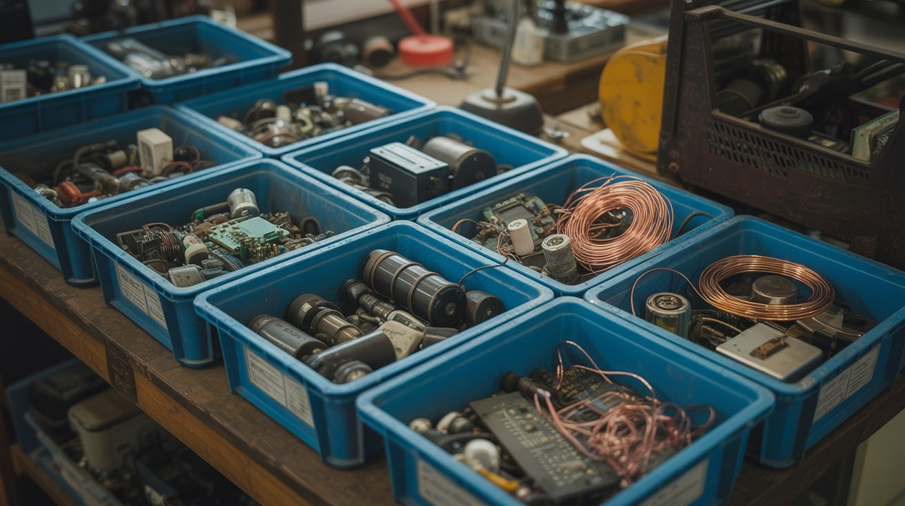

# Ingredient Index

  

> Reverse lookup: you have the part, now find the build. Every major component mapped to every project that uses it.

You just pulled a Peltier module out of a dead mini fridge. What can you build with it? You've got a box of stepper motors from three dead printers. Now what? This index answers those questions. Find the ingredient, follow the links.

For where to find these ingredients for free or cheap, see the [Sourcing Guide](sourcing-guide.md).

---

## How to Use This Index

1. **By category** — Jump to a group below to browse what's available
2. **By name** — Scroll to the [Master Table](#master-ingredient-table) (alphabetical)
3. **By backstory** — Hit the [Rap Sheet](#rap-sheet-extended-intel-on-the-heavy-hitters) for deep-dive sourcing intel on the heavy hitters
4. Click through to the build that interests you most
5. Check that build's full ingredient list to see what else you need

---

## Browse by Category

### ⚡ Salvaged Electronics
Motors, transformers, sensors, displays, and the guts of dead appliances.

> 18650 Cells · Accelerometer · Alternator · Brushless DC Motor · Capacitors · Compressor · CRT Glass · Deflection Yoke · ESP32 · Flex Sensors · Flyback Transformer · Galvanometer Mirrors · Gyroscope/IMU · Hall Effect Sensor · Hard Drive · Ignition Coil · Laser Diode · LCD Panel · LED Strip · Linear Rail · Microphone · MOSFET · MOT · Neodymium Magnets · OLED Display · Peltier Module · Photocells · Piezo Elements · PIR Sensor · Relay Module · Scanner CCD · Servo Motor · Solenoid · Spark Plug · Speaker · Starter Motor · Stepper Motor · Thermocouple · Timing Belt · Transformer · Ultrasonic Transducer · UV LEDs · Vacuum Cleaner Motor · Vacuum Tubes · Voice Coil · Webcam · Window Motor · Wiper Motor

### 🧪 Chemicals & Materials
Powders, liquids, crystals, and compounds that react, glow, burn, or crystallize.

> Bismuth · Calcium Carbide · Copper Sulfate · Dry Ice · Epoxy Resin · Ferric Chloride · Ferrofluid · Fluorescein · Gallium · Glow Powder · Hydrogen Peroxide · Iron Oxide · KNO3 · Luminol · Non-Newtonian Fluid · Potassium Permanganate · Propane · Resin · Sodium Acetate · Sodium Silicate · Thermochromic Pigment · Titanium Powder

### 🔧 Structural & Mechanical
Raw materials, tubing, wire, and mechanical components for frames and assemblies.

> Aluminum · Copper Tubing · Fiber Optic Strands · Heating Element / Nichrome Wire

### 💻 Platforms & Modules
Microcontrollers, computers, and development boards — the brains of the builds.

> Arduino · ESP32 · Raspberry Pi

---

## Master Ingredient Table

| Ingredient | Description | Builds |
|---|---|---|
| **18650 Cells** | Rechargeable lithium-ion batteries, 3.7V nominal. Found in laptop battery packs, power tool batteries, and UPS systems. *(Crack open any dead laptop battery — 6-9 cells inside, often still good.)* | [#052 DIY Powerwall](../categories/power-and-energy/052-diy-powerwall.md), [#067 Laptop Battery Power Bank](../categories/computer-and-phone/067-laptop-battery-power-bank.md), [#206 Drone LiPo Powerwall](../categories/drone-salvage/206-drone-lipo-powerwall.md) |
| **Accelerometer** | MEMS sensor measuring acceleration/tilt. Found in phones, game controllers, hard drives. *(Every cracked-screen phone has a perfectly good one on the main board.)* | [#146 Earthquake Detector](../categories/python-projects/146-earthquake-detector.md), [#064 Phone Sensor Network](../categories/computer-and-phone/064-phone-sensor-network.md), [#140 EMF Ghost Detector](../categories/pi-and-arduino/140-emf-ghost-detector.md) |
| **Aluminum (scrap)** | Sheet, bar, or cast aluminum from appliance housings, car parts, cookware. *(Old lawn chairs, cookware, and window frames are all castable aluminum.)* | [#005 Desktop Foundry](../categories/fire-and-plasma/005-desktop-foundry.md), [#157 Anodizing Setup](../categories/chemical-electronic/157-anodizing-setup.md), [#045 Scrap Metal Sculpture](../categories/art-and-installation/045-scrap-metal-sculpture.md) |
| **Alternator (automotive)** | Three-phase generator from cars, 100+ amps at 12-14V. *(Pull-A-Part yards sell them for $10-15 — every car in the yard has one.)* | [#219 Alternator Welder](../categories/junkyard-auto/219-alternator-welder.md), [#050 Bicycle Generator](../categories/power-and-energy/050-bicycle-generator.md) |
| **Aquarium Pump** | Small submersible water pump, 3-12V DC. Found in fish tanks, humidifiers, water features. *(Thrift stores always have one in the pet section for $3.)* | [#099 Swamp Cooler](../categories/fridge-and-cooling/099-swamp-cooler.md), [#023 UV-Reactive Water Wall](../categories/light-and-visual/023-uv-reactive-water-wall.md), [#118 Fluorescein Blacklight Fountain](../categories/pyro-and-chemistry/118-fluorescein-blacklight-fountain.md), [#127 Auto Plant Watering](../categories/pi-and-arduino/127-auto-plant-watering.md), [#100 Beverage Chiller](../categories/fridge-and-cooling/100-beverage-chiller.md) |
| **Arduino (Uno/Nano/Mega)** | Microcontroller development board, 5V logic, digital and analog I/O. *(AliExpress clones run $3 shipped — buy five and don't look back.)* | [#122 LED Cube 8x8x8](../categories/pi-and-arduino/122-led-cube-8x8x8.md), [#124 Arduino Guitar Pedal](../categories/pi-and-arduino/124-arduino-guitar-pedal.md), [#127 Auto Plant Watering](../categories/pi-and-arduino/127-auto-plant-watering.md), [#133 Arduino Breathalyzer](../categories/pi-and-arduino/133-arduino-breathalyzer.md), [#135 MIDI Stepper Organ](../categories/pi-and-arduino/135-midi-stepper-organ.md), [#138 Nerf Sentry Turret](../categories/pi-and-arduino/138-nerf-sentry-turret.md), [#140 EMF Ghost Detector](../categories/pi-and-arduino/140-emf-ghost-detector.md) |
| **Bismuth** | Low-melting-point metal (520F) that forms iridescent staircase crystals when cooled slowly. *(Buy as lead-free fishing sinkers at tackle shops, or online — it's reusable.)* | [#107 Bismuth Crystal Garden](../categories/pyro-and-chemistry/107-bismuth-crystal-garden.md) |
| **Brushless DC Motor (BLDC)** | High-efficiency motor from drones, scooters, hard drives. Requires ESC to run. *(Every dead scooter and hoverboard on Facebook "free" has one waiting.)* | [#088 Electric Skateboard](../categories/scooter-and-motor/088-electric-skateboard.md), [#024 Electric Go-Kart](../categories/functional-machines/024-electric-go-kart.md), [#204 Drone Motor Wind Turbine](../categories/drone-salvage/204-drone-motor-wind-turbine.md), [#091 Wind Phone Charger](../categories/scooter-and-motor/091-wind-phone-charger.md), [#136 ESP32 Micro Drone](../categories/pi-and-arduino/136-esp32-micro-drone.md) |
| **Calcium Carbide** | Chemical that reacts with water to produce flammable acetylene gas. *(Welding supply shops stock it. Old-school camping stores sell it for carbide lamps.)* | [#116 Calcium Carbide Cannon](../categories/pyro-and-chemistry/116-calcium-carbide-cannon.md), [#232 Carbide Spark Plug Repeater](../categories/alchemist-cookbook/232-carbide-spark-plug-repeater.md) |
| **Capacitors (large, electrolytic)** | Energy storage for pulse discharge applications. Found in microwaves, camera flashes, UPS systems. *(The one inside a microwave can kill you — discharge it before touching ANYTHING.)* | [#032 Capacitor Discharge Welder](../categories/functional-machines/032-capacitor-discharge-welder.md), [#035 Electromagnetic Can Crusher](../categories/mad-scientist/035-electromagnetic-can-crusher.md), [#036 Rail Gun](../categories/mad-scientist/036-rail-gun.md), [#037 Coil Gun](../categories/mad-scientist/037-coil-gun.md), [#275 Capacitor Bank Plasma Igniter](../categories/alchemist-cookbook/275-capacitor-bank-plasma-igniter.md) |
| **Compressor (fridge)** | Hermetically sealed motor + pump from refrigerators. Generates vacuum or compressed air. *(Every fridge has one. The smaller the fridge, the easier to extract.)* | [#031 Silent Compressor](../categories/functional-machines/031-silent-compressor.md), [#039 Vacuum Chamber](../categories/mad-scientist/039-vacuum-chamber.md), [#092 Fermentation Chamber](../categories/fridge-and-cooling/092-fermentation-chamber.md), [#094 DIY Freeze Dryer](../categories/fridge-and-cooling/094-diy-freeze-dryer.md), [#097 Absorption Fridge](../categories/fridge-and-cooling/097-absorption-fridge.md) |
| **Copper Sulfate** | Blue crystalline chemical used in electroplating, crystal growing, and etching. *(Sold as "root killer" at hardware stores — same chemical, fraction of lab-grade price.)* | [#156 Electroplating Station](../categories/chemical-electronic/156-electroplating-station.md), [#161 Copper Crystal Tree](../categories/chemical-electronic/161-copper-crystal-tree.md), [#160 Electroforming Art](../categories/chemical-electronic/160-electroforming-art.md) |
| **Copper Tubing** | Found in fridges (condenser/evaporator coils), AC units, and plumbing. *(Rip it out of any dead fridge's back panel — 10-20 feet coiled up back there.)* | [#093 Fog Chiller](../categories/fridge-and-cooling/093-fog-chiller.md), [#051 Solar Water Heater](../categories/power-and-energy/051-solar-water-heater.md), [#095 Absorption Cooler](../categories/fridge-and-cooling/095-absorption-cooler.md), [#100 Beverage Chiller](../categories/fridge-and-cooling/100-beverage-chiller.md) |
| **CRT Glass / Tube** | Cathode ray tube from old televisions. Under vacuum, coated with phosphor. Contains lead glass. *(Estate sales and e-waste recyclers can't give these away fast enough.)* | [#021 CRT Oscilloscope Visualizer](../categories/light-and-visual/021-crt-oscilloscope-visualizer.md), [#048 CRT Electromagnetic Art](../categories/art-and-installation/048-crt-electromagnetic-art.md), [#015 Giant Plasma Globe](../categories/light-and-visual/015-giant-plasma-globe.md) |
| **Deflection Yoke** | Electromagnetic coil assembly from CRT TVs. Precision wound for beam steering. *(Unscrew the ring at the neck of any CRT — the yoke slides right off.)* | [#021 CRT Oscilloscope Visualizer](../categories/light-and-visual/021-crt-oscilloscope-visualizer.md), [#048 CRT Electromagnetic Art](../categories/art-and-installation/048-crt-electromagnetic-art.md) |
| **Dry Ice** | Solid CO2, -109F. Sublimates directly to gas. Available at grocery stores and ice suppliers. *(Most grocery chains sell it at the customer service counter — $1-2/lb.)* | [#114 Dry Ice Comet Balls](../categories/pyro-and-chemistry/114-dry-ice-comet-balls.md), [#120 Dry Ice Bubble Cauldron](../categories/pyro-and-chemistry/120-dry-ice-bubble-cauldron.md), [#093 Fog Chiller](../categories/fridge-and-cooling/093-fog-chiller.md) |
| **ESP32** | WiFi + Bluetooth microcontroller, dual-core, cheap ($4). The Swiss Army knife of IoT. *(AliExpress, $4 shipped. The most capable $4 you'll ever spend.)* | [#125 ESP32 Mesh Walkie-Talkie](../categories/pi-and-arduino/125-esp32-mesh-walkie-talkie.md), [#128 ESP32-CAM Security](../categories/pi-and-arduino/128-esp32-cam-security.md), [#132 ESP32 Weather Station](../categories/pi-and-arduino/132-esp32-weather-station.md), [#136 ESP32 Micro Drone](../categories/pi-and-arduino/136-esp32-micro-drone.md) |
| **Ferric Chloride** | Chemical etchant for copper. Used for custom PCB fabrication. *(Amazon or electronics suppliers. Wear gloves — it stains everything it touches permanently.)* | [#158 PCB Etching Station](../categories/chemical-electronic/158-pcb-etching-station.md), [#162 Electrochemical Etching](../categories/chemical-electronic/162-electrochemical-etching.md) |
| **Ferrofluid** | Magnetic liquid (iron nanoparticles in oil). Responds to magnetic fields with spiky, organic shapes. *(Make your own: laser printer toner + vegetable oil + 20 minutes of stirring.)* | [#046 Ferrofluid Mirror](../categories/art-and-installation/046-ferrofluid-mirror.md), [#011 Ferrofluid Speaker](../categories/sound-and-music/011-ferrofluid-speaker.md), [#053 Singing Ferrofluid Tornado](../categories/unholy-combos/053-singing-ferrofluid-tornado.md) |
| **Fiber Optic Strands** | Thin plastic or glass fibers that carry light. Available in bulk online. *(Buy a cheap decorative fiber lamp at a thrift store — harvest hundreds of strands.)* | [#173 Fiber Optic Star Ceiling](../categories/light-and-visual/173-fiber-optic-star-ceiling.md) |
| **Flex Sensors** | Resistors that change value when bent. Found in gloves, game controllers, wearables. *(SpectraSymbol sensors are $8 each new. Old Nintendo Power Gloves had them too.)* | [#152 Body Pose Music](../categories/python-projects/152-body-pose-music.md), [#242 LED Jacket](../categories/wearable-tech/242-led-jacket.md) |
| **Fluorescein** | Fluorescent yellow-green dye that glows intensely under UV/blacklight. Water-soluble. *(Amazon, $8 for enough to make a swimming pool glow. A little goes absurdly far.)* | [#118 Fluorescein Blacklight Fountain](../categories/pyro-and-chemistry/118-fluorescein-blacklight-fountain.md), [#023 UV-Reactive Water Wall](../categories/light-and-visual/023-uv-reactive-water-wall.md) |
| **Flyback Transformer** | High-voltage transformer from CRT TVs, producing 10,000-30,000V. *(Look for the fat red wire with a suction cup — that's your 30kV anode lead.)* | [#008 Plasma Speaker](../categories/sound-and-music/008-plasma-speaker.md), [#015 Giant Plasma Globe](../categories/light-and-visual/015-giant-plasma-globe.md), [#033 Musical Tesla Coil](../categories/mad-scientist/033-musical-tesla-coil.md), [#196 Kirlian Photography](../categories/weird-science/196-kirlian-photography.md), [#055 Levitating Plasma Speaker](../categories/unholy-combos/055-levitating-plasma-speaker.md) |
| **Fresnel Lens** | Large flat lens from rear-projection TVs. Focuses sunlight to extreme temperatures. *(Score one from a dead rear-projection TV — it's the full screen-sized flat lens.)* | [#020 Fresnel Lens Solar Forge](../categories/light-and-visual/020-fresnel-lens-solar-forge.md) |
| **Gallium** | Metal that melts at 86F (in your hand). Attacks aluminum grain boundaries. *(Amazon, ~$20 for 100g. Reusable — it doesn't get consumed, just re-melt and go again.)* | [#106 Gallium Melting Spoon](../categories/pyro-and-chemistry/106-gallium-melting-spoon.md) |
| **Galvanometer Mirrors** | Fast-rotating mirrors that steer laser beams. Found in laser printers (polygon mirrors) and barcode scanners. *(Old laser printers have a polygon mirror spinning at 20k+ RPM — that's your galvo.)* | [#017 Laser Fog Projector](../categories/light-and-visual/017-laser-fog-projector.md), [#150 Fractal Laser Engraver](../categories/python-projects/150-fractal-laser-engraver.md), [#176 Laser Maze](../categories/light-and-visual/176-laser-maze.md) |
| **Glow Powder (strontium aluminate)** | Phosphorescent powder that absorbs light and glows in the dark for hours. *(Amazon, $10 for a lifetime supply. Green is the brightest by far.)* | [#117 Glow Resin River Table](../categories/pyro-and-chemistry/117-glow-resin-river-table.md) |
| **Gyroscope / IMU** | Inertial measurement unit. Found in drones, phones, game controllers. Measures angular velocity. *(MPU-6050 breakout boards are $2 on AliExpress. Every drone flight controller has one.)* | [#201 Camera Gimbal Stabilizer](../categories/drone-salvage/201-camera-gimbal-stabilizer.md), [#203 Gimbal Motor Star Tracker](../categories/drone-salvage/203-gimbal-motor-star-tracker.md), [#205 Obstacle Dodging Robot](../categories/drone-salvage/205-obstacle-dodging-robot.md) |
| **Hall Effect Sensor** | Magnetic field detector. Found in brushless motor controllers, speedometers, door sensors. *(Embedded in every brushless motor. Also inside most laptop lid-close switches.)* | [#057 Hard Drive POV Clock](../categories/computer-and-phone/057-hard-drive-pov-clock.md), [#132 ESP32 Weather Station](../categories/pi-and-arduino/132-esp32-weather-station.md), [#091 Wind Phone Charger](../categories/scooter-and-motor/091-wind-phone-charger.md) |
| **Hard Drive** | Contains neodymium magnets, voice coil actuator, precision bearings, mirror-finish platters. *(The magnets alone are worth the teardown — they're absurdly strong for free.)* | [#056 Hard Drive Speaker](../categories/computer-and-phone/056-hard-drive-speaker.md), [#057 Hard Drive POV Clock](../categories/computer-and-phone/057-hard-drive-pov-clock.md), [#058 HDD Platter Wind Chimes](../categories/computer-and-phone/058-hdd-platter-wind-chimes.md) |
| **Heating Element / Nichrome Wire** | Resistance wire from toasters, hair dryers, space heaters. Glows red-hot when current flows. *(Gut any toaster — the glowing coils inside are nichrome wire, ready to harvest.)* | [#005 Desktop Foundry](../categories/fire-and-plasma/005-desktop-foundry.md), [#028 Powder Coating Oven](../categories/functional-machines/028-powder-coating-oven.md), [#243 Heated Gloves](../categories/wearable-tech/243-heated-gloves.md), [#004 Thermic Lance](../categories/fire-and-plasma/004-thermic-lance.md), [#225 Seat Heater Sous Vide](../categories/junkyard-auto/225-seat-heater-sous-vide.md) |
| **Hydrogen Peroxide (30%+)** | Oxidizer used in chemistry builds. Grocery store 3% works for some; lab-grade needed for others. *(Beauty supply stores sell 40-volume developer — that's 12%. Lab suppliers for 30%+.)* | [#102 Elephant Toothpaste](../categories/pyro-and-chemistry/102-elephant-toothpaste.md), [#109 Luminol Crime Scene](../categories/pyro-and-chemistry/109-luminol-crime-scene.md), [#159 Hydrogen Generator](../categories/chemical-electronic/159-hydrogen-generator.md) |
| **Ignition Coil (automotive)** | Steps up 12V to 40,000V. Found in car engine compartments. *(Any car junkyard — $2-5 each, and every vehicle in the yard has at least one.)* | [#220 Ignition Coil Tesla Coil](../categories/junkyard-auto/220-ignition-coil-tesla-coil.md), [#231 Ignition Coil KNO3 Flame Jet](../categories/alchemist-cookbook/231-ignition-coil-kno3-flame-jet.md) |
| **Iron Oxide (rust powder)** | Fe2O3 powder. Combined with aluminum powder for thermite. Also used in ferrofluid synthesis. *(Leave steel wool in vinegar overnight. Filter, dry, grind. Free rust powder forever.)* | [#105 Thermite Flower Pot](../categories/pyro-and-chemistry/105-thermite-flower-pot.md), [#230 Thermite Cold Spark Fountain](../categories/alchemist-cookbook/230-thermite-cold-spark-fountain.md), [#046 Ferrofluid Mirror](../categories/art-and-installation/046-ferrofluid-mirror.md) |
| **KNO3 (Potassium Nitrate)** | Oxidizer used in smoke bombs, fuses, and pyrotechnic compositions. Available as stump remover. *(Sold as "stump remover" at hardware stores. Same chemical, zero questions asked.)* | [#103 Smoke Bomb Array](../categories/pyro-and-chemistry/103-smoke-bomb-array.md), [#121 Fireworks Sequencer](../categories/pi-and-arduino/121-fireworks-sequencer.md), [#231 Ignition Coil KNO3 Flame Jet](../categories/alchemist-cookbook/231-ignition-coil-kno3-flame-jet.md) |
| **Laser Diode** | Found in DVD/Blu-ray drives, laser printers, laser pointers. 405nm (violet) to 650nm (red). *(Every DVD burner has a red diode. Blu-ray drives have violet 405nm — the good stuff.)* | [#071 DVD Laser Engraver](../categories/printer-and-scanner/071-dvd-laser-engraver.md), [#141 Face Tracking Laser](../categories/python-projects/141-face-tracking-laser.md), [#150 Fractal Laser Engraver](../categories/python-projects/150-fractal-laser-engraver.md), [#176 Laser Maze](../categories/light-and-visual/176-laser-maze.md), [#017 Laser Fog Projector](../categories/light-and-visual/017-laser-fog-projector.md) |
| **LCD Panel** | Liquid crystal display from laptops, monitors, tablets. Needs controller board to drive. *(Dead laptops are the move — buy an LVDS controller board for $15 and it's a monitor.)* | [#061 Laptop Screen Monitor](../categories/computer-and-phone/061-laptop-screen-monitor.md), [#062 Laptop Screen Light Table](../categories/computer-and-phone/062-laptop-screen-light-table.md), [#123 Smart Mirror](../categories/pi-and-arduino/123-smart-mirror.md) |
| **LED Strip (WS2812B / Neopixel)** | Individually addressable RGB LEDs on a flexible strip. Each pixel independently controlled. *(AliExpress, $3-5/meter. Buy IP30 non-waterproof for indoor builds to save money.)* | [#122 LED Cube 8x8x8](../categories/pi-and-arduino/122-led-cube-8x8x8.md), [#145 Music Visualizer LED Wall](../categories/python-projects/145-music-visualizer-led-wall.md), [#144 Sentiment Room Lighting](../categories/python-projects/144-sentiment-room-lighting.md), [#242 LED Jacket](../categories/wearable-tech/242-led-jacket.md), [#016 Infinity Mirror Table](../categories/light-and-visual/016-infinity-mirror-table.md) |
| **Linear Rail / Guide Rod** | Precision ground steel rod for smooth linear motion. Found in printers, scanners, DVD drives. *(Every inkjet printer has 1-2 precision ground rods. Three printers = a CNC worth of rails.)* | [#069 Printer Stepper CNC](../categories/printer-and-scanner/069-printer-stepper-cnc.md), [#072 Pen Plotter](../categories/printer-and-scanner/072-pen-plotter.md), [#089 Motorized Camera Slider](../categories/scooter-and-motor/089-motorized-camera-slider.md), [#129 Printer Robot Arm](../categories/pi-and-arduino/129-printer-robot-arm.md) |
| **Luminol** | Chemical that glows blue when it contacts iron compounds. Used in forensics. *(Amazon or science supply stores. ~$15 for enough to light up an entire room.)* | [#109 Luminol Crime Scene](../categories/pyro-and-chemistry/109-luminol-crime-scene.md) |
| **Microphone (electret)** | Tiny condenser microphone found in phones, laptops, hearing aids. *(Desolder from any dead phone or laptop — they're everywhere and always functional.)* | [#133 Arduino Breathalyzer](../categories/pi-and-arduino/133-arduino-breathalyzer.md), [#144 Sentiment Room Lighting](../categories/python-projects/144-sentiment-room-lighting.md), [#152 Body Pose Music](../categories/python-projects/152-body-pose-music.md) |
| **MOSFET** | Metal-oxide semiconductor transistor. Electronic switch for high-current loads. Found on motherboards, power supplies, motor drivers. *(Harvest beefy ones from dead PC power supplies — IRFZ44N equivalents for free.)* | [#033 Musical Tesla Coil](../categories/mad-scientist/033-musical-tesla-coil.md), [#037 Coil Gun](../categories/mad-scientist/037-coil-gun.md), [#088 Electric Skateboard](../categories/scooter-and-motor/088-electric-skateboard.md), [#027 Spot Welder](../categories/functional-machines/027-spot-welder.md) |
| **MOT (Microwave Oven Transformer)** | Heavy iron-core transformer from microwaves. 120V in, 2000V out (or rewound for high-current low-voltage). *(One per microwave. Dead microwaves are the most thrown-away appliance in America.)* | [#001 Plasma Tornado Lamp](../categories/fire-and-plasma/001-plasma-tornado-lamp.md), [#002 Lichtenberg Wood Burner](../categories/fire-and-plasma/002-lichtenberg-wood-burner.md), [#027 Spot Welder](../categories/functional-machines/027-spot-welder.md), [#034 Jacob's Ladder](../categories/mad-scientist/034-jacobs-ladder.md), [#006 Atmospheric Reentry Simulator](../categories/fire-and-plasma/006-atmospheric-reentry-simulator.md), [#227 MOT Ignited Firework Mortar](../categories/alchemist-cookbook/227-mot-ignited-firework-mortar.md) |
| **Neodymium Magnets** | Powerful rare-earth permanent magnets. Found in hard drives, microwave magnetrons, speakers, headphones. *(Two massive ones in every hard drive voice coil assembly. Pry with a flathead — carefully.)* | [#198 Homopolar Motor](../categories/weird-science/198-homopolar-motor.md), [#187 Ball Bearing Motor](../categories/mechanical-and-kinetic/187-ball-bearing-motor.md), [#038 Electromagnetic Levitator](../categories/mad-scientist/038-electromagnetic-levitator.md), [#186 Eddy Current Brake](../categories/mechanical-and-kinetic/186-eddy-current-brake.md), [#199 Lenz's Law Slow-Mo Magnet](../categories/weird-science/199-lenzs-law-slow-mo-magnet.md), [#188 Magnetic Gear Train](../categories/mechanical-and-kinetic/188-magnetic-gear-train.md), [#189 Curie Engine](../categories/mechanical-and-kinetic/189-curie-engine.md), [#046 Ferrofluid Mirror](../categories/art-and-installation/046-ferrofluid-mirror.md) |
| **Non-Newtonian Fluid** | Cornstarch + water mixture that acts solid under force and liquid when relaxed. *(You already own both ingredients. Mix 2:1 cornstarch to water. No excuses.)* | [#112 Non-Newtonian Speaker](../categories/pyro-and-chemistry/112-non-newtonian-speaker.md) |
| **OLED Display (small)** | Tiny I2C or SPI display (0.96" or 1.3") for microcontroller projects. *(AliExpress, $2-3 for a 0.96" I2C display. Buy a 5-pack — you'll use them all.)* | [#132 ESP32 Weather Station](../categories/pi-and-arduino/132-esp32-weather-station.md), [#133 Arduino Breathalyzer](../categories/pi-and-arduino/133-arduino-breathalyzer.md), [#140 EMF Ghost Detector](../categories/pi-and-arduino/140-emf-ghost-detector.md) |
| **Peltier Module (TEC)** | Thermoelectric cooler/heater. Apply voltage: one side gets hot, other gets cold. Found in mini fridges and car coolers. *(Every cheap mini-fridge has one hiding behind the heatsink on the back wall.)* | [#096 Peltier Portable Cooler](../categories/fridge-and-cooling/096-peltier-portable-cooler.md), [#100 Beverage Chiller](../categories/fridge-and-cooling/100-beverage-chiller.md), [#041 Cloud Chamber](../categories/mad-scientist/041-cloud-chamber.md), [#049 Campfire Thermoelectric Charger](../categories/power-and-energy/049-campfire-thermoelectric-charger.md), [#092 Fermentation Chamber](../categories/fridge-and-cooling/092-fermentation-chamber.md) |
| **Photocells (LDR)** | Light-dependent resistor. Resistance changes with light intensity. Found in nightlights, garden lights, streetlights. *(Desolder from any solar garden light — each one has an LDR and a small solar cell.)* | [#127 Auto Plant Watering](../categories/pi-and-arduino/127-auto-plant-watering.md), [#132 ESP32 Weather Station](../categories/pi-and-arduino/132-esp32-weather-station.md), [#144 Sentiment Room Lighting](../categories/python-projects/144-sentiment-room-lighting.md) |
| **Piezo Elements** | Ceramic discs that generate voltage when flexed (or vibrate when voltage applied). Found in buzzers, lighters, speakers. *(Free from dead lighters and alarm buzzers. Under every dollar-store birthday card speaker.)* | [#146 Earthquake Detector](../categories/python-projects/146-earthquake-detector.md), [#235 Cigar Box Guitar](../categories/junk-instruments/235-cigar-box-guitar.md), [#012 Thunder Drum](../categories/sound-and-music/012-thunder-drum.md), [#140 EMF Ghost Detector](../categories/pi-and-arduino/140-emf-ghost-detector.md) |
| **PIR Sensor** | Passive infrared motion detector. Found in security lights, alarm systems. *(Inside every motion-activated security light. Unscrew the dome, it's right behind the lens.)* | [#255 Motion Jump Scare](../categories/pranks-and-party/255-motion-jump-scare.md), [#128 ESP32-CAM Security](../categories/pi-and-arduino/128-esp32-cam-security.md), [#130 AI Doorbell](../categories/pi-and-arduino/130-ai-doorbell.md) |
| **Potassium Permanganate** | Purple oxidizer crystal. Reacts with glycerin for auto-ignition. Used in water treatment. *(Pool supply stores or Amazon. The purple crystals that stain everything they touch.)* | [#115 Permanganate Auto-Ignition](../categories/pyro-and-chemistry/115-permanganate-auto-ignition.md) |
| **Propane** | Fuel gas for torches and builds. Available at hardware stores and gas stations. *(Swap your empty grill tank at any Blue Rhino exchange for ~$20. Torch-size cans are $5.)* | [#003 Propane Vortex Cannon](../categories/fire-and-plasma/003-propane-vortex-cannon.md), [#007 Fire Tornado Table](../categories/fire-and-plasma/007-fire-tornado-table.md), [#009 Rubens' Tube](../categories/sound-and-music/009-rubens-tube.md) |
| **Raspberry Pi** | Single-board Linux computer with GPIO pins. Runs Python, web servers, cameras, everything. *(Check for in-stock alerts — supply fluctuates. Pi Zero W units are $15 when available.)* | [#121 Fireworks Sequencer](../categories/pi-and-arduino/121-fireworks-sequencer.md), [#123 Smart Mirror](../categories/pi-and-arduino/123-smart-mirror.md), [#126 Retro Arcade Cabinet](../categories/pi-and-arduino/126-retro-arcade-cabinet.md), [#131 Pi DJ Controller](../categories/pi-and-arduino/131-pi-dj-controller.md), [#134 Pirate Radio](../categories/pi-and-arduino/134-pirate-radio.md), [#139 Pi-Hole Ad Blocker](../categories/pi-and-arduino/139-pi-hole-ad-blocker.md), [#141 Face Tracking Laser](../categories/python-projects/141-face-tracking-laser.md), [#143 AI Photo Booth](../categories/python-projects/143-ai-photo-booth.md), [#153 Deepfake Mirror](../categories/python-projects/153-deepfake-mirror.md) |
| **Relay Module** | Electrically controlled switch. Allows microcontroller to switch high-voltage/high-current loads. *(Car junkyard fuse boxes are packed with 12V relays — pull the whole box for $3.)* | [#121 Fireworks Sequencer](../categories/pi-and-arduino/121-fireworks-sequencer.md), [#127 Auto Plant Watering](../categories/pi-and-arduino/127-auto-plant-watering.md), [#149 Voice Home Automation](../categories/python-projects/149-voice-home-automation.md), [#255 Motion Jump Scare](../categories/pranks-and-party/255-motion-jump-scare.md) |
| **Resin (epoxy)** | Two-part clear or colored epoxy for casting, coating, and embedding objects. *(Art resin for clear pours, marine epoxy for structural. Hardware stores stock both.)* | [#059 CPU Resin Jewelry](../categories/computer-and-phone/059-cpu-resin-jewelry.md), [#117 Glow Resin River Table](../categories/pyro-and-chemistry/117-glow-resin-river-table.md), [#160 Electroforming Art](../categories/chemical-electronic/160-electroforming-art.md) |
| **Scanner CCD/CIS Bar** | Linear image sensor from flatbed scanners. High-resolution line scanning. *(Every flatbed scanner has one — the linear sensor bar riding under the glass.)* | [#070 Scanner Camera](../categories/printer-and-scanner/070-scanner-camera.md), [#074 DIY 3D Scanner](../categories/printer-and-scanner/074-diy-3d-scanner.md) |
| **Servo Motor** | Motor with built-in position feedback. Precise angle control from PWM signal. *(Old RC cars at thrift stores. Standard hobby servos are $3 new on AliExpress.)* | [#141 Face Tracking Laser](../categories/python-projects/141-face-tracking-laser.md), [#138 Nerf Sentry Turret](../categories/pi-and-arduino/138-nerf-sentry-turret.md), [#201 Camera Gimbal Stabilizer](../categories/drone-salvage/201-camera-gimbal-stabilizer.md), [#129 Printer Robot Arm](../categories/pi-and-arduino/129-printer-robot-arm.md), [#255 Motion Jump Scare](../categories/pranks-and-party/255-motion-jump-scare.md) |
| **Sodium Acetate** | "Hot ice" chemical. Supersaturated solution crystallizes instantly when triggered. *(Make it free: boil vinegar and baking soda, then evaporate. Kitchen chemistry.)* | [#108 Instant Ice Sculpture](../categories/pyro-and-chemistry/108-instant-ice-sculpture.md) |
| **Sodium Silicate (Water Glass)** | Liquid chemical that reacts with acids to form hard silica gel. Used in "chemical garden" demonstrations. *(Amazon or pottery suppliers. Also sold as "water glass" for egg preservation.)* | [#164 Sodium Silicate Demos](../categories/chemical-electronic/164-sodium-silicate-demos.md) |
| **Solenoid** | Electromagnetic linear actuator. Found in washing machine water valves, car door locks, pinball machines. *(Washing machine water inlet valves have two. Car door lock actuators have one each.)* | [#127 Auto Plant Watering](../categories/pi-and-arduino/127-auto-plant-watering.md), [#255 Motion Jump Scare](../categories/pranks-and-party/255-motion-jump-scare.md), [#224 Window Motor Secret Door](../categories/junkyard-auto/224-window-motor-secret-door.md), [#181 Musical Marble Machine](../categories/mechanical-and-kinetic/181-musical-marble-machine.md) |
| **Spark Plug (automotive)** | Reliable ignition source, withstands extreme temperatures. *(Pull-A-Part, $0.50 each. Any engine. Older cars = easier to reach.)* | [#223 Spark Plug Cannon](../categories/junkyard-auto/223-spark-plug-cannon.md), [#232 Carbide Spark Plug Repeater](../categories/alchemist-cookbook/232-carbide-spark-plug-repeater.md) |
| **Speaker (full range)** | Audio transducer from stereos, TVs, cars, headphones. Many sizes and impedances. *(Free from any dead stereo, TV, or car door panel. Check the ohms — impedance matters.)* | [#056 Hard Drive Speaker](../categories/computer-and-phone/056-hard-drive-speaker.md), [#112 Non-Newtonian Speaker](../categories/pyro-and-chemistry/112-non-newtonian-speaker.md), [#254 Invisible Speaker](../categories/pranks-and-party/254-invisible-speaker.md), [#009 Rubens' Tube](../categories/sound-and-music/009-rubens-tube.md), [#044 Anti-Gravity Water Fountain](../categories/art-and-installation/044-antigravity-water-fountain.md) |
| **Starter Motor (automotive)** | Extreme-torque DC motor from car engines. Compact but brutally powerful. *(Pull-A-Part, $10-15. Bring a socket set — it's bolted directly to the engine block.)* | [#221 Starter Motor Go-Kart](../categories/junkyard-auto/221-starter-motor-go-kart.md) |
| **Stepper Motor** | Motor that moves in precise discrete steps. Found in printers (2-4 per printer), 3D printers, CNC machines. *(Every inkjet printer has 2-4. People throw away printers like they're disposable.)* | [#069 Printer Stepper CNC](../categories/printer-and-scanner/069-printer-stepper-cnc.md), [#072 Pen Plotter](../categories/printer-and-scanner/072-pen-plotter.md), [#129 Printer Robot Arm](../categories/pi-and-arduino/129-printer-robot-arm.md), [#135 MIDI Stepper Organ](../categories/pi-and-arduino/135-midi-stepper-organ.md), [#089 Motorized Camera Slider](../categories/scooter-and-motor/089-motorized-camera-slider.md), [#137 Star Tracker](../categories/pi-and-arduino/137-star-tracker.md), [#142 Generative Art Plotter](../categories/python-projects/142-generative-art-plotter.md) |
| **Thermocouple** | Temperature sensor that generates voltage proportional to temperature. Found in ovens, furnaces, water heaters. *(Inside every oven and water heater. Type K is the universal workhorse.)* | [#005 Desktop Foundry](../categories/fire-and-plasma/005-desktop-foundry.md), [#028 Powder Coating Oven](../categories/functional-machines/028-powder-coating-oven.md), [#132 ESP32 Weather Station](../categories/pi-and-arduino/132-esp32-weather-station.md), [#092 Fermentation Chamber](../categories/fridge-and-cooling/092-fermentation-chamber.md) |
| **Thermochromic Pigment** | Color-changing pigment that reacts to temperature. *(Amazon, ~$10. Mix into paint, resin, or nail polish for color-changing anything.)* | [#119 Thermochromic Paint](../categories/pyro-and-chemistry/119-thermochromic-paint.md), [#168 Thermochromic Mug](../categories/chemical-electronic/168-thermochromic-mug.md) |
| **Timing Belt + Pulleys** | GT2 or similar belts from printers for precise linear motion. *(Printer teardowns again — GT2 belts and matching pulleys, free with every donor.)* | [#069 Printer Stepper CNC](../categories/printer-and-scanner/069-printer-stepper-cnc.md), [#072 Pen Plotter](../categories/printer-and-scanner/072-pen-plotter.md), [#142 Generative Art Plotter](../categories/python-projects/142-generative-art-plotter.md) |
| **Titanium Powder** | Metal powder used in cold spark machines. Burns at controlled temperature. *(Specialty pyrotechnic suppliers or Amazon. Store sealed — it's moisture-sensitive.)* | [#104 Cold Spark Machine](../categories/pyro-and-chemistry/104-cold-spark-machine.md), [#230 Thermite Cold Spark Fountain](../categories/alchemist-cookbook/230-thermite-cold-spark-fountain.md) |
| **Transformer (misc.)** | Step-up or step-down voltage transformer from power supplies, old radios, chargers. *(Old wall-wart power adapters are transformers with wire already wound. Free from any junk drawer.)* | [#166 DIY Neon Sign](../categories/chemical-electronic/166-diy-neon-sign.md), [#169 Vacuum Tube Amp](../categories/chemical-electronic/169-vacuum-tube-amp.md), [#197 Van de Graaff Generator](../categories/weird-science/197-van-de-graaff-generator.md) |
| **Ultrasonic Transducer** | Piezoelectric element vibrating at 40kHz+. Found in humidifiers, ultrasonic cleaners, parking sensors. *(Every $15 humidifier has one — the little silver disc at the bottom of the reservoir.)* | [#010 Ultrasonic Levitator](../categories/sound-and-music/010-ultrasonic-levitator.md), [#084 Ultrasonic Fog Machine](../categories/humidifier-and-water/084-ultrasonic-fog-machine.md), [#085 Ultrasonic Parts Cleaner](../categories/humidifier-and-water/085-ultrasonic-parts-cleaner.md), [#086 Fog Waterfall Table](../categories/humidifier-and-water/086-fog-waterfall-table.md), [#087 Nebula Lamp](../categories/humidifier-and-water/087-nebula-lamp.md) |
| **UV LEDs / Blacklight** | LEDs emitting ultraviolet light (365-405nm). Make fluorescent materials glow. *(Amazon, $5 for a strip. Old UV nail curing lamps have high-power 365nm LEDs inside.)* | [#023 UV-Reactive Water Wall](../categories/light-and-visual/023-uv-reactive-water-wall.md), [#118 Fluorescein Blacklight Fountain](../categories/pyro-and-chemistry/118-fluorescein-blacklight-fountain.md), [#177 UV Mineral Display](../categories/light-and-visual/177-uv-mineral-display.md), [#226 HID Headlight UV Curer](../categories/junkyard-auto/226-hid-headlight-uv-curer.md) |
| **Vacuum Cleaner Motor** | Universal motor, 15,000-30,000 RPM, 1000-1500W. With centrifugal impeller. *(These things are everywhere — nobody repairs a vacuum, they just buy a new one.)* | [#075 Vacuum Hovercraft](../categories/vacuum-cleaner/075-vacuum-hovercraft.md), [#076 Wall-Climbing Robot](../categories/vacuum-cleaner/076-wall-climbing-robot.md), [#029 Vacuum Former](../categories/functional-machines/029-vacuum-former.md), [#077 Cyclone Dust Separator](../categories/vacuum-cleaner/077-cyclone-dust-separator.md), [#078 Vacuum Leaf Blower](../categories/vacuum-cleaner/078-vacuum-leaf-blower.md) |
| **Vacuum Tubes** | Glass amplification devices from vintage radios and amps. Produce warm, rich audio. *(Estate sales are the last reliable source. Ham radio swaps too. They're not making more.)* | [#169 Vacuum Tube Amp](../categories/chemical-electronic/169-vacuum-tube-amp.md) |
| **Webcam / Camera Module** | USB or CSI camera from laptops, phones, or standalone webcams. *(Every laptop lid has one. Pry off the bezel, desolder two wires, done.)* | [#128 ESP32-CAM Security](../categories/pi-and-arduino/128-esp32-cam-security.md), [#130 AI Doorbell](../categories/pi-and-arduino/130-ai-doorbell.md), [#141 Face Tracking Laser](../categories/python-projects/141-face-tracking-laser.md), [#143 AI Photo Booth](../categories/python-projects/143-ai-photo-booth.md), [#153 Deepfake Mirror](../categories/python-projects/153-deepfake-mirror.md), [#148 Automated Microscope](../categories/python-projects/148-automated-microscope.md) |
| **Window Motor (automotive)** | Geared DC motor designed to lift car windows. High force, slow speed. *(Pull-A-Part, $3-5. Inside every car door panel — two screws and a connector.)* | [#224 Window Motor Secret Door](../categories/junkyard-auto/224-window-motor-secret-door.md), [#090 Electric Winch](../categories/scooter-and-motor/090-electric-winch.md) |
| **Wiper Motor (automotive)** | Worm-geared motor with high torque and slow RPM. Self-locking when unpowered. *(Under the plastic cowl at the base of any windshield. $3-5 at a junkyard.)* | [#222 Wiper Motor Rotisserie](../categories/junkyard-auto/222-wiper-motor-rotisserie.md), [#043 Kinetic Wind Sculpture](../categories/art-and-installation/043-kinetic-wind-sculpture.md) |

---

## Quick-Find: "I Have a [Thing]"

Don't see your exact part above? Here's a broader mapping:

| You Have... | Look Under |
|---|---|
| Any motor | Brushless DC Motor, Stepper Motor, Vacuum Cleaner Motor, Window Motor, Wiper Motor, Starter Motor, Servo Motor, Alternator |
| Any battery pack | 18650 Cells |
| Any transformer | MOT, Flyback Transformer, Transformer (misc.) |
| Any pump | Aquarium Pump, Compressor |
| Any sensor | Accelerometer, Hall Effect Sensor, Photocells, Piezo Elements, Thermocouple, Flex Sensors, PIR Sensor, Gyroscope/IMU |
| Any display/screen | LCD Panel, OLED Display, CRT Glass |
| Any microcontroller | Arduino, ESP32, Raspberry Pi |
| Any camera | Webcam / Camera Module |
| Any chemical | Check the specific chemical name |
| Any speaker | Speaker, Ultrasonic Transducer, Piezo Elements |
| Any magnet | Neodymium Magnets |
| Any wire (insulated) | Heating Element / Nichrome Wire, Copper Tubing |
| Any belt/pulley | Timing Belt + Pulleys |
| Any rail/rod | Linear Rail / Guide Rod |

---

## By Source: What You Get from Each Appliance

| Appliance | Key Ingredients You'll Harvest |
|---|---|
| **Microwave** | MOT, capacitors, neodymium magnets, turntable motor, cooling fan |
| **Fridge** | Compressor, Peltier module (mini fridge), copper tubing, thermocouple, fan motors |
| **Printer** | Stepper motors (2-4), linear rails, timing belts, laser diode, scanner bar, DC motors |
| **Laptop** | LCD panel, 18650 cells, webcam, hard drive (magnets + voice coil), fans |
| **Phone** | Accelerometer, camera, speaker, piezo vibration motor, GPS, WiFi |
| **CRT TV** | Flyback transformer, deflection yoke, CRT tube, speakers, HV capacitors |
| **Vacuum** | High-RPM motor, impeller, hose, HEPA filter, power switch |
| **Washing Machine** | Motor (brushless), solenoid valves, drain pump, bearings, counterweight |
| **Car** | Alternator, starter motor, ignition coil, window motor, wiper motor, spark plugs, relays |
| **Drone** | BLDC motors, ESCs, gyroscope/IMU, camera, LiPo battery |
| **Humidifier** | Ultrasonic transducer, fan, water reservoir |

For detailed teardown instructions, see the [Appliance Teardown Guide](appliance-teardown-guide.md).
For where to find these appliances free, see the [Sourcing Guide](sourcing-guide.md).

---

## Rap Sheet: Extended Intel on the Heavy Hitters

Not every ingredient needs a backstory. Wire is wire. But these components — the ones that show up in build after build, the ones that are surprisingly easy to score for free, the ones with secrets worth knowing — get the full treatment.

---

### MOT (Microwave Oven Transformer)

**What it actually is:** A massive iron-core transformer weighing 5-10 lbs. The primary coil takes 120V wall power. The secondary coil outputs ~2000V at low current (stock) or can be rewound to deliver enormous current at low voltage for welding and metal melting.

**Where to hunt:** Every dead microwave has exactly one. Microwaves are the most commonly discarded appliance in America — they show up on curbs, at Goodwill for $5, in apartment dumpsters after move-out season, and at appliance repair shops that can't give them away. One microwave also nets you a high-voltage capacitor, a magnetron with neodymium magnets, a turntable motor, and a cooling fan. It's the highest-value single salvage target in this entire repo.

**Pro move:** The secondary coil is the high-voltage one (thin wire, many turns). For welding builds, you remove it and wind your own: 2-3 turns of thick welding cable gives you massive amperage at ~2V. A hacksaw through one side of the core lets you slide the secondary off without destroying the primary. YouTube "MOT rewinding" before you start — it saves an hour of frustration.

**Used in:** [#001](../categories/fire-and-plasma/001-plasma-tornado-lamp.md), [#002](../categories/fire-and-plasma/002-lichtenberg-wood-burner.md), [#006](../categories/fire-and-plasma/006-atmospheric-reentry-simulator.md), [#027](../categories/functional-machines/027-spot-welder.md), [#034](../categories/mad-scientist/034-jacobs-ladder.md), [#227](../categories/alchemist-cookbook/227-mot-ignited-firework-mortar.md)

---

### Flyback Transformer

**What it actually is:** A small, potent high-frequency transformer that generates 10,000-30,000V from a low-voltage input. Designed to accelerate electrons toward the phosphor screen in a CRT. Ferrite core, compact, and wildly overbuilt for the job it was made to do.

**Where to hunt:** Any CRT television or CRT computer monitor manufactured before ~2008. The flyback is the component with the thick red wire ending in a rubber suction cup — that's the high-voltage anode connector. You literally cannot miss it. Estate sales are the best source: the families can't give old tube TVs away, and every one contains a flyback, a deflection yoke, and strong ceramic magnets. E-waste recyclers typically have stacks of CRTs nobody wants.

**Pro move:** Test before you tear down. Connect a 555 timer driver circuit to the primary pins and see if the flyback produces an arc. A working flyback will snap-crack within seconds. Dead ones exist, and they're not worth the teardown time. Also: the pinout varies by manufacturer — use a multimeter to find the primary coil (lowest resistance pair of pins, usually 1-3 ohms).

**Used in:** [#008](../categories/sound-and-music/008-plasma-speaker.md), [#015](../categories/light-and-visual/015-giant-plasma-globe.md), [#033](../categories/mad-scientist/033-musical-tesla-coil.md), [#055](../categories/unholy-combos/055-levitating-plasma-speaker.md), [#196](../categories/weird-science/196-kirlian-photography.md)

---

### 18650 Cells

**What it actually is:** The workhorse of rechargeable lithium-ion batteries. 18mm diameter, 65mm long, 3.7V nominal. Same form factor used in Tesla battery packs, laptop batteries, power tool packs, and vape mods. Energy density that would have been science fiction 30 years ago.

**Where to hunt:** Dead laptop battery packs are the classic source. Crack open the plastic shell (it's usually just clips or glue) and you'll find 6-9 cells inside. The battery management board flagged the pack as "dead" because one cell dropped below threshold — the other 5-8 are usually fine. ThinkPad and Dell business laptops use premium Samsung, LG, or Panasonic cells. Consumer laptops use cheaper cells that degrade faster. Power tool battery packs (DeWalt, Makita, Milwaukee) use even higher-quality cells rated for high discharge. UPS battery backup units sometimes use 18650s too. E-waste recyclers have buckets of dead laptop batteries they'll give away.

**Pro move:** Test every cell individually with a multimeter. Anything reading above 2.5V is potentially recoverable — charge it slowly with a proper lithium charger and see if it holds 3.7V after 24 hours. Below 2.0V is dead. Never charge a puffy or dented cell. A $15 LiitoKala charger tests capacity automatically — essential if you're building a powerwall from salvaged cells.

**Used in:** [#052](../categories/power-and-energy/052-diy-powerwall.md), [#067](../categories/computer-and-phone/067-laptop-battery-power-bank.md), [#206](../categories/drone-salvage/206-drone-lipo-powerwall.md)

---

### Neodymium Magnets

**What it actually is:** Rare-earth permanent magnets made from neodymium, iron, and boron (NdFeB). The strongest permanent magnets commercially available. A magnet the size of a quarter can hold 20+ lbs. They're in more things than you realize.

**Where to hunt:** Hard drives are the universal source. Every hard drive ever made has two neodymium magnets in the voice coil actuator assembly — the metal arm that moves the read head. Pop four Torx screws, pry out the bracket, and you have two arc-shaped magnets that are terrifyingly strong. Microwave magnetrons also contain ring magnets, though extracting them requires more disassembly. Old headphones and earbuds have small but strong neodymium disc magnets. Magnetic phone mounts from cars are another source.

**Pro move:** These magnets are brittle — they crack and shatter on impact. When prying them off the steel bracket (they're seriously stuck), wear safety glasses and put a rag over them. Slide, don't pry. And never put two large neodymium magnets near each other without controlling the approach — they'll snap together and pinch flesh, crack themselves, or launch one across the room. Treat them like they want to hurt you, because they do.

**Used in:** [#038](../categories/mad-scientist/038-electromagnetic-levitator.md), [#046](../categories/art-and-installation/046-ferrofluid-mirror.md), [#186](../categories/mechanical-and-kinetic/186-eddy-current-brake.md), [#187](../categories/mechanical-and-kinetic/187-ball-bearing-motor.md), [#188](../categories/mechanical-and-kinetic/188-magnetic-gear-train.md), [#189](../categories/mechanical-and-kinetic/189-curie-engine.md), [#198](../categories/weird-science/198-homopolar-motor.md), [#199](../categories/weird-science/199-lenzs-law-slow-mo-magnet.md)

---

### Stepper Motors

**What it actually is:** A motor that moves in precise, discrete steps — typically 200 steps per revolution (1.8 degrees each). Digital precision in an analog world. Four or six wires instead of two. Requires a driver board, but the payoff is exact position control without feedback sensors.

**Where to hunt:** Inkjet printers. Every single inkjet has 2-4 stepper motors: one for the paper feed, one for the carriage, sometimes more. Printers are the most undervalued salvage target in existence — people throw them away after the ink cartridge costs more than a new printer. Which means your local Goodwill has a shelf of them for $3-5 each, and curb-placed printers are a weekly occurrence. Three dead printers yield enough steppers, linear rails, timing belts, and guide rods to build a functional CNC machine for the cost of a pizza.

**Pro move:** NEMA 17 is the standard size for 3D printers and small CNC machines. Most printer steppers are smaller (NEMA 14 or 17). The motor's holding torque matters — check the model number on the label and look up the datasheet. Higher torque motors come from larger printers and photocopiers. If the motor has 4 wires, it's bipolar (needs an H-bridge driver). Six wires = unipolar (simpler to drive).

**Used in:** [#069](../categories/printer-and-scanner/069-printer-stepper-cnc.md), [#072](../categories/printer-and-scanner/072-pen-plotter.md), [#089](../categories/scooter-and-motor/089-motorized-camera-slider.md), [#129](../categories/pi-and-arduino/129-printer-robot-arm.md), [#135](../categories/pi-and-arduino/135-midi-stepper-organ.md), [#137](../categories/pi-and-arduino/137-star-tracker.md), [#142](../categories/python-projects/142-generative-art-plotter.md)

---

### Peltier Module (TEC)

**What it actually is:** A solid-state heat pump with no moving parts. Apply DC voltage and one face gets hot while the other gets cold. Reverse the polarity and the sides swap. Apply a temperature difference across it and it generates electricity. Two tricks in one flat ceramic sandwich. The physics is called the Peltier-Seebeck effect and it still feels like a magic trick.

**Where to hunt:** Thermoelectric mini-fridges — the small ones without a compressor. Every single one contains a Peltier module sandwiched between two aluminum heatsinks on the back wall. These fridges fail constantly because people run them 24/7 in dorm rooms, and the Peltier module can't keep up. Goodwill, Habitat ReStore, and garage sales are loaded with dead ones for $3-5. Car coolers that plug into the 12V outlet also use Peltier modules. USB drink coolers — same thing, smaller module.

**Pro move:** Test a salvaged module with a 9V battery and your fingertip. Apply the battery to the wires — one side will get noticeably cold within 5 seconds, the other side hot. If nothing happens, it's dead. Cost reality: TEC1-12706 modules are $3-5 new on Amazon/AliExpress, so salvaging is more about the sport than the savings. But the heatsinks that come with a dead mini-fridge are worth $10-15 each new, and those are free.

**Used in:** [#041](../categories/mad-scientist/041-cloud-chamber.md), [#049](../categories/power-and-energy/049-campfire-thermoelectric-charger.md), [#092](../categories/fridge-and-cooling/092-fermentation-chamber.md), [#096](../categories/fridge-and-cooling/096-peltier-portable-cooler.md), [#100](../categories/fridge-and-cooling/100-beverage-chiller.md)

---

### Brushless DC Motor (BLDC)

**What it actually is:** A motor where the magnets spin and the coils stay still — the opposite of a brushed motor. No carbon brushes wearing out, no sparking, higher efficiency, longer life. Found in everything from computer fans to electric vehicles. Requires an ESC (electronic speed controller) to run, because the coils need to be energized in sequence.

**Where to hunt:** Dead electric scooters and hoverboards are the prime source. Hub motors from these vehicles are 250-500W brushless monsters with built-in hall effect sensors — and hoverboards became so cheap ($100-150 retail) that people throw them out when the battery dies rather than replace it. Facebook Marketplace "free" and "broken hoverboard" searches yield results weekly. Dead drones have smaller BLDCs (2205-2212 size) plus ESCs already wired up. Computer hard drives have tiny BLDCs spinning the platters — useful for small projects.

**Pro move:** Every BLDC motor is also a generator. Spin the shaft and it produces three-phase AC that you can rectify to DC. This is the principle behind wind turbines and bicycle generators. A scooter hub motor spun by wind or water produces enough power to charge a phone. The motor doesn't care what spins it.

**Used in:** [#024](../categories/functional-machines/024-electric-go-kart.md), [#088](../categories/scooter-and-motor/088-electric-skateboard.md), [#091](../categories/scooter-and-motor/091-wind-phone-charger.md), [#136](../categories/pi-and-arduino/136-esp32-micro-drone.md), [#204](../categories/drone-salvage/204-drone-motor-wind-turbine.md)

---

### Fridge Compressor

**What it actually is:** A hermetically sealed piston pump driven by a motor, all welded inside a steel canister. Designed to compress refrigerant gas in a cooling cycle. But remove the refrigerant plumbing and you have either a vacuum pump (inlet) or a compressed air source (outlet). Two tools in one free component.

**Where to hunt:** Every full-size refrigerator has a compressor — it's the black canister bolted to the bottom rear of the unit. Dead fridges show up on curbs constantly (especially during bulk trash week) and they're heavy enough that people will pay you to haul them away. Mini fridges have smaller compressors that are easier to handle. Dehumidifiers also contain compressors, and they fail more frequently than fridges. AC window units are another source. Check with HVAC technicians — they pull compressors during service calls and discard them.

**Pro move:** Cut the copper tubing with a pipe cutter (not a hacksaw — metal shavings will destroy the compressor). Leave 6" of tubing on each port for connections. The compressor needs its original oil to function — if the oil leaked out during extraction, add a few ounces of mineral oil through the intake port. Plug in the power cord and listen for a hum followed by a click of the pressure switch. No hum = dead motor. Hum but no pumping = seized piston.

**Used in:** [#031](../categories/functional-machines/031-silent-compressor.md), [#039](../categories/mad-scientist/039-vacuum-chamber.md), [#092](../categories/fridge-and-cooling/092-fermentation-chamber.md), [#094](../categories/fridge-and-cooling/094-diy-freeze-dryer.md), [#097](../categories/fridge-and-cooling/097-absorption-fridge.md)

---

### ESP32

**What it actually is:** A dual-core 240MHz microcontroller with built-in WiFi and Bluetooth, 520KB SRAM, 34 GPIO pins, ADC, DAC, touch sensors, and a hardware cryptographic accelerator. It costs $4 and fits on your thumbnail. It is arguably the most capable electronics component per dollar ever manufactured.

**Where to hunt:** This one you buy new — there's no salvage angle worth the effort. AliExpress sells ESP32-WROOM-32 dev boards for $3-5 shipped (2-4 week delivery). Amazon has them for $7-10 with next-day shipping. Buy the 30-pin or 38-pin dev boards with USB-C. If you want a camera, the ESP32-CAM module is $6 and includes a 2MP OV2640 camera. Order 5 — you'll use them.

**Pro move:** The ESP32 runs MicroPython, Arduino IDE, and ESP-IDF (the manufacturer's own C framework). Start with Arduino IDE if you're coming from Arduino. Switch to ESP-IDF when you need the performance. The built-in WiFi means every project is automatically IoT-capable — no shield, no hat, no additional module. The ESP32-S3 variant adds USB OTG and a vector instruction set for machine learning at the edge.

**Used in:** [#125](../categories/pi-and-arduino/125-esp32-mesh-walkie-talkie.md), [#128](../categories/pi-and-arduino/128-esp32-cam-security.md), [#132](../categories/pi-and-arduino/132-esp32-weather-station.md), [#136](../categories/pi-and-arduino/136-esp32-micro-drone.md)

---

### Arduino

**What it actually is:** An open-source microcontroller platform that democratized electronics. The Uno (ATmega328P) runs at 16MHz with 32KB flash, 2KB SRAM, and 14 digital I/O pins. It's slow, limited, and absolutely perfect for learning because every possible mistake has been made by someone else and documented on a forum.

**Where to hunt:** AliExpress clones (Elegoo, LAFVIN, etc.) are $3-5 shipped and functionally identical to the $25 official board. Amazon starter kits bundle an Uno clone with breadboard, jumpers, LEDs, resistors, sensors, and a servo for $15-25 — legitimately the best value in electronics education. Nano clones are $2-3 each and breadboard-friendly. Mega 2560 clones (for builds needing more pins) are $8-10.

**Pro move:** If you're only going to use it for one permanent project, solder the ATmega328P chip onto a custom PCB with a crystal and two capacitors — total cost under $3 for the same functionality as the full board. Program it via ISP header. The Arduino is a development tool; the chip itself is the final product. Also: the Arduino's 5V logic level is increasingly a pain when working with 3.3V sensors and modules. Level shifters ($1) or just switching to ESP32 solves this.

**Used in:** [#122](../categories/pi-and-arduino/122-led-cube-8x8x8.md), [#124](../categories/pi-and-arduino/124-arduino-guitar-pedal.md), [#127](../categories/pi-and-arduino/127-auto-plant-watering.md), [#133](../categories/pi-and-arduino/133-arduino-breathalyzer.md), [#135](../categories/pi-and-arduino/135-midi-stepper-organ.md), [#138](../categories/pi-and-arduino/138-nerf-sentry-turret.md), [#140](../categories/pi-and-arduino/140-emf-ghost-detector.md)

---

### Ferrofluid

**What it actually is:** A colloidal suspension of iron nanoparticles (~10nm) coated in surfactant, suspended in a carrier oil. Apply a magnetic field and the fluid erupts into spiky, organic, alien-looking structures called Rosensweig instabilities. Remove the field and it settles back to an unassuming black puddle. It looks like it was designed by H.R. Giger.

**Where to hunt:** You can buy it ($15-25 for a small bottle on Amazon) or make your own for nearly free. DIY method: collect laser printer toner (the black magnetic kind — test with a magnet to confirm), mix with vegetable oil or mineral oil at roughly 1:1 ratio, and stir vigorously for 20+ minutes. The toner particles are iron oxide coated in plastic, which acts as a crude surfactant. The result isn't as refined as commercial ferrofluid, but it responds to magnets and costs nothing. For higher quality: buy iron oxide nanoparticles, oleic acid (surfactant), and kerosene (carrier).

**Pro move:** Ferrofluid stains absolutely everything it touches — permanently. Work on surfaces you don't care about, wear gloves you're willing to sacrifice, and keep it away from clothing, skin, and anything porous. Contain displays in sealed glass vessels. If you're making a ferrofluid art piece, use a syringe to dispense exact amounts. A little goes a long way.

**Used in:** [#011](../categories/sound-and-music/011-ferrofluid-speaker.md), [#046](../categories/art-and-installation/046-ferrofluid-mirror.md), [#053](../categories/unholy-combos/053-singing-ferrofluid-tornado.md)

---

### Nichrome Wire / Heating Elements

**What it actually is:** An alloy of nickel and chromium that has high electrical resistance and doesn't oxidize at high temperatures. It's the wire that glows red-hot inside every toaster, hair dryer, space heater, and heat gun. Apply current and it converts electricity directly into heat. Simple, reliable, and ancient technology that's still in daily use everywhere.

**Where to hunt:** Toasters are the easiest source — unscrew the bottom, pull out the mica cards with the wire coiled around them, and unwind. A single toaster yields several feet of usable nichrome. Hair dryers have coiled nichrome inside a ceramic insulator. Space heaters have the thickest gauge wire (lower resistance, higher current). Broken electric stove burner elements are nichrome in a protective sheath. Hotel-room coffee makers have heating elements too.

**Pro move:** Nichrome wire gauge matters. Thinner wire (higher gauge) = higher resistance = less current needed to glow. For hot wire foam cutters, use thin wire (28-30 AWG) at low voltage. For foundry heating elements, use thick wire (14-16 AWG) at higher voltage. You can buy specific gauges on Amazon for $5-10 per spool, but salvaged wire works perfectly for most builds. Measure resistance per foot with a multimeter to calculate the wattage you'll get at a given voltage.

**Used in:** [#004](../categories/fire-and-plasma/004-thermic-lance.md), [#005](../categories/fire-and-plasma/005-desktop-foundry.md), [#028](../categories/functional-machines/028-powder-coating-oven.md), [#225](../categories/junkyard-auto/225-seat-heater-sous-vide.md), [#243](../categories/wearable-tech/243-heated-gloves.md)

---

### Ultrasonic Transducer

**What it actually is:** A piezoelectric ceramic disc that vibrates at frequencies above human hearing (typically 40kHz for cleaning, 1.7MHz for fog generation). At 40kHz, it cavitates water — creating microscopic vacuum bubbles that implode and blast contamination off surfaces. At 1.7MHz, it atomizes water into a fine fog without heat. Same principle, different frequency, wildly different results.

**Where to hunt:** Ultrasonic humidifiers ($15-20 at any drugstore or thrift store) contain a 1.7MHz transducer disc at the bottom of the water reservoir. It's the little silver or gold disc with two wires. Ultrasonic jewelry cleaners ($20-30) contain 40kHz transducers bonded to the stainless steel tank. Automotive parking sensors use 40kHz transducers in waterproof housings — junkyard bumpers have 4-8 of them. For the best selection, buy packs of 10 on AliExpress for $3-5.

**Pro move:** 1.7MHz fog-making transducers die if they run without water — the ceramic overheats and cracks. Always submerge them to the correct depth (usually 30-40mm below water surface). 40kHz cleaning transducers need a driver circuit operating at the resonant frequency — being even 1kHz off dramatically reduces cavitation. A frequency sweep generator helps find the sweet spot.

**Used in:** [#010](../categories/sound-and-music/010-ultrasonic-levitator.md), [#084](../categories/humidifier-and-water/084-ultrasonic-fog-machine.md), [#085](../categories/humidifier-and-water/085-ultrasonic-parts-cleaner.md), [#086](../categories/humidifier-and-water/086-fog-waterfall-table.md), [#087](../categories/humidifier-and-water/087-nebula-lamp.md)

---

### Vacuum Cleaner Motor

**What it actually is:** A universal motor (runs on AC or DC) spinning at 15,000-30,000 RPM, producing 1000-1500W. Attached to a centrifugal impeller that moves massive volumes of air. This is functionally a turbine. Reverse the airflow direction and it becomes a powerful blower instead of a suction device.

**Where to hunt:** People replace vacuum cleaners more often than almost any other household appliance. Curbs, thrift stores ($5-10), and apartment move-out dumpsters are perpetual sources. Dyson uprights that have "lost suction" usually have a perfectly good motor — the problem is typically a clogged filter or cracked hose. Shop vacuums have even beefier motors (5-6.5 HP ratings, though those are "peak" HP marketing numbers). Car wash vacuum stations occasionally discard old units — ask the owner.

**Pro move:** The impeller is as important as the motor. Keep them together. The impeller is what converts rotational speed into airflow. Without it, the motor is just a fast-spinning shaft. For hovercraft builds, the impeller is the whole point. For wind tunnel builds, you want laminar flow — add a honeycomb straightener (bundle of drinking straws) after the fan output.

**Used in:** [#029](../categories/functional-machines/029-vacuum-former.md), [#075](../categories/vacuum-cleaner/075-vacuum-hovercraft.md), [#076](../categories/vacuum-cleaner/076-wall-climbing-robot.md), [#077](../categories/vacuum-cleaner/077-cyclone-dust-separator.md), [#078](../categories/vacuum-cleaner/078-vacuum-leaf-blower.md)

---

### Copper Tubing

**What it actually is:** Soft-drawn copper pipe, typically 1/4" to 3/8" OD, used in refrigeration systems, HVAC, and plumbing. Excellent thermal conductor, easily bent and soldered, and available in surprisingly large quantities from a single dead appliance.

**Where to hunt:** The back of any refrigerator has a condenser coil (the black zigzag grid) made of copper or copper-coated steel tubing — check with a magnet (copper isn't magnetic). Inside the fridge walls, the evaporator coil is pure copper. A single fridge yields 10-20 feet of tubing. AC window units have even more. Old cars have copper heater core tubing. Plumbing renovations generate copper pipe offcuts — ask any plumber or check construction dumpsters.

**Pro move:** Soft copper tubing can be bent by hand for gentle curves. For tight bends without kinking, fill the tube with sand (cap both ends), bend, then pour the sand out. Or use a spring-type tube bender ($5 at a hardware store). Refrigeration tubing is already clean inside — no need to flush it. For soldering copper tube joints, use a propane torch and silver solder, not plumbing solder (which contains lead).

**Used in:** [#051](../categories/power-and-energy/051-solar-water-heater.md), [#093](../categories/fridge-and-cooling/093-fog-chiller.md), [#095](../categories/fridge-and-cooling/095-absorption-cooler.md), [#100](../categories/fridge-and-cooling/100-beverage-chiller.md)

---

### Laser Diode

**What it actually is:** A semiconductor that emits coherent, focused light at a specific wavelength. DVD readers use 650nm (red, ~5mW). DVD burners use the same wavelength at much higher power (~200mW — enough to engrave). Blu-ray drives use 405nm (violet, ~100-400mW). Laser pointers are typically 532nm (green) or 650nm (red) at 1-5mW.

**Where to hunt:** DVD and Blu-ray drives from dead computers and game consoles. A single DVD burner drive yields a 200mW 650nm diode that's strong enough to pop balloons, burn tape, and engrave soft materials. Blu-ray drives yield 405nm violet diodes that are more useful for photoresist exposure (PCB fabrication). Old laser printers have line-scanner diodes at various wavelengths. Green laser modules from AliExpress ($5-10) are useful when you need visible-beam projects like laser mazes.

**Pro move:** Laser diodes are killed by static discharge and overcurrent. Always use a constant-current driver, not a constant-voltage source — a resistor-only circuit will eventually fry the diode. The Aixiz module ($3-5 on eBay) is a standard press-fit housing with a collimating lens that accepts most DVD/Blu-ray diodes. Never look into the beam, even from a "weak" DVD diode. At 200mW, it causes retinal damage faster than your blink reflex.

**Used in:** [#017](../categories/light-and-visual/017-laser-fog-projector.md), [#071](../categories/printer-and-scanner/071-dvd-laser-engraver.md), [#141](../categories/python-projects/141-face-tracking-laser.md), [#150](../categories/python-projects/150-fractal-laser-engraver.md), [#176](../categories/light-and-visual/176-laser-maze.md)

---

### Piezo Elements

**What it actually is:** A thin ceramic disc bonded to a metal plate. Apply mechanical stress and it generates voltage (the "piezoelectric effect"). Apply voltage and it vibrates. This duality makes it both a sensor and an actuator. The same physics powers guitar pickups, grill igniters, ultrasonic transducers, and SONAR.

**Where to hunt:** The cheapest source in existence: barbecue lighter igniters and greeting card speakers. Crack open any gas grill igniter and you'll find a piezo crystal. Buzzing alarm clocks, smoke detectors, and musical greeting cards all contain thin brass-disc piezo elements. Electronic keyboards (the cheap kind) use piezos under each key for velocity sensitivity. For larger elements, check old ultrasonic cleaners. AliExpress sells packs of 10 piezo discs for $2.

**Pro move:** For acoustic pickup applications (cigar box guitar, contact microphone, earthquake detector), glue the piezo element to the surface with hot glue, not super glue. Hot glue is flexible enough to transmit vibrations; super glue is rigid and dampens them. Solder leads carefully — too much heat destroys the ceramic layer. Use a low-temperature iron and be fast.

**Used in:** [#012](../categories/sound-and-music/012-thunder-drum.md), [#140](../categories/pi-and-arduino/140-emf-ghost-detector.md), [#146](../categories/python-projects/146-earthquake-detector.md), [#235](../categories/junk-instruments/235-cigar-box-guitar.md)

---

### Capacitors (large, electrolytic)

**What it actually is:** Energy storage devices measured in microfarads (µF). Small ones filter power supplies. Large ones — the kind used in these builds — store enough energy to arc-weld, crush cans, or accelerate projectiles. A 450V 2200µF capacitor stores about 220 joules — enough to vaporize a wire or stop your heart. Respect the can.

**Where to hunt:** Microwave ovens contain a single high-voltage capacitor (typically 2100V, 1µF). Old CRT televisions have HV caps in the power supply section. Camera flash units from disposable cameras contain 300V capacitors — collect a dozen from a photo lab's recycling bin for a capacitor bank. UPS battery backup units have banks of large electrolytics. Amplifiers and powered speakers often contain big filter caps (25V-63V, 10,000µF+).

**Pro move:** Always discharge before handling. A charged capacitor sitting on a shelf can retain lethal voltage for days. Discharge through a resistor (a 10K-ohm 5W resistor for HV caps, or a 12V lightbulb for lower voltages) — never short the terminals with a screwdriver. The resulting spark damages the capacitor and launches shrapnel. Check voltage with a multimeter after discharging. Then check again. Paranoia keeps you alive.

**Used in:** [#032](../categories/functional-machines/032-capacitor-discharge-welder.md), [#035](../categories/mad-scientist/035-electromagnetic-can-crusher.md), [#036](../categories/mad-scientist/036-rail-gun.md), [#037](../categories/mad-scientist/037-coil-gun.md), [#275](../categories/alchemist-cookbook/275-capacitor-bank-plasma-igniter.md)

---

### Ignition Coil (automotive)

**What it actually is:** A step-up transformer that takes 12V from a car battery and outputs 20,000-40,000V to fire a spark plug. It does this thousands of times per minute, every minute the engine runs, for years. They're absurdly robust, absurdly cheap at junkyards, and absurdly useful for high-voltage builds when you don't want to mess with MOTs.

**Where to hunt:** Any car junkyard. Every internal combustion car has at least one (older cars with distributors) or one per cylinder (modern coil-on-plug systems). At a Pull-A-Part yard, they're $2-5 each. A V8 engine has 8 of them. You can also find them at auto parts stores as "failed" returns — the car's computer flagged a misfire, the owner replaced all coils, and the old ones usually work fine. Ask the counter guy if they have any returns.

**Pro move:** Drive them with a 555 timer circuit or an Arduino generating square wave pulses at 100-500Hz. The output voltage depends on the interruption rate — faster switching means shorter spark but higher frequency arcs. For continuous arc builds (Tesla coil effect), add a flyback diode and drive at higher frequencies. Always use heavy-gauge wire for the primary circuit — ignition coils draw significant current during the charging phase.

**Used in:** [#220](../categories/junkyard-auto/220-ignition-coil-tesla-coil.md), [#231](../categories/alchemist-cookbook/231-ignition-coil-kno3-flame-jet.md)

---

### Raspberry Pi

**What it actually is:** A credit-card-sized Linux computer with GPIO pins, USB ports, HDMI output, WiFi, Bluetooth, and an ARM processor. Unlike microcontrollers (Arduino, ESP32), the Pi runs a full operating system — which means Python scripts, web servers, machine learning models, databases, and camera processing. It's a $35-75 computer that replaces what used to require a desktop tower.

**Where to hunt:** Buy new from authorized resellers (Adafruit, SparkFun, PiShop.us, CanaKit). Supply has stabilized after the 2021-2023 shortage. Pi 4 (4GB) is the workhorse at ~$55. Pi 5 is the current flagship at $60-80. Pi Zero 2 W is $15 and perfect for headless projects. For salvage: occasionally you'll find Pis in discarded smart home devices, digital signage, or industrial automation — but the time spent finding one isn't worth the $35 savings.

**Pro move:** Don't run a Pi without a heatsink. Even a $1 stick-on aluminum heatsink prevents thermal throttling. For camera projects, use the CSI ribbon cable camera module (not USB webcams) — it offloads image processing to dedicated silicon. For reliability, boot from USB SSD instead of an SD card — SD cards eventually fail from write wear. A Pi with an SSD runs for years without issues.

**Used in:** [#121](../categories/pi-and-arduino/121-fireworks-sequencer.md), [#123](../categories/pi-and-arduino/123-smart-mirror.md), [#126](../categories/pi-and-arduino/126-retro-arcade-cabinet.md), [#131](../categories/pi-and-arduino/131-pi-dj-controller.md), [#134](../categories/pi-and-arduino/134-pirate-radio.md), [#139](../categories/pi-and-arduino/139-pi-hole-ad-blocker.md), [#141](../categories/python-projects/141-face-tracking-laser.md), [#143](../categories/python-projects/143-ai-photo-booth.md), [#153](../categories/python-projects/153-deepfake-mirror.md)

---

## Stats

- **Total unique ingredients indexed:** 77
- **Total build cross-references:** 220+
- **Most versatile ingredient:** Neodymium Magnets (8+ builds)
- **Most builds from one component:** Raspberry Pi (9+ builds)
- **Cheapest ingredient with most builds:** Piezo elements (free from lighters and buzzers, 4+ builds)
- **Most versatile platform:** Raspberry Pi (9+ builds)
- **Best single-appliance salvage value:** Microwave oven (MOT + capacitor + magnets + motor + fan = 6 ingredients from one unit)
