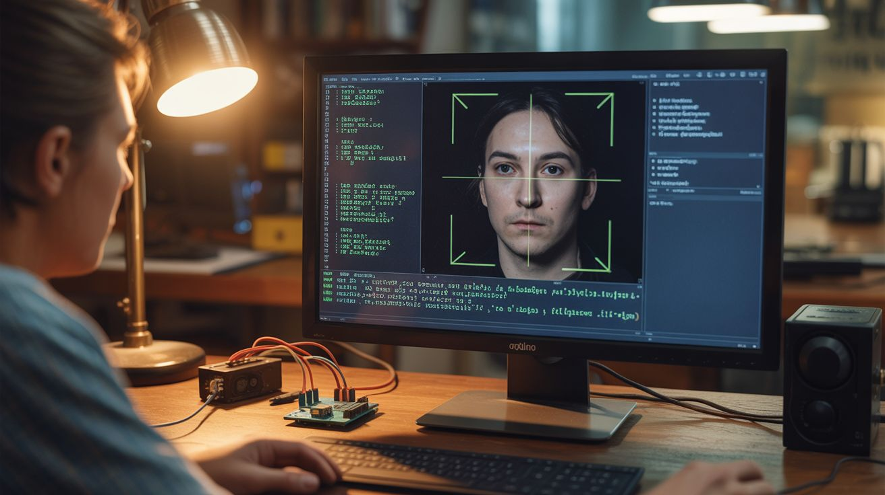

# Python Libraries for Builds

<p align="center">
  
</p>

> Key Python packages that power the software side of Junkyard Genius builds — computer vision, audio processing, machine learning, and hardware control.

All builds that involve a Raspberry Pi or laptop running Python use some combination of these libraries. This guide covers what each one does, how to install it, and which builds depend on it.

---

## Computer Vision

### OpenCV (`opencv-python`)

**What it does:** The heavyweight of computer vision. Image capture, face detection, object tracking, color filtering, edge detection, image transformation, and video processing. If it involves a camera and processing what the camera sees, you're using OpenCV.

**Install:**
```bash
pip install opencv-python         # Full version with GUI support
pip install opencv-python-headless  # No GUI — use on headless Pi
```

**Used in builds:**
- [Face Tracking Laser](../categories/python-projects/141-face-tracking-laser.md) — face detection and tracking
- [AI Photo Booth](../categories/python-projects/143-ai-photo-booth.md) — real-time image processing
- [Automated Microscope](../categories/python-projects/148-automated-microscope.md) — image capture and focus stacking
- [Deepfake Mirror](../categories/python-projects/153-deepfake-mirror.md) — face swapping pipeline
- [AI Doorbell](../categories/pi-and-arduino/130-ai-doorbell.md) — person detection
- [Nerf Sentry Turret](../categories/pi-and-arduino/138-nerf-sentry-turret.md) — target detection

**Key functions you'll use:**
- `cv2.VideoCapture()` — open camera or video stream
- `cv2.CascadeClassifier()` — Haar cascade face/object detection
- `cv2.cvtColor()` — color space conversion (BGR to RGB, gray, HSV)
- `cv2.imshow()` — display image (desktop only, not headless)

---

### MediaPipe (`mediapipe`)

**What it does:** Google's perception framework. Provides pre-trained models for face detection, face mesh (468 landmarks), hand tracking (21 landmarks per hand), body pose estimation (33 landmarks), and object detection. Much more accurate than Haar cascades and runs in real time on a Pi 4.

**Install:**
```bash
pip install mediapipe
```

**Used in builds:**
- [Face Tracking Laser](../categories/python-projects/141-face-tracking-laser.md) — high-accuracy face detection
- [Body Pose Music](../categories/python-projects/152-body-pose-music.md) — full body pose estimation
- [AI Photo Booth](../categories/python-projects/143-ai-photo-booth.md) — face and hand landmarks
- [Translator Glasses](../categories/python-projects/151-translator-glasses.md) — gesture recognition

**Key functions you'll use:**
- `mp.solutions.face_detection` — face bounding boxes
- `mp.solutions.face_mesh` — 468 facial landmarks
- `mp.solutions.hands` — hand tracking with 21 landmarks
- `mp.solutions.pose` — 33 body landmarks

---

## Audio

### librosa

**What it does:** Audio analysis library. Loads audio files, computes spectrograms, extracts features (tempo, pitch, MFCCs), and performs beat tracking. The standard tool for any build that needs to understand music.

**Install:**
```bash
pip install librosa
```

**Used in builds:**
- [Music Visualizer LED Wall](../categories/python-projects/145-music-visualizer-led-wall.md) — beat detection and frequency analysis
- [Pi DJ Controller](../categories/pi-and-arduino/131-pi-dj-controller.md) — BPM detection and audio analysis
- [Body Pose Music](../categories/python-projects/152-body-pose-music.md) — audio feature extraction

**Key functions you'll use:**
- `librosa.load()` — load audio file
- `librosa.stft()` — Short-Time Fourier Transform
- `librosa.beat.beat_track()` — detect beats and tempo
- `librosa.feature.mfcc()` — extract spectral features

---

### PyAudio (`pyaudio`)

**What it does:** Python interface to the PortAudio library. Captures and plays audio in real time through your system's audio hardware. The bridge between your microphone/speakers and your Python code.

**Install:**
```bash
# Linux/Pi:
sudo apt install portaudio19-dev
pip install pyaudio

# Windows:
pip install pyaudio

# macOS:
brew install portaudio
pip install pyaudio
```

**Used in builds:**
- [Music Visualizer LED Wall](../categories/python-projects/145-music-visualizer-led-wall.md) — real-time audio capture
- [Arduino Guitar Pedal](../categories/pi-and-arduino/124-arduino-guitar-pedal.md) — audio I/O
- [Earthquake Detector](../categories/python-projects/146-earthquake-detector.md) — vibration capture via microphone
- Any build that captures live audio

**Key functions you'll use:**
- `pyaudio.PyAudio()` — initialize audio system
- `stream.read()` — capture audio buffer
- `stream.write()` — play audio buffer

---

### FluidSynth (`pyfluidsynth`)

**What it does:** Software MIDI synthesizer. Takes MIDI note events and produces audio output using SoundFont instrument samples. Turns MIDI signals from sensors and controllers into actual music.

**Install:**
```bash
# Linux/Pi:
sudo apt install fluidsynth
pip install pyfluidsynth

# Windows/macOS:
pip install pyfluidsynth
# (Requires FluidSynth binary installed separately)
```

**Used in builds:**
- [Body Pose Music](../categories/python-projects/152-body-pose-music.md) — converting pose data to MIDI sounds
- [MIDI Stepper Organ](../categories/pi-and-arduino/135-midi-stepper-organ.md) — MIDI processing
- Any build that generates music from sensor data

---

## Data & Math

### NumPy (`numpy`)

**What it does:** The foundation of scientific computing in Python. Fast array operations, matrix math, FFT, and linear algebra. Nearly every other library on this page depends on it. If a build does math on data, NumPy is involved.

**Install:**
```bash
pip install numpy
```

**Used in builds:** Virtually every Python build in the repo. Specific uses:
- FFT for audio spectrum analysis ([Music Visualizer LED Wall](../categories/python-projects/145-music-visualizer-led-wall.md))
- Matrix operations for image processing
- Signal processing and filtering
- Data manipulation and averaging

---

### SciPy (`scipy`)

**What it does:** Built on NumPy. Adds signal processing (filters, FFT), optimization, interpolation, statistics, and integration. The go-to for any scientific or engineering computation beyond basic math.

**Install:**
```bash
pip install scipy
```

**Used in builds:**
- [Earthquake Detector](../categories/python-projects/146-earthquake-detector.md) — signal filtering and frequency analysis
- [Arduino Guitar Pedal](../categories/pi-and-arduino/124-arduino-guitar-pedal.md) — audio DSP filters
- Signal processing in sensor-heavy builds

**Key functions you'll use:**
- `scipy.signal.butter()` + `scipy.signal.filtfilt()` — digital filtering
- `scipy.fft.fft()` — Fast Fourier Transform (alternative to numpy.fft)
- `scipy.signal.find_peaks()` — peak detection in signals

---

### Matplotlib (`matplotlib`)

**What it does:** Plotting and visualization. Generates charts, graphs, spectrograms, and 2D visualizations. Essential for debugging sensor data and creating data visualizations.

**Install:**
```bash
pip install matplotlib
```

**Used in builds:**
- [Earthquake Detector](../categories/python-projects/146-earthquake-detector.md) — seismogram plots
- [ESP32 Weather Station](../categories/pi-and-arduino/132-esp32-weather-station.md) — historical data graphs
- Debugging and data visualization across all builds

---

## Machine Learning

### scikit-learn (`sklearn`)

**What it does:** Classical machine learning — classification, regression, clustering, dimensionality reduction. No neural networks (that's TensorFlow/PyTorch territory). Good for simpler ML tasks like anomaly detection, classification from sensor data, and pattern recognition.

**Install:**
```bash
pip install scikit-learn
```

**Used in builds:**
- [AI Metal Detector](../categories/python-projects/147-ai-metal-detector.md) — classifying metal types from sensor signatures
- [Sentiment Room Lighting](../categories/python-projects/144-sentiment-room-lighting.md) — text sentiment classification

---

### TensorFlow Lite (`tflite-runtime`)

**What it does:** Lightweight inference engine for running pre-trained neural network models on resource-constrained devices like Raspberry Pi. Handles image classification, object detection, and speech recognition without a GPU.

**Install:**
```bash
pip install tflite-runtime
```

**Used in builds:**
- [AI Doorbell](../categories/pi-and-arduino/130-ai-doorbell.md) — person detection on Pi
- [AI Photo Booth](../categories/python-projects/143-ai-photo-booth.md) — style transfer
- [Translator Glasses](../categories/python-projects/151-translator-glasses.md) — text recognition

**Note:** Use `tflite-runtime` on Pi (lightweight), not the full `tensorflow` package (too heavy for Pi). Pre-trained models are available from Google's TFHub and the TensorFlow Lite model zoo.

---

### PyTorch (`torch`)

**What it does:** Deep learning framework. More flexible than TensorFlow for research and custom models. Better developer experience. Used when you need to train or run custom neural networks.

**Install:**
```bash
pip install torch torchvision  # CPU version
```

**Used in builds:**
- [Deepfake Mirror](../categories/python-projects/153-deepfake-mirror.md) — face generation models
- [Generative Art Plotter](../categories/python-projects/142-generative-art-plotter.md) — style transfer models
- Advanced builds needing custom model training

**Note:** PyTorch is heavy. On Raspberry Pi, prefer TensorFlow Lite for inference. Use PyTorch on a laptop for training, then export models for Pi deployment.

---

## Speech

### Vosk (`vosk`)

**What it does:** Offline speech recognition. Converts spoken words to text without an internet connection. Small model size (50MB for English), fast recognition, and works on Raspberry Pi. No cloud dependency.

**Install:**
```bash
pip install vosk
```

**Used in builds:**
- [Voice Home Automation](../categories/python-projects/149-voice-home-automation.md) — voice command recognition
- [AI Dungeon Master](../categories/python-projects/155-ai-dungeon-master.md) — voice input
- Any build needing offline voice control

**Note:** Download the language model separately from [alphacephei.com/vosk/models](https://alphacephei.com/vosk/models). The "small" English model works well for command recognition on Pi.

---

### Whisper (`openai-whisper`)

**What it does:** OpenAI's speech recognition model. More accurate than Vosk, especially with accents and background noise. Runs locally (no internet needed). Multiple model sizes from "tiny" (fast, less accurate) to "large" (slow, very accurate).

**Install:**
```bash
pip install openai-whisper
```

**Used in builds:**
- [Translator Glasses](../categories/python-projects/151-translator-glasses.md) — speech-to-text for translation
- [AI Dungeon Master](../categories/python-projects/155-ai-dungeon-master.md) — high-accuracy speech input

**Note:** The "tiny" and "base" models run on Pi 4 (slowly). For real-time use, run on a laptop or use Vosk instead. The "small" model is a good accuracy/speed tradeoff on a laptop.

---

## Web & Interface

### Flask (`flask`)

**What it does:** Lightweight web framework. Creates web interfaces for your builds — dashboards, control panels, data viewers. Runs a web server on the Pi that you access from your phone or laptop browser.

**Install:**
```bash
pip install flask
```

**Used in builds:**
- [ESP32 Weather Station](../categories/pi-and-arduino/132-esp32-weather-station.md) — web dashboard for sensor data
- [Smart Mirror](../categories/pi-and-arduino/123-smart-mirror.md) — configuration interface
- [AI Photo Booth](../categories/python-projects/143-ai-photo-booth.md) — photo gallery and controls
- Any build needing a web-based control panel

---

### Gradio (`gradio`)

**What it does:** Creates instant web interfaces for Python functions. Point it at a function, and it auto-generates a web UI with inputs, outputs, and a "Submit" button. Incredible for demos and rapid prototyping. More polished than Flask for demo purposes, less flexible for custom UIs.

**Install:**
```bash
pip install gradio
```

**Used in builds:**
- [AI Photo Booth](../categories/python-projects/143-ai-photo-booth.md) — quick demo interface
- [Deepfake Mirror](../categories/python-projects/153-deepfake-mirror.md) — face swap demo interface
- Any build needing a quick web demo

---

## Hardware Control

### pyserial (`serial`)

**What it does:** Serial communication with Arduino, ESP32, and other microcontrollers. Sends and receives data over USB serial. The bridge between Python on a Pi/laptop and code running on an Arduino.

**Install:**
```bash
pip install pyserial
```

**Used in builds:**
- [Fractal Laser Engraver](../categories/python-projects/150-fractal-laser-engraver.md) — sending G-code to Arduino
- [Generative Art Plotter](../categories/python-projects/142-generative-art-plotter.md) — sending coordinates to plotter
- [Music Visualizer LED Wall](../categories/python-projects/145-music-visualizer-led-wall.md) — serial to Arduino LED controller
- Any build where Python on a computer controls an Arduino

**Key usage:**
```python
import serial
ser = serial.Serial('/dev/ttyUSB0', 9600)
ser.write(b'command\n')
response = ser.readline()
```

---

### RPi.GPIO (`RPi.GPIO`)

**What it does:** Controls Raspberry Pi GPIO pins — set pins high/low, read digital inputs, generate PWM signals. Pre-installed on Raspberry Pi OS.

**Install:**
```bash
pip install RPi.GPIO  # Usually pre-installed on Pi
```

**Used in builds:**
- [Fireworks Sequencer](../categories/pi-and-arduino/121-fireworks-sequencer.md) — relay control via GPIO
- [Auto Plant Watering](../categories/pi-and-arduino/127-auto-plant-watering.md) — pump relay control
- Most Pi-based hardware control builds

---

### gpiozero (`gpiozero`)

**What it does:** Simpler, more Pythonic interface to GPIO than RPi.GPIO. Higher-level abstractions — `LED`, `Button`, `Servo`, `MotionSensor` classes instead of raw pin manipulation. Pre-installed on Raspberry Pi OS.

**Install:**
```bash
pip install gpiozero  # Usually pre-installed on Pi
```

**Used in builds:** Same builds as RPi.GPIO — gpiozero is an easier alternative for simpler projects. Use RPi.GPIO when you need fine-grained timing control; use gpiozero when you want cleaner code.

**Key usage:**
```python
from gpiozero import LED, Button
led = LED(17)
button = Button(2)
button.when_pressed = led.on
button.when_released = led.off
```

---

## Quick Reference Table

| Library | Category | Install Command | Pi Compatible? | Key Builds |
|---|---|---|---|---|
| opencv-python | Computer Vision | `pip install opencv-python-headless` | Yes (headless) | Face Tracking Laser, AI Photo Booth |
| mediapipe | Computer Vision | `pip install mediapipe` | Yes (Pi 4+) | Body Pose Music, Face Tracking |
| librosa | Audio | `pip install librosa` | Yes | Music Visualizer, DJ Controller |
| pyaudio | Audio | `pip install pyaudio` | Yes | Music Visualizer, Guitar Pedal |
| pyfluidsynth | Audio | `pip install pyfluidsynth` | Yes | Body Pose Music, MIDI Organ |
| numpy | Math | `pip install numpy` | Yes | Everything |
| scipy | Math | `pip install scipy` | Yes | Earthquake Detector, signal processing |
| matplotlib | Visualization | `pip install matplotlib` | Yes | Data debugging, seismograms |
| scikit-learn | ML | `pip install scikit-learn` | Yes | AI Metal Detector, Sentiment Lighting |
| tflite-runtime | ML | `pip install tflite-runtime` | Yes | AI Doorbell, Translator Glasses |
| torch | ML | `pip install torch` | Laptop only | Deepfake Mirror, Generative Art |
| vosk | Speech | `pip install vosk` | Yes | Voice Home Automation |
| openai-whisper | Speech | `pip install openai-whisper` | Slow on Pi | Translator Glasses |
| flask | Web | `pip install flask` | Yes | Weather Station, Smart Mirror |
| gradio | Web | `pip install gradio` | Yes | AI Photo Booth, demos |
| pyserial | Hardware | `pip install pyserial` | Yes | Laser Engraver, Art Plotter |
| RPi.GPIO | Hardware | Pre-installed | Pi only | Fireworks Sequencer, Plant Watering |
| gpiozero | Hardware | Pre-installed | Pi only | Same as RPi.GPIO (easier API) |

---

## Virtual Environments

Always use a virtual environment for each build's Python dependencies. Libraries can conflict with each other (especially ML frameworks), and a venv keeps each build isolated.

```bash
# Create a virtual environment
python -m venv myproject-env

# Activate it
source myproject-env/bin/activate  # Linux/macOS/Pi
myproject-env\Scripts\activate     # Windows

# Install dependencies
pip install opencv-python-headless numpy pyaudio

# Deactivate when done
deactivate
```

On Raspberry Pi, some libraries (OpenCV, NumPy) can take a long time to compile from source. Use the `--prefer-binary` flag or install system packages via `apt` when available:

```bash
sudo apt install python3-opencv python3-numpy python3-scipy
```
