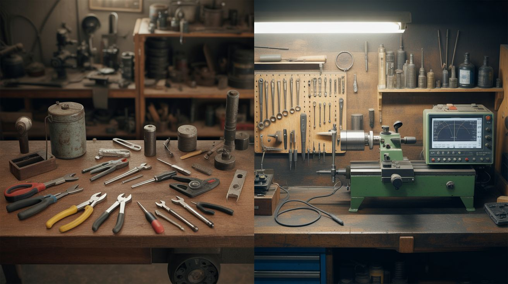

# Skill Trees

  

> Pick a path. Start at the bottom. Work your way up. Every build teaches you something the next build needs.

This isn't a random list of projects. It's a progression system. Each path starts with something anyone can build in an afternoon and ends with something that'll make a professional engineer raise an eyebrow. The skills compound — what you learn in build #1 is the foundation for build #4.

Pick the path that excites you most and start at the beginning. Don't skip ahead. The early builds are easy on purpose — they're teaching you the skills that keep you alive (and successful) on the hard ones.

---

## Electrical Path

**Theme:** Understanding voltage, current, magnetism, and the invisible forces that make everything work.

| Stage | Build | What You Learn | Link |
|---|---|---|---|
| 1. Beginner | **Homopolar Motor** | The simplest motor in existence. Battery + magnet + wire = rotation. Teaches you that current flowing through a magnetic field creates force. This is the foundation of every motor, generator, and electromagnetic device. | [#198](../categories/weird-science/198-homopolar-motor.md) |
| 2. Beginner | **Ball Bearing Motor** | A battery, two magnets, and a ball bearing. The motor spins itself. Teaches eddy currents and the relationship between electrical contact and mechanical rotation. | [#187](../categories/mechanical-and-kinetic/187-ball-bearing-motor.md) |
| 3. Beginner | **LED Circuits / LED Jacket** | Soldering LEDs in series and parallel, understanding resistors, forward voltage drops, and current limiting. If you can wire 100 LEDs without burning any out, you understand Ohm's law. | [#242](../categories/wearable-tech/242-led-jacket.md) |
| 4. Intermediate | **LED Cube 8x8x8** | 512 LEDs soldered into a 3D matrix, driven by multiplexed signals from an Arduino. Teaches matrix addressing, charlieplexing, shift registers, and the art of keeping 512 solder joints from going cold. | [#122](../categories/pi-and-arduino/122-led-cube-8x8x8.md) |
| 5. Intermediate | **Jacob's Ladder** | High voltage from a MOT climbs between two diverging electrodes. Teaches transformer operation, high-voltage safety, air ionization, and why plasma rises (it's hot gas). | [#034](../categories/mad-scientist/034-jacobs-ladder.md) |
| 6. Advanced | **Musical Tesla Coil** | A solid-state Tesla coil modulated by audio frequencies — it literally plays music through lightning. Teaches resonant circuits, MOSFET switching, flyback transformer driving, and RF interference management. | [#033](../categories/mad-scientist/033-musical-tesla-coil.md) |
| 7. Advanced | **Coil Gun** | Electromagnetic projectile launcher using sequentially timed coils. Teaches solenoid design, timing circuits, high-current switching, and energy storage in inductors. | [#037](../categories/mad-scientist/037-coil-gun.md) |
| 8. Endgame | **Rail Gun** | Two parallel rails, a conductive projectile, and a massive capacitor bank. Current flowing through the projectile creates a magnetic field that accelerates it at terrifying speed. Teaches capacitor bank construction, Lorentz force, and why the military spends billions on this technology. | [#036](../categories/mad-scientist/036-rail-gun.md) |

**Side quests:** [#038 Electromagnetic Levitator](../categories/mad-scientist/038-electromagnetic-levitator.md), [#035 Electromagnetic Can Crusher](../categories/mad-scientist/035-electromagnetic-can-crusher.md), [#186 Eddy Current Brake](../categories/mechanical-and-kinetic/186-eddy-current-brake.md), [#199 Lenz's Law Slow-Mo Magnet](../categories/weird-science/199-lenzs-law-slow-mo-magnet.md)

---

## Pyro & Chemistry Path

**Theme:** Controlling chemical reactions, understanding combustion, and making things glow, burn, and explode (safely).

| Stage | Build | What You Learn | Link |
|---|---|---|---|
| 1. Beginner | **Colored Fire** | Different metal salts burn different colors — copper = green, lithium = red, sodium = yellow. Teaches flame chemistry, oxidizer basics, and safe handling of chemical compounds. This is day-one chemistry that looks like wizardry. | [#101](../categories/pyro-and-chemistry/101-colored-fire.md) |
| 2. Beginner | **Elephant Toothpaste** | Hydrogen peroxide, potassium iodide, and dish soap create a massive foam eruption. Teaches catalysis, exothermic reactions, and the joy of making a catastrophic mess on camera. | [#102](../categories/pyro-and-chemistry/102-elephant-toothpaste.md) |
| 3. Intermediate | **Smoke Bomb Array** | KNO3 (potassium nitrate) mixed with an organic fuel creates dense colored smoke. Teaches oxidizer/fuel ratios, melting and casting, and fuse timing. | [#103](../categories/pyro-and-chemistry/103-smoke-bomb-array.md) |
| 4. Intermediate | **Steel Wool Photography** | Burning steel wool spun on a string creates circular spark trails for long-exposure photography. Teaches combustion of metals, surface-area-to-volume ratio effects, and timing. | [#113](../categories/pyro-and-chemistry/113-steel-wool-photography.md) |
| 5. Intermediate | **Cold Spark Machine** | Ti (titanium) powder granules ignited in a controlled column — the "cold sparks" used at concerts and weddings. Looks like a fountain of fire but is cool enough to touch. Teaches particle ignition, controlled burn rate, and fan-driven spark direction. | [#104](../categories/pyro-and-chemistry/104-cold-spark-machine.md) |
| 6. Advanced | **Pharaoh's Serpent** | Mercury thiocyanate or sodium bicarbonate/sugar mix ignites and expands into an eerie writhing ash snake. Teaches decomposition reactions and intumescent chemistry. | [#110](../categories/pyro-and-chemistry/110-pharaohs-serpent.md) |
| 7. Advanced | **Luminol Crime Scene** | Luminol reacts with iron in hemoglobin to produce blue chemiluminescence. Spray a room, kill the lights, watch evidence glow. Teaches oxidation-reduction chemistry, bioluminescence, and forensic science. | [#109](../categories/pyro-and-chemistry/109-luminol-crime-scene.md) |
| 8. Endgame | **Thermite Flower Pot** | Iron oxide + aluminum powder ignites at 4,000F and melts through steel. Teaches thermite chemistry (aluminothermic reaction), ignition temperature, and extreme-heat safety. This is the final boss of backyard chemistry. | [#105](../categories/pyro-and-chemistry/105-thermite-flower-pot.md) |

**Side quests:** [#115 Permanganate Auto-Ignition](../categories/pyro-and-chemistry/115-permanganate-auto-ignition.md), [#116 Calcium Carbide Cannon](../categories/pyro-and-chemistry/116-calcium-carbide-cannon.md), [#111 Chemiluminescent Fountain](../categories/pyro-and-chemistry/111-chemiluminescent-fountain.md), [#007 Fire Tornado Table](../categories/fire-and-plasma/007-fire-tornado-table.md), [#120 Dry Ice Bubble Cauldron](../categories/pyro-and-chemistry/120-dry-ice-bubble-cauldron.md)

---

## Coding & Automation Path

**Theme:** Using microcontrollers and code to make physical things smart, responsive, and autonomous.

| Stage | Build | What You Learn | Link |
|---|---|---|---|
| 1. Beginner | **Pi-Hole Ad Blocker** | Set up a Raspberry Pi as a network-wide ad blocker. Teaches Linux basics, SSH, networking, DNS, and the Pi ecosystem. Zero soldering required — this is 100% software on real hardware. | [#139](../categories/pi-and-arduino/139-pi-hole-ad-blocker.md) |
| 2. Beginner | **ESP32 Weather Station** | ESP32 reads temperature, humidity, and barometric pressure sensors, displays data on an OLED screen and/or web dashboard. Teaches microcontroller programming, I2C communication, sensor reading, and WiFi connectivity. | [#132](../categories/pi-and-arduino/132-esp32-weather-station.md) |
| 3. Intermediate | **Auto Plant Watering** | Arduino or ESP32 reads soil moisture sensors and activates a pump or solenoid valve when plants need water. Teaches analog-to-digital conversion, threshold logic, relay control, and the basics of closed-loop automation. | [#127](../categories/pi-and-arduino/127-auto-plant-watering.md) |
| 4. Intermediate | **ESP32-CAM Security** | ESP32-CAM module streams video over WiFi, detects motion, and sends alerts. Teaches camera interfacing, streaming protocols, motion detection algorithms, and notification systems. | [#128](../categories/pi-and-arduino/128-esp32-cam-security.md) |
| 5. Intermediate | **Smart Mirror** | A Raspberry Pi behind a two-way mirror displays time, weather, calendar, and news. Teaches web rendering, display output, widget systems, and the art of hiding tech behind glass. | [#123](../categories/pi-and-arduino/123-smart-mirror.md) |
| 6. Advanced | **Face Tracking Laser** | OpenCV detects faces through a webcam and servos aim a laser pointer at them. Teaches computer vision, servo PWM control, PID tracking, and the intersection of software and hardware. | [#141](../categories/python-projects/141-face-tracking-laser.md) |
| 7. Advanced | **Sentiment Room Lighting** | Microphone input analyzed for emotional tone in real time; LED strips shift color to match the mood of conversation. Teaches audio processing, sentiment analysis, LED control protocols (WS2812B), and real-time data pipelines. | [#144](../categories/python-projects/144-sentiment-room-lighting.md) |
| 8. Endgame | **Deepfake Mirror** | A mirror with a screen behind it that maps your face onto someone else's face in real time. Teaches neural network inference, face mesh detection, real-time video processing, and why this technology is both amazing and terrifying. | [#153](../categories/python-projects/153-deepfake-mirror.md) |

**Side quests:** [#130 AI Doorbell](../categories/pi-and-arduino/130-ai-doorbell.md), [#149 Voice Home Automation](../categories/python-projects/149-voice-home-automation.md), [#143 AI Photo Booth](../categories/python-projects/143-ai-photo-booth.md), [#134 Pirate Radio](../categories/pi-and-arduino/134-pirate-radio.md), [#155 AI Dungeon Master](../categories/python-projects/155-ai-dungeon-master.md)

---

## Mechanical & Kinetic Path

**Theme:** Gears, levers, thermodynamics, and the beauty of things that move.

| Stage | Build | What You Learn | Link |
|---|---|---|---|
| 1. Beginner | **Chain Fountain** | A ball chain in a beaker spontaneously rises in an arc when one end is dropped over the edge. Teaches momentum transfer, the Mould effect, and the joy of physics that looks like magic. | [#184](../categories/mechanical-and-kinetic/184-chain-fountain.md) |
| 2. Beginner | **Prince Rupert's Drop** | Molten glass dropped into water creates a tadpole-shaped drop that's nearly indestructible at the head but explodes entirely if the tail is snapped. Teaches internal stress, tempered glass physics, and slow-motion videography. | [#190](../categories/mechanical-and-kinetic/190-prince-ruperts-drop.md) |
| 3. Intermediate | **Trebuchet** | A counterweight siege engine built from scrap wood and metal. Teaches mechanical advantage, leverage ratios, projectile physics, and structural engineering. Also: launching pumpkins is objectively funny. | [#185](../categories/mechanical-and-kinetic/185-trebuchet.md) |
| 4. Intermediate | **Hydraulic Robot Arm** | Syringes and tubing create a hydraulic system that moves a multi-joint robot arm. Teaches Pascal's law, hydraulic multiplication, mechanical linkages, and gripper design. | [#183](../categories/mechanical-and-kinetic/183-hydraulic-robot-arm.md) |
| 5. Intermediate | **Curie Engine** | A heat engine powered by the Curie temperature of ferromagnetic material — a magnet attracts a nickel element, a candle heats it past its Curie point, it loses magnetism and falls away, cools, and gets attracted again. Perpetual motion (as long as the candle burns). | [#189](../categories/mechanical-and-kinetic/189-curie-engine.md) |
| 6. Advanced | **Stirling Engine** | An external combustion engine that runs on any temperature differential — a cup of hot coffee is enough. Teaches thermodynamic cycles, piston/displacer mechanics, regenerator design, and the Stirling cycle. Building one that actually runs is a machining milestone. | [#182](../categories/mechanical-and-kinetic/182-stirling-engine.md) |
| 7. Advanced | **Kinetic Wind Sculpture** | A balanced, multi-element sculpture that moves with the wind in mesmerizing patterns. Teaches balance points, bearing selection, wind loading, and the intersection of engineering and art. | [#043](../categories/art-and-installation/043-kinetic-wind-sculpture.md) |
| 8. Endgame | **Musical Marble Machine** | A hand-cranked or motorized machine that lifts marbles to the top of a track system where they trigger tuned percussion elements (vibraphone bars, drums, bells) as they descend. Teaches gear trains, cam mechanisms, timing, musical tuning, and precision fabrication. This is the Everest of mechanical builds. | [#181](../categories/mechanical-and-kinetic/181-musical-marble-machine.md) |

**Side quests:** [#188 Magnetic Gear Train](../categories/mechanical-and-kinetic/188-magnetic-gear-train.md), [#186 Eddy Current Brake](../categories/mechanical-and-kinetic/186-eddy-current-brake.md), [#044 Anti-Gravity Water Fountain](../categories/art-and-installation/044-antigravity-water-fountain.md), [#025 Scooter Motor Lathe](../categories/functional-machines/025-scooter-motor-lathe.md)

---

## Chemistry & Electrochemistry Path

**Theme:** Growing crystals, plating metals, etching surfaces, and controlling chemical reactions with electricity.

| Stage | Build | What You Learn | Link |
|---|---|---|---|
| 1. Beginner | **Bismuth Crystal Garden** | Melt bismuth on the stove, cool it slowly, and harvest iridescent staircase crystals. Teaches crystallization, cooling rate effects, and the oxide layer interference that creates those rainbow colors. | [#107](../categories/pyro-and-chemistry/107-bismuth-crystal-garden.md) |
| 2. Beginner | **Copper Crystal Tree** | Copper sulfate solution + an iron nail = a fuzzy tree of pure copper crystals grows over hours. Teaches displacement reactions, reduction-oxidation, and the electrochemical series. | [#161](../categories/chemical-electronic/161-copper-crystal-tree.md) |
| 3. Beginner | **Density Tower** | Layer household liquids by density in a tall container — honey, corn syrup, dish soap, water, oil, alcohol. Teaches density, miscibility, and fluid physics. Simple but mesmerizing. | [#213](../categories/household-chemistry/280-density-tower.md) |
| 4. Intermediate | **Electroplating Station** | Run current through a solution to deposit metal (copper, nickel, chrome, gold) onto any conductive surface. Teaches electrochemistry, anode/cathode reactions, current density, and surface preparation. | [#156](../categories/chemical-electronic/156-electroplating-station.md) |
| 5. Intermediate | **PCB Etching Station** | Ferric chloride or copper chloride solution etches custom circuit boards from copper-clad board + toner transfer. Teaches chemical etching, resist patterns, and PCB fabrication. | [#158](../categories/chemical-electronic/158-pcb-etching-station.md) |
| 6. Advanced | **Anodizing Setup** | Electrolytic process that grows a controlled oxide layer on aluminum, which can then absorb dyes for permanent color. Teaches anodization, oxide layer physics, and dye absorption. | [#157](../categories/chemical-electronic/157-anodizing-setup.md) |
| 7. Advanced | **Electroforming Art** | Build up thick layers of copper onto a non-conductive object (leaf, 3D print, wax sculpture) by electroplating over a conductive paint coating. Teaches electroforming, conductive coatings, and the patience of saints. | [#160](../categories/chemical-electronic/160-electroforming-art.md) |
| 8. Endgame | **Luminol Crime Scene** | Luminol + hydrogen peroxide + iron catalyst = blue chemiluminescent glow in a dark room. Spray everything. Kill the lights. See what glows. Teaches chemiluminescence, catalysis, and forensic chemistry. | [#109](../categories/pyro-and-chemistry/109-luminol-crime-scene.md) |

**Side quests:** [#162 Electrochemical Etching](../categories/chemical-electronic/162-electrochemical-etching.md), [#165 Rochelle Salt Crystal](../categories/chemical-electronic/165-rochelle-salt-crystal.md), [#163 pH-Reactive Paint](../categories/chemical-electronic/163-ph-reactive-paint.md), [#164 Sodium Silicate Demos](../categories/chemical-electronic/164-sodium-silicate-demos.md), [#168 Thermochromic Mug](../categories/chemical-electronic/168-thermochromic-mug.md)

---

## Light & Optics Path

**Theme:** Lasers, plasma, optics, and everything that glows, refracts, or projects.

| Stage | Build | What You Learn | Link |
|---|---|---|---|
| 1. Beginner | **Pepper's Ghost Hologram** | A sheet of clear plastic at 45 degrees reflects a phone screen into a "floating" 3D image. Teaches reflection, angle of incidence, and the century-old theater trick behind most "hologram" displays. | [#171](../categories/light-and-visual/171-peppers-ghost-hologram.md) |
| 2. Beginner | **UV Mineral Display** | UV LEDs or a blacklight lamp illuminate fluorescent minerals that glow in vivid colors invisible under normal light. Teaches fluorescence, UV light safety, and mineral identification. | [#177](../categories/light-and-visual/177-uv-mineral-display.md) |
| 3. Intermediate | **Infinity Mirror Table** | Two parallel mirrors with LEDs between them create an infinite tunnel of light. Teaches two-way mirror behavior, LED strip wiring, and the perception of depth through reflection. | [#016](../categories/light-and-visual/016-infinity-mirror-table.md) |
| 4. Intermediate | **Shadow Chandelier** | A sculptural light fixture that casts intricate shadow patterns on the walls — the shadows are the art, not the fixture. Teaches light geometry, shadow projection, and the relationship between 3D form and 2D projection. | [#018](../categories/light-and-visual/018-shadow-chandelier.md) |
| 5. Intermediate | **Camera Obscura Room** | Darken a room, cut a small hole in the window cover, and the entire outside world projects (inverted) onto the opposite wall. Teaches pinhole optics, the origin of photography, and focal length. | [#175](../categories/light-and-visual/175-camera-obscura-room.md) |
| 6. Advanced | **Laser Fog Projector** | A laser, two galvanometer mirrors, and a fog machine create sweeping laser patterns in mid-air. Teaches galvo mirror control, DAC output, and vector graphics rendering with light. | [#017](../categories/light-and-visual/017-laser-fog-projector.md) |
| 7. Advanced | **Schlieren Optics** | An optical setup that makes invisible air currents, heat waves, and gas flows visible. Teaches schlieren photography, focal point manipulation, and optical bench alignment. | [#172](../categories/light-and-visual/172-schlieren-optics.md) |
| 8. Endgame | **Fiber Optic Star Ceiling** | Hundreds of fiber optic strands threaded through a ceiling panel, each lit by a central LED source, creating a realistic starfield. Teaches fiber optic principles, light coupling, constellation mapping, and the patience required to drill 300 holes. | [#173](../categories/light-and-visual/173-fiber-optic-star-ceiling.md) |

**Side quests:** [#176 Laser Maze](../categories/light-and-visual/176-laser-maze.md), [#174 Polarization Art](../categories/light-and-visual/174-polarization-art.md), [#178 Light Painting Robot](../categories/light-and-visual/178-light-painting-robot.md), [#022 Holographic Fan Display](../categories/light-and-visual/022-holographic-fan-display.md), [#023 UV-Reactive Water Wall](../categories/light-and-visual/023-uv-reactive-water-wall.md)

---

## Sound & Music Path

**Theme:** Making noise, music, and instruments from salvaged parts.

| Stage | Build | What You Learn | Link |
|---|---|---|---|
| 1. Beginner | **Cigar Box Guitar** | A box, a stick, strings, and a piezo pickup. A playable instrument from trash. Teaches string tension, resonance, scale length, and the basics of acoustic amplification. | [#235](../categories/junk-instruments/235-cigar-box-guitar.md) |
| 2. Beginner | **Bottle Xylophone** | Glass bottles filled to different water levels, tuned to a scale. Teaches pitch, resonant frequency, and the relationship between air column length and tone. | [#241](../categories/junk-instruments/241-bottle-xylophone.md) |
| 3. Beginner | **Thunder Drum** | A drum with a spring attached to the head — shaking the spring creates thunder and rain sounds. Teaches resonance, vibration transfer, and sound design. | [#012](../categories/sound-and-music/012-thunder-drum.md) |
| 4. Intermediate | **Hard Drive Speaker** | A hard drive's voice coil actuator driven by an audio signal turns the platter into a speaker diaphragm. Teaches electromagnetic speakers, impedance matching, and audio amplification. | [#056](../categories/computer-and-phone/056-hard-drive-speaker.md) |
| 5. Intermediate | **Arduino Guitar Pedal** | An Arduino reads audio input, applies digital effects (distortion, delay, reverb), and outputs processed audio. Teaches ADC/DAC, DSP fundamentals, audio buffers, and real-time signal processing. | [#124](../categories/pi-and-arduino/124-arduino-guitar-pedal.md) |
| 6. Advanced | **Plasma Speaker** | A modulated high-voltage arc creates sound directly from ionized air — no diaphragm, no cone, just plasma vibrating at audio frequencies. Teaches audio modulation, flyback transformer driving, and the physics of sound production from plasma. | [#008](../categories/sound-and-music/008-plasma-speaker.md) |
| 7. Advanced | **Rubens' Tube** | A tube filled with flammable gas, perforated along the top, with a speaker at one end. Sound waves create pressure nodes that produce a standing wave pattern in the flames. Teaches standing waves, acoustic resonance, and gas dynamics. | [#009](../categories/sound-and-music/009-rubens-tube.md) |
| 8. Endgame | **MIDI Stepper Organ** | Multiple stepper motors, each tuned to play musical notes by precisely controlling step frequency. A MIDI controller sends note commands and the motors play polyphonic music. Teaches MIDI protocol, stepper driver timing, frequency-to-note mapping, and multi-channel coordination. | [#135](../categories/pi-and-arduino/135-midi-stepper-organ.md) |

**Side quests:** [#011 Ferrofluid Speaker](../categories/sound-and-music/011-ferrofluid-speaker.md), [#014 Bone Conduction Speaker](../categories/sound-and-music/014-bone-conduction-speaker.md), [#013 Aeolian Wind Harp](../categories/sound-and-music/013-aeolian-wind-harp.md), [#236 PVC Pipe Organ](../categories/junk-instruments/236-pvc-pipe-organ.md), [#239 Steel Tongue Drum](../categories/junk-instruments/239-steel-tongue-drum.md)

---

## Cross-Path Builds

The best projects live at the intersection of multiple skill trees. Once you're at stage 3-4 in two paths, you're ready for these combo builds:

| Build | Paths Combined | Link |
|---|---|---|
| **Singing Ferrofluid Tornado** | Electrical + Sound + Chemistry | [#053](../categories/unholy-combos/053-singing-ferrofluid-tornado.md) |
| **Vacuum Plasma Cloud Chamber** | Electrical + Chemistry + Mechanical | [#054](../categories/unholy-combos/054-vacuum-plasma-cloud-chamber.md) |
| **Levitating Plasma Speaker** | Electrical + Sound | [#055](../categories/unholy-combos/055-levitating-plasma-speaker.md) |
| **Ferrofluid Mirror** | Electrical + Chemistry + Light | [#046](../categories/art-and-installation/046-ferrofluid-mirror.md) |
| **Music Visualizer LED Wall** | Coding + Sound + Light | [#145](../categories/python-projects/145-music-visualizer-led-wall.md) |
| **Generative Art Plotter** | Coding + Mechanical | [#142](../categories/python-projects/142-generative-art-plotter.md) |
| **Fireworks Sequencer** | Coding + Pyro | [#121](../categories/pi-and-arduino/121-fireworks-sequencer.md) |
| **Body Pose Music** | Coding + Sound | [#152](../categories/python-projects/152-body-pose-music.md) |
| **Atmospheric Reentry Simulator** | Electrical + Pyro | [#006](../categories/fire-and-plasma/006-atmospheric-reentry-simulator.md) |

---

## How to Use This Page

1. **Pick one path.** Whichever one makes your brain light up.
2. **Start at stage 1.** Even if you think you're beyond it. The early builds are fast, cheap, and teach fundamentals you'll need later.
3. **Don't rush.** Spend time understanding WHY each build works, not just HOW to assemble it.
4. **Cross paths.** Once you're at stage 3-4 in one path, start stage 1 in another. The best builds combine skills from multiple paths.
5. **Side quests are optional but rewarding.** They reinforce the same skills from a different angle.

The endgame builds aren't gatekept by money or access — they're gatekept by skill. The skill tree is how you earn your way there.
