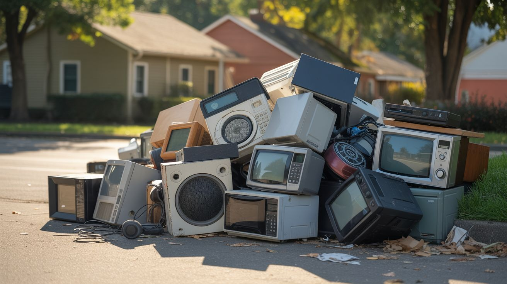

# Where to Find Free Junk

  

> The best builds start at the curb, not at the checkout counter. Your next masterpiece is sitting in someone's driveway right now, with a "FREE" sign taped to it.

The number one barrier to building isn't skill — it's materials. And the number one misconception about materials is that they cost money. They don't. Appliances, electronics, scrap metal, and perfectly good components are thrown away every single day in staggering quantities. The entire American waste stream is your personal parts catalog. You just need to know where to look and when to show up.

---

## Bulk Trash Days

**The holy grail of free junk.** Most municipalities schedule 1-4 bulk pickup days per year where residents can put large items at the curb for free collection. This is when microwaves, fridges, washing machines, dryers, vacuums, printers, and CRT TVs materialize on every block like Christmas morning for tinkerers.

### How to find the schedule:
- Search "[your city] bulk trash pickup schedule" — it's almost always on the city or waste management website
- Sign up for your city's newsletter or alert system — many send reminders before bulk pickup weeks
- Check neighboring cities too — they often have different schedules, doubling your window

### What to look for:
- **Microwaves** — the single most valuable salvage item in this repo. MOTs, magnetron magnets, capacitors, fans, turntable motors. One dead microwave supplies ingredients for a dozen builds.
- **Washers/dryers** — heavy-duty motors, bearings, drums (fire pit!), solenoid valves, counterweights
- **Refrigerators** — compressors, copper tubing, Peltier modules (mini fridges), thermostats
- **Vacuum cleaners** — high-RPM motors, impellers, hoses, HEPA filters
- **CRT TVs** — flyback transformers (high voltage gold), deflection yokes, speakers
- **Printers** — stepper motors, linear rails, timing belts, laser diodes, scanner bars

### Pro tips:
- **Drive the route the night before pickup.** The good stuff gets grabbed fast. The evening before trash day is prime time.
- **Bring a friend and a truck.** Washing machines are not solo-lift items.
- **Check affluent neighborhoods.** People with money throw away better stuff. That "broken" microwave might just have a blown fuse.
- **Hit apartment complex dumpster areas.** Move-out season (May-August) is a goldmine — entire apartments worth of appliances and electronics appear overnight.
- **Make multiple passes.** People set stuff out at different times. A 7pm drive and a 6am drive will yield different finds.

---

## Craigslist / Facebook Marketplace "Free" Section

People will give away almost anything to avoid carrying it to the dump. Your job is to be the first person who shows up with a truck and a smile.

### Search strategy:
- **Craigslist:** Go to your local Craigslist -> "For Sale" -> "Free." Check daily. Set up email alerts for keywords like "microwave," "printer," "old TV," "electronics," "appliances"
- **Facebook Marketplace:** Filter by "Free" -> search "broken," "for parts," "not working," "old," "junk"
- **Facebook groups:** Search for "buy nothing [your city]" and "[your city] free stuff" groups. These are communities built around giving things away. Join all of them.
- **Nextdoor:** Your neighbors post free stuff constantly. Bonus: you don't have to drive far.
- **OfferUp:** Filter by "Free" — less competition than Facebook because fewer people think to check here.

### Best times to check:
- **Sunday evening and Monday morning** — people clean up over the weekend and post what they don't want
- **End of month** — people moving out of apartments dump everything
- **Right after holidays** — old appliances get replaced with new gifts
- **Spring cleaning (March-May)** — the annual purge fills curbs and free sections
- **Back-to-school (August)** — college students abandon furniture and electronics en masse

### Response template that works:
> "Hi! I'd love to pick this up. I can come today/tomorrow at whatever time works for you. I'll bring help if it's heavy. Thanks!"

Short, polite, flexible on timing. Don't ask questions — just show up fast. The first person to reply with a pickup time wins.

### Negotiation tactics for "cheap" listings:
- For items listed at $5-20, offer to pick up immediately: "I can grab this in the next hour if you're around." Speed is worth more than a few dollars to most sellers.
- If something has been listed for more than a week, message with: "Still available? I'd love to take it off your hands."
- Bundle: "I see you also have [other item] — I'd take both if that works?"

---

## Habitat for Humanity ReStore

ReStore shops sell donated building materials, appliances, and furniture at 50-90% off retail. They're operated by Habitat for Humanity and the money goes to building houses. You get cheap parts AND a tax-deductible reason to feel good about it.

### What to expect:
- **Appliances for $5-20** — working or non-working microwaves, fridges, washers, dryers, dishwashers
- **Light fixtures and electrical supplies** — wire, outlets, switches, breaker panels
- **Hardware** — bolts, screws, hinges, brackets in bulk
- **Power tools** (sometimes) — drills, saws, grinders that people upgraded from
- **Cabinets and countertops** — useful for workbench material and enclosures
- **Lumber and plywood** — build bases, frames, and enclosures for pennies

### Tips:
- **Visit regularly.** Inventory rotates constantly. The good stuff moves fast.
- **Ask about their "as-is" bin.** Many locations have a pile of non-working or incomplete items they'll sell for almost nothing.
- **Ask about delivery day.** Find out when they get new donations — show up that morning.
- **Volunteer.** ReStore volunteers get first look at incoming donations. A few hours per month gets you insider access to the stream of goods.
- Find your nearest location: [habitat.org/restores](https://www.habitat.org/restores)

---

## E-Waste Recyclers

E-waste recycling companies receive truckloads of old electronics every week. Most of it gets shredded for raw material recovery. But before it hits the shredder, there's a window where you can negotiate.

### How to approach:
1. **Find local e-waste recyclers.** Search "e-waste recycling [your city]" or check [e-stewards.org](https://e-stewards.org) for certified recyclers.
2. **Call or visit in person.** Explain that you're a hobbyist/maker and you're interested in specific components before they go through the shredder.
3. **Ask specifically for:** dead laptops, printers, CRT monitors, old phones, server equipment, UPS battery backups (18650 cells!), and broken power tools.
4. **Offer to sort.** Some recyclers will let you pick through a bin if you help them sort the rest. This is the golden deal — unlimited parts access in exchange for labor.

### What they typically have mountains of:
- Old laptops (screens, batteries, fans, keyboards)
- Desktop computers (power supplies, fans, hard drives with magnets)
- Printers (stepper motors, linear rails, timing belts, laser diodes)
- CRT monitors (flyback transformers, yokes)
- Cables and power adapters (copper wire, barrel connectors, USB cables)
- Circuit boards (components for desoldering practice)
- UPS battery backups (18650 or lead-acid cells, inverter circuits)
- Old phones (cameras, vibration motors, speakers, screens)

---

## Appliance Repair Shops

Appliance repair technicians replace parts constantly. The old parts are functional-enough components removed because one thing failed — the motor works, but the control board died, so the whole motor assembly goes in the bin.

### The ask:
> "Hey, I do DIY electronics projects. Do you ever have parts you'd otherwise throw away? I'd be happy to take dead appliances or pulled components off your hands — saves you a dump run."

Most shops will say yes. Some will even call you when they have something interesting. You're solving a disposal problem for them.

### What they commonly discard:
- MOTs from microwaves (the repair was cheaper than the microwave)
- Compressors from fridges
- Motors from washers and dryers
- Control boards (often with perfectly good relays, capacitors, and connectors)
- Pumps, solenoids, and valves
- Heating elements
- Thermostats and temperature sensors

### Building the relationship:
- **Be reliable.** If you say you'll pick up, actually show up. Nothing kills the arrangement faster than a no-show.
- **Bring donuts or coffee** occasionally. A $5 gesture keeps the parts flowing for months.
- **Share your builds.** Show them a video of what you made from their "trash." Techs love seeing dead parts come back to life.

---

## University / College Surplus

Universities cycle through lab equipment, computers, and electronics on a 3-5 year rotation. What gets surplused is often higher quality than anything you'd find at a consumer level — lab power supplies, oscilloscopes, signal generators, precision instruments, and server-grade hardware.

### How to access:
- **Surplus stores:** Many universities operate physical surplus stores open to the public. Search "[university name] surplus store" or "property disposition." Prices are typically 10-25% of original cost.
- **Online auctions:** Universities use GovDeals, PublicSurplus, or their own auction platforms. Search for your state's universities.
- **Ask professors.** If you know anyone at a university, ask if their department has old lab equipment heading for surplus. Physics, chemistry, and engineering departments are the jackpot.
- **End of fiscal year (June-August)** is when departments dump equipment to justify next year's budget. This is shopping season.
- **Community colleges** are often overlooked — they have the same equipment refresh cycles with far less competition from buyers.

### Gems to look for:
- Bench power supplies (variable voltage/current — essential for builds)
- Oscilloscopes (even old analog ones are useful)
- Lab-grade multimeters (Fluke, Keithley — these last forever)
- Microscopes (optics, stages, illuminators)
- Old computers and servers (high-capacity power supplies, fans, hard drives)
- Chemistry equipment (glassware, scales, hot plates, stir plates)
- Stepper motor controllers and servo drives from CNC equipment
- Signal generators and function generators

---

## Estate Sales and Garage Sales

Older people collected different junk than we do. Their junk is often way better.

### What to hunt for:
- **Tube radios and hi-fi equipment** — vacuum tubes, transformers, rotary switches, variable capacitors. These components are irreplaceable for certain builds and increasingly rare.
- **Old test equipment** — analog oscilloscopes, signal generators, tube testers, multimeters. Built like tanks, still accurate.
- **CRT televisions** — the last reliable source of flyback transformers in the wild
- **Vintage power tools** — older tools used heavier-duty motors and metal gears instead of plastic
- **Collections of parts** — hobbyists who've passed on often leave behind bins of resistors, capacitors, transistors, wire, and hardware. The family just wants it gone.
- **Ham radio equipment** — antenna tuners, transceivers, SWR meters, coaxial cable. Ham operators accumulate gear for decades.
- **Old cameras and projectors** — lenses, optics, mirrors, mechanical shutters

### Tips:
- **Go early.** Serious finds disappear in the first hour.
- **Bring cash and small bills.** Estate sale operators don't want to make change.
- **Ask about the garage/basement/workshop.** That's where the interesting stuff is — not the living room.
- **Check EstateSales.net** for listings in your area. Photos in the listing often show what's available.
- **Last day = best deals.** If it hasn't sold by Sunday, they'll take any offer to avoid hauling it away.
- **Look for the "box of miscellaneous" lots.** These catch-all boxes often contain rare components priced at a flat $5-10 because nobody wants to sort them. You do.

---

## Thrift Stores

Goodwill, Salvation Army, Value Village, and local thrift shops are underrated parts sources. Most people walk past the electronics section. Don't.

### What to grab:
- **Old printers** ($2-5) — stepper motors, linear rails, timing belts, laser diodes
- **Broken electronics** (often in a bin near the register) — $1-3 each
- **Kitchen appliances** ($3-10) — blender motors, coffee maker heating elements, toaster oven elements
- **Lamps and light fixtures** ($1-5) — wire, sockets, switches, sometimes transformers
- **Old stereo equipment** ($5-15) — speakers, amplifier boards, potentiometers, transformers
- **Extension cords and power strips** ($1-3) — copper wire, plugs
- **Picture frames** ($1-3) — glass panes for projects, thin wood for enclosures

### Thrift store hacks:
- **Color tag sales:** Most chains rotate weekly color-tag discounts (50-75% off). Learn the schedule.
- **Outlet stores:** Goodwill Outlet stores sell by the pound. Electronics are often $1.49/lb. An entire printer for $3.
- **Check the book section** for old electronics textbooks, ham radio manuals, and hobbyist magazines. These are worth gold for reference.
- **Ask about their "not for sale" pile.** Items that fail testing sometimes get binned — ask if you can take them.

---

## Auto Salvage Yards (Pull-A-Part)

Self-service junkyards (Pull-A-Part, LKQ Pick Your Part, U-Pull-It) charge a flat entry fee ($1-3) and let you walk the yard with tools, removing whatever you want. Parts are priced by type, not by vehicle — and they're absurdly cheap for what you get.

### What to pull:
- **Alternators ($10-15)** — three-phase generators capable of 100+ amps. Core of [#219 Alternator Welder](../categories/junkyard-auto/219-alternator-welder.md).
- **Starter motors ($10-15)** — brutal torque, compact size. Heart of [#221 Starter Motor Go-Kart](../categories/junkyard-auto/221-starter-motor-go-kart.md).
- **Ignition coils ($2-5)** — step up 12V to 40,000V. Perfect for [#220 Ignition Coil Tesla Coil](../categories/junkyard-auto/220-ignition-coil-tesla-coil.md).
- **Window motors ($3-5)** — geared DC motors with serious force. Great for [#224 Window Motor Secret Door](../categories/junkyard-auto/224-window-motor-secret-door.md).
- **Wiper motors ($3-5)** — slow, high-torque rotation through a worm gear. Ideal for [#222 Wiper Motor Rotisserie](../categories/junkyard-auto/222-wiper-motor-rotisserie.md).
- **Spark plugs ($0.50-1)** — reliable ignition source for [#223 Spark Plug Cannon](../categories/junkyard-auto/223-spark-plug-cannon.md).
- **Seat heater pads** — flexible resistance heating elements for [#225 Seat Heater Sous Vide](../categories/junkyard-auto/225-seat-heater-sous-vide.md).
- **HID headlight ballasts** — high-voltage drivers for [#226 HID Headlight UV Curer](../categories/junkyard-auto/226-hid-headlight-uv-curer.md).
- **12V batteries** — even a "dead" car battery can deliver massive current for short bursts
- **Copper wiring harnesses** — yards of insulated copper wire in every vehicle
- **Relays and fuse boxes** — automotive relays are beefy and reliable

### Tips:
- **Bring your own tools.** Socket set, wrenches, screwdrivers, wire cutters, pliers. Most yards don't lend tools.
- **Wear boots and gloves.** Junkyards are sharp-edged, oily, and occasionally muddy.
- **Check the yard's inventory online.** Most Pull-A-Part locations have searchable databases showing what vehicles are currently in the yard.
- **Go on a weekday** if you can. Weekends are crowded and picked over.
- **Hit hybrids and EVs.** As they enter salvage yards, they bring high-capacity battery packs, inverters, and brushless motors that are worth 10x their junkyard price.

---

## Dumpster Diving

Controversial? Maybe. Legal? Usually. Profitable? Absolutely.

### The legal landscape:
- In the US, the Supreme Court ruled in *California v. Greenwood* (1988) that trash placed on a public curb has no expectation of privacy. In most jurisdictions, curb-placed trash is fair game.
- **However:** Trespassing is still trespassing. If a dumpster is behind a locked gate, on private property, or has "no trespassing" signs, stay out.
- Some cities have specific ordinances. Check yours before you dive.

### Best targets:
- **College dorms at move-out** — the absolute peak. Students abandon TVs, printers, microwaves, mini fridges, computers, and perfectly good electronics in dumpsters because shipping it home costs more than replacing it.
- **Office building dumpsters** — old computers, monitors, keyboards, networking equipment, chairs, desks
- **Behind electronics stores** — damaged packaging returns, display models, demo units
- **Construction dumpsters** — lumber, wire, conduit, pipe, hardware, metal

### Etiquette:
- Leave the area cleaner than you found it. Don't scatter bags or leave a mess.
- Close the lid when you're done.
- Don't block access for waste collection trucks.
- If someone asks you to leave, leave. No arguments.

---

## Your Own House

Before you drive anywhere, walk through your own home with fresh eyes. You're probably sitting on a pile of ingredients and don't even know it.

### The garage:
- That vacuum cleaner you replaced two years ago — high-RPM motor
- The drill with a dead battery — motor, gears, chuck still work on a bench supply
- Old extension cords — copper wire
- Paint cans with dried paint — metal containers for foundry crucibles
- That box of "miscellaneous screws" — hardware for every build

### The junk drawer:
- Dead flashlights — LED modules, reflectors, switches, battery springs
- Old phone chargers — USB cables, barrel connectors, 5V power supplies
- Broken headphones — speakers, wire, 3.5mm jacks
- Random magnets — refrigerator magnets are weak, but they're free
- Dead batteries — even "dead" alkalines have voltage left for low-draw projects

### The basement / attic:
- Old computers and laptops — screens, 18650 cells, fans, hard drive magnets
- Retired phones and tablets — cameras, sensors, touchscreens, still-functional Linux/Android devices
- Old routers and modems — Ethernet jacks, antennas, small PCBs
- Holiday decorations — LED strings, timers, transformers
- Old stereo equipment — speakers, amplifier boards, potentiometers, RCA jacks

### The kitchen:
- Dead microwave — THE motherlode (see [Appliance Teardown Guide](appliance-teardown-guide.md))
- Old blenders — motors, couplings
- Broken coffee makers — heating elements, pumps, tubing
- Aluminum cans — material for foundry casting

---

## Online Sources (When Free Isn't Available)

Sometimes you need a specific part and can't wait for the junk gods to provide. Here's where to buy cheap:

### Best value online:
- **AliExpress** — Arduino clones ($3), ESP32 boards ($4), stepper motors ($5), sensors ($1-3). Shipping takes 2-4 weeks. Buy in advance.
- **eBay "used/for parts" filter** — test equipment, motors, transformers at 10-20% retail
- **Amazon Warehouse Deals** — returned/opened items at 20-40% off
- **DigiKey / Mouser** — for specific electronic components when you need exact specs. Single-unit pricing is reasonable.
- **McMaster-Carr** — hardware, raw materials, mechanical components. Not cheap, but they have literally everything and ship overnight.

### Buying used test equipment:
- **eBay** is the best source for used oscilloscopes, bench power supplies, and signal generators
- Search for "as-is" or "powers on untested" — these listings are cheaper and the equipment usually works fine
- Tektronix, HP/Agilent, and Fluke equipment from the 90s-2000s is built to last decades. A 20-year-old Fluke multimeter is still better than a new $15 one.

---

## Seasonal Calendar: When to Score What

| Month | What's Available | Why |
|---|---|---|
| January | TVs, old gaming consoles, kitchen appliances | Post-Christmas upgrades |
| March-May | Everything | Spring cleaning season |
| May-June | College dorm cleanout — mini fridges, microwaves, printers, laptops | End of school year |
| June-August | Lab equipment, university surplus | End of fiscal year |
| July-August | Apartment move-outs — appliances, furniture, electronics | Lease turnover season |
| September | Back-to-school electronics, old laptops and tablets | Upgrade cycle |
| November | Old tools and workshop equipment | Pre-Black-Friday purge |
| December | Working appliances replaced by gifts | Holiday upgrade wave |

---

## Etiquette: The Unwritten Rules

Salvaging is a community activity, whether you're grabbing from a curb or negotiating at a shop. Follow these rules and you'll always be welcome back.

1. **Ask before you take.** If it's on someone's property (even at the curb), knock on the door and ask. "Hey, are you throwing this away? Mind if I grab it?" takes five seconds and prevents confrontations.

2. **Clean up after yourself.** If you disassemble something at the curb, take ALL of it — don't leave a mess of screws and broken plastic for the homeowner to deal with.

3. **Don't be greedy.** If there are two microwaves and another tinkerer is there, take one. The community is small and reputations travel.

4. **Respect "no."** If someone doesn't want you taking their stuff, say thanks and move on. There's always more junk.

5. **Know the law.** In some municipalities, items placed at the curb for collection are legally the property of the waste management company. In practice, nobody enforces this for individual items, but know the rules in your area.

6. **Leave businesses better than you found them.** If a repair shop lets you pick through their discard pile, clean up when you're done. Sweep up. Stack what's left neatly. They'll call you next time.

7. **Pay it forward.** When you strip an appliance and have parts left over that you don't need, post them in a local maker group or Buy Nothing group. What's junk to you is treasure to someone else.

---

## Quick Reference: Best Source by Item

| You Need... | Best Source | Expected Cost |
|---|---|---|
| Microwave (whole) | Bulk trash, Craigslist Free | Free |
| Stepper motors | Dead printers, e-waste recycler | Free |
| 18650 battery cells | Old laptops, e-waste recycler, UPS units | Free |
| Flyback transformer | CRT TV, estate sales | Free-$5 |
| Brushless DC motor | Dead scooter/hoverboard, Marketplace | Free-$20 |
| Oscilloscope | University surplus, estate sales | $20-50 |
| Bench power supply | University surplus | $15-30 |
| Neodymium magnets | Dead hard drives, dead microwave magnetrons | Free |
| Copper wire | Old extension cords, car wiring harnesses | Free |
| Lab glassware | University surplus, estate sales | $5-20 |
| Car alternator | Pull-A-Part salvage yard | $10-15 |
| Compressor | Dead fridge, Craigslist Free | Free |
| Stepper motors + linear rails | Dead printers (2-3 printers = CNC) | Free |
| Arduino / ESP32 | AliExpress | $3-5 |
| Peltier modules | Dead mini fridges, AliExpress | Free-$3 |
| Vacuum tubes | Estate sales, ham radio swaps | $1-10 |
| Relay modules | Appliance repair shops, car junkyard | Free-$3 |
| Aquarium pumps | Thrift stores, Craigslist | $3-8 |

---

The best build costs nothing but time and sweat equity. The junkyard is always open.
